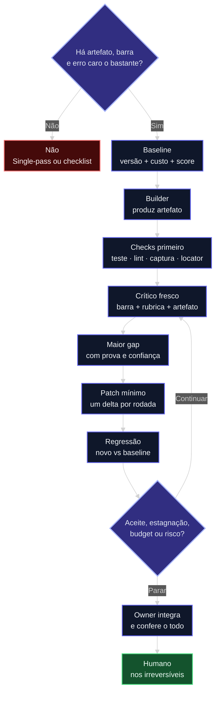
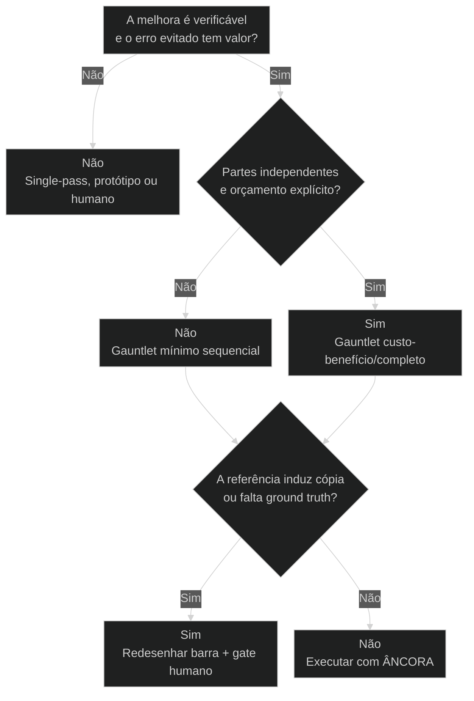

# [[Gauntlet Loop]]: barra, crítico e freio

## Resultado

Ao final desta aula, você consegue **projetar e executar uma corrida Gauntlet curta** sobre um artefato real — sem vender prompt mágico, sem frota por padrão e sem loop infinito.

Você sai com quatro evidências:

1. uma baseline versionada;
2. uma barra nomeada e convertida em critérios;
3. uma crítica em contexto novo, ancorada no artefato;
4. uma decisão de continuar ou parar, com motivo registrado.

Se você sair apenas com um prompt mais dramático, a aula falhou. O valor não está na frase “seja implacável”. Está na composição que torna **melhora, regressão e parada observáveis**.

## Conceitos

- [[Gauntlet Loop]]
- [[Goal vs Loop]]
- [[No-self-review]]
- [[Stop rule]]
- [[Determinismo Progressivo]]
- [[Evidência]]

Fonte e limites dos claims: [Fonte 77 — Gauntlet Loop](../sources/77-gauntlet-loop-evidencias.md).

## Mapa desta aula

O Gauntlet começa antes da primeira iteração e termina por regra, não por cansaço.



> Leia o diagrama antes do texto longo. O prompt é o gatilho; a barra, o artefato, a crítica, a evidência e o freio formam o sistema.

---

## O problema: “faça excelente” não é uma barra

Imagine uma landing page. O builder cria a primeira versão, olha o próprio trabalho e diz que “está profissional”. Você pede para melhorar. Ele muda o gradiente, aumenta a headline e escreve que a experiência “agora está premium”. Mais duas rodadas: novos adjetivos, mais código, nenhuma forma de provar avanço.

O erro não é falta de esforço. É uma composição sem controle:

- o objetivo é adjetivo, não estado final;
- o builder também é o único juiz;
- o crítico recebe a narrativa de progresso;
- nenhuma ferramenta confere o artefato;
- não existe baseline preservada;
- não existe condição de parada.

O loop trabalha. O sistema não aprende.

**Gauntlet**, na versão defensável, corrige isso com uma mudança simples de poder: quem constrói não concede o próprio PASS; a opinião vem depois da evidência; cada rodada corrige um delta; alguém tem autoridade para parar.

> **Frase da aula:** Gauntlet não é pedir mais força ao modelo. É impedir que o processo confunda movimento com melhora.

---

## O que é Gauntlet — e o que é só hype

O nome **Gauntlet Loop** foi publicado por Matt Shumer em julho de 2026 depois do caso *Claude of Duty*. O mecanismo não nasceu ali. O padrão evaluator–optimizer, Self-Refine, Reflexion e crítica com ferramentas já exploravam geração, feedback e revisão em arquiteturas diferentes.

A contribuição útil do nome foi juntar, para ambientes agentic de trabalho:

- uma referência externa de qualidade;
- decomposição em partes julgáveis;
- builders e críticos com contextos separados;
- inspeção de arquivos, páginas, testes e screenshots;
- comparação entre versões;
- iteração até um gate explícito.

### Quatro classes que não podem ser misturadas

| Classe | Exemplo | Como ensinar |
|---|---|---|
| Fato documentado | O repositório, o prompt e o artigo existem. | Pode afirmar. |
| Relato do criador | Duração, compute, isolamento e evolução de scores. | Atribua a fonte e preserve a ressalva. |
| Inferência | O artefato é compatível com trabalho agentic prolongado. | Diga que é inferência. |
| Marketing | “Perfeito”, “one shot” ou equivalência com produto comercial. | Não trate como evidência. |

O caso fundador demonstra capacidade. Não demonstra, sozinho, que o pacote completo vence uma baseline com o mesmo orçamento.

### A contradição mais valiosa do próprio caso

O relato público descreve rodadas paralelas que melhoraram pouco e aumentaram defeitos em um sistema acoplado. Depois, um owner sequencial produziu ganho maior. Em outro episódio, críticos repetiram um diagnóstico visual plausível, mas errado, e as correções pioraram o resultado.

Duas regras sobrevivem ao viral:

1. **fan-out não é default** — partes acopladas pedem owner sequencial;
2. **crítica sem prova não é finding** — peça locator, reprodução, trecho, screenshot ou output.

---

## A anatomia durável: sete peças

### 1. Task fit

Antes do loop, decida se o loop merece existir. Uma tarefa pequena, determinística e barata deve receber código, teste ou single-pass. Gauntlet é justificável quando o erro evitado vale mais que o custo da avaliação.

Perguntas de fit:

- existe um artefato que outra pessoa consegue abrir ou executar?
- melhora pode ser distinguida de preferência pessoal?
- existe barra legítima, rubrica calibrada ou estado externo?
- o risco ou o valor justificam mais de uma execução?

### 2. Baseline

Sem primeira versão preservada, qualquer mudança pode ser narrada como avanço. A baseline registra:

- versão ou hash;
- custo, tempo e número de execuções;
- checks iniciais;
- score por critério;
- limitações conhecidas.

O ratchet só funciona se o processo conseguir voltar ao melhor estado conhecido.

### 3. Barra externa

A **barra** é a referência que torna a lacuna concreta. Pode ser:

- especificação e critérios de aceite;
- página publicada e atributos mensuráveis;
- capítulo aprovado e rubrica editorial;
- resposta de referência;
- benchmark, fixture ou dataset;
- comportamento observado no sistema real.

Uma barra não é “faça como a Stripe”. Isso é terceirização de gosto. A barra precisa virar critérios: hierarquia, densidade, contraste, tempo de tarefa, precisão, cobertura, voz, acessibilidade ou outro atributo que possa ser inspecionado.

**Limite:** referência não é licença para copiar marca, assets, personagens, texto ou identidade. Extraia propriedades; preserve proveniência; use gate humano quando a similaridade trouxer risco.

### 4. Verificação antes da opinião

Siga a aula anterior: [[Determinismo Progressivo|determinístico primeiro]]. Rode o que o modelo não pode persuadir:

1. teste, lint, typecheck ou schema;
2. holdout ou teste metamórfico quando houver risco de gaming;
3. captura reproduzível, locator e inspeção por ferramenta;
4. rubrica com judge;
5. humano nas dimensões subjetivas ou irreversíveis.

Um agente dizendo “os testes passaram” não é evidência. O log do comando, o estado externo e o artefato são.

### 5. Builder diferente do crítico

[[No-self-review]] não exige um exército. Exige separar autoridade:

- **builder** produz ou corrige;
- **crítico** encontra o maior gap;
- **stop controller** decide se a próxima rodada ainda se justifica;
- **owner de integração** protege a coerência global;
- **humano** aceita risco, voz, legal, reputação ou irreversibilidade.

Um único operador pode instanciar esses papéis em momentos e contextos diferentes. O ponto é impedir que a mesma narrativa seja a única fonte de construção e aprovação.

### 6. Patch do maior delta

Crítica ampla produz reescrita ampla. Reescrita ampla cria regressões e apaga causalidade. Cada rodada deve devolver:

- até três blockers;
- um maior gap priorizado;
- prova e confiança;
- um patch local com escopo limitado.

Corrija o maior delta, rode regressão e compare de novo. Só então abra outra frente.

### 7. Freio

“Até perfeito” não é [[Stop rule]]. É renúncia de responsabilidade.

Freios válidos:

- critérios e holdouts atingidos;
- nenhum blocker reproduzível;
- ganho marginal abaixo do limiar;
- duas rodadas concordantes;
- regressão mais grave que o ganho;
- teto de rodadas, tempo, tokens ou dinheiro;
- falta de ground truth;
- próximo passo exige novo escopo ou autorização.

O freio vive no contrato e, quando possível, no runtime. Não depende de o modelo “sentir” que já basta.

---

## Crítico fresco não é crítico desinformado

O crítico deve desconhecer a trajetória do builder, não o problema.

### Entregue ao crítico

- objetivo e anti-escopo;
- barra, critérios e pesos;
- restrições do domínio;
- artefato real ou instrução para abri-lo;
- outputs dos verificadores;
- formato do finding;
- autoridade: recomendar, bloquear ou escalar.

### Não entregue

- defesa do builder;
- raciocínio passo a passo da implementação;
- lista de quanto trabalho já foi feito;
- score anterior quando ele puder ancorar o novo julgamento;
- pedido para ser “gentil” ou “aprovar se estiver razoável”.

### Contrato mínimo do finding

```yaml
finding:
  criterio: "qual requisito ou dimensão falhou"
  severidade: "blocker | major | minor"
  locator: "arquivo, linha, viewport, trecho ou passo reproduzível"
  evidencia: "o que foi observado"
  esperado: "o que a barra exige"
  confianca: "alta | media | baixa"
  maior_gap: true
```

Se o crítico não consegue preencher `locator` e `evidencia`, ele tem uma hipótese. Não um finding.

### Pairwise com honestidade

Comparar A e B torna diferenças concretas, mas o judge pode preferir a primeira posição, mais verbosidade ou um estilo familiar. Para decisões subjetivas:

1. remova autoria e labels de modelo;
2. randomize a ordem;
3. repita com A/B invertidos;
4. combine preferência relativa com score absoluto;
5. escale divergência material.

Crítico fresco reduz ancoragem. Não elimina viés nem cria independência estatística.

---

## Gauntlet 2.0: arquitetura em gates

Esta é a composição recomendada para operação, não um runtime para instalar.

| Gate | Pergunta | Saída exigida | Quem pode parar |
|---|---|---|---|
| G0 · Fit | O loop vale o custo? | escolha single-pass, mínimo ou completo | owner |
| G1 · Baseline | Qual é o estado inicial? | artefato, checks, score e custo | owner |
| G2 · Plan | O que é independente? | dependências, unidades e ownership | owner técnico |
| G3 · Build | O que foi produzido? | artefato versionado | builder |
| G4 · Verify | O estado externo confirma? | logs, testes, captura e locators | verificador |
| G5 · Critique | Qual é o maior gap? | findings priorizados com confiança | crítico |
| G6 · Patch | Qual menor mudança move a barra? | diff local | builder |
| G7 · Regression | Algo aceito piorou? | comparação com baseline e holdouts | verificador |
| G8 · Stop | Outra rodada se paga? | continuar ou parar com motivo | stop controller |
| G9 · Integration | As partes formam um sistema? | E2E e coerência global | owner de integração |
| G10 · Human | O risco residual é aceitável? | aceitar, rejeitar ou abrir exceção | autoridade humana |

### Dois loops, não um

**Loop local:** unidade → check → crítico → patch → regressão.

**Loop global:** integração → E2E → consistência → risco → aceite.

Misturar os dois cria feedback inútil: o crítico local tenta resolver arquitetura; o crítico global devolve “melhore a experiência” sem um patch acionável.

### O ledger que segura a verdade

```yaml
round:
  id: "R1"
  unit: "hero-copy"
  artifact: "path ou URL"
  baseline: "hash ou versão"
  bar: "referência + critérios"
  checks:
    - "comando/captura + resultado"
  blockers:
    - "finding com locator"
  patch: "diff aplicado"
  regressions: []
  cost:
    executions: 3
    time_minutes: 18
  decision:
    status: "continue | stop | escalate"
    reason: "por que outra rodada se paga ou não"
    owner: "autoridade"
```

O ledger não precisa ser sofisticado. Precisa impedir que o histórico da conversa seja a única memória do processo.

---

## Teste ÂNCORA

O curso usa **ÂNCORA** como checklist de entrada. Qualquer “não” reduz o escopo ou impede o Gauntlet completo.

| Letra | Pergunta | Se faltar |
|---|---|---|
| **A · Artefato** | Existe algo real para abrir, executar ou comparar? | Volte à baseline. |
| **N · Norma** | A barra está nomeada e traduzida em critérios? | Faça elicitação; não itere gosto. |
| **C · Crítico separado** | Quem avalia está separado da narrativa do builder? | Abra contexto novo ou use revisor externo. |
| **O · Observabilidade** | Checks e evidências precedem opinião? | Instrumente antes de escalar. |
| **R · Regra de parada** | Rodadas, budget, estagnação e risco têm freio? | Não ligue autonomia longa. |
| **A · Autoridade** | Há owner de integração e humano para o irreversível? | Nomeie quem aceita e quem bloqueia. |

```yaml
ancora:
  artefato: "sim | nao"
  norma: "sim | nao"
  critico_separado: "sim | nao"
  observabilidade: "sim | nao"
  regra_de_parada: "sim | nao"
  autoridade: "sim | nao"
  decisao: "single-pass | gauntlet-minimo | gauntlet-completo | nao-usar"
```

**Regra:** ÂNCORA não mede entusiasmo. Mede se o sistema possui apoio suficiente para não derivar.

---

## Router: completo, mínimo ou nenhum



### Use o Gauntlet completo quando

- o erro custa muito mais que o compute;
- o artefato é decomponível e inspecionável;
- ferramentas verificam estado;
- existe barra legítima;
- há orçamento, telemetria e owner de integração;
- revisão humana cabe no valor da entrega.

### Use o mínimo quando

- um builder, uma suite e um crítico cobrem o risco;
- a tarefa é acoplada e pede fluxo sequencial;
- um patch já testa a hipótese;
- você ainda está validando se a arquitetura agrega valor.

### Não use quando

- a tarefa é pequena e determinística;
- melhora não pode ser distinguida de gosto;
- o resultado é descartável;
- a referência incentiva cópia indevida;
- custo ou latência importam mais que o possível ganho;
- não existe acesso ao artefato nem forma de verificar execução.

---

## Fan-out: só depois do grafo de dependências

Paralelize quando as unidades possuem contrato próprio, não editam o mesmo estado e podem ser julgadas separadamente.

Mantenha um owner sequencial quando:

- existe uma causa sistêmica compartilhada;
- uma mudança invalida outra;
- o artefato exige voz, arquitetura ou direção única;
- o merge custa mais que o tempo economizado;
- a crítica atravessa várias unidades.

Exemplos:

| Tarefa | Melhor composição | Motivo |
|---|---|---|
| Pesquisar cinco mercados independentes | fan-out + integrador | fontes e entregáveis separáveis |
| Reescrever um capítulo com voz única | owner sequencial + crítico | patches locais podem quebrar o arco |
| Corrigir cinco bugs sem arquivos compartilhados | paralelo por ownership | isolamento verificável |
| Ajustar design system de uma página inteira | sequência + captura global | tokens e componentes estão acoplados |
| Julgar alternativas estratégicas | perspectivas paralelas + humano | diversidade importa; ground truth é fraco |

Mais agentes não compensam uma decomposição ruim.

---

## Economia do loop

Loop completo é multiplicação, não uma chamada longa. Cada unidade pode acionar builder, crítico, patch, regressão e integração.

| Perfil | Composição | Default de rodada | Quando cabe |
|---|---|---:|---|
| Rápido | baseline + checks + crítico + até um patch | 1 | baixo risco e feedback objetivo |
| Custo-benefício | baseline + builder + checks + crítico + patch + regressão | 1–3 | default recomendado |
| Completo | plan + unidades + builders + críticos + integração + humano | 2–4 | alto valor e orçamento explícito |

Métricas comparáveis exigem a mesma tarefa, modelos, política de seed, orçamento e avaliação:

- qualidade da baseline e da versão final;
- custo total e custo adicional;
- tempo de parede;
- regressões introduzidas;
- ganho marginal por rodada.

Paralelismo reduz tempo de parede quando as branches são independentes. Não reduz compute total.

---

## Failure modes: como o Gauntlet quebra

| Falha | Como cheira | Correção |
|---|---|---|
| Crítico complacente | PASS na primeira rodada sem prova | casos de calibração, rubrica e amostra humana |
| Crítico impossível | mesmo blocker após correções válidas | critério máximo, tie-break e override humano |
| Alucinação do judge | finding sem reprodução | exigir locator, output, screenshot ou trecho |
| Contaminação | crítico repete a defesa do builder | contexto novo e handoff mínimo |
| Benchmark gaming | suite visível verde, uso real ruim | holdout, teste metamórfico e rotação |
| Reward hacking | score sobe, qualidade percebida cai | rubrica multiobjetivo e humano |
| Fan-out acoplado | peças boas, sistema incoerente | owner sequencial e E2E global |
| Oscilação | corrige A, quebra B, volta para A | congelar dimensões aceitas e usar ratchet |
| Polimento eterno | mudanças cosméticas sem mover blockers | ganho marginal e teto de rodadas |
| Tool run falso | agente relata comando sem output | executar ferramenta e guardar evidência |
| Falsa conclusão | “pronto” sem artefato ou estado externo | verificar ambiente e registrar log |
| Explosão de contexto | toda a história em toda rodada | ledger compacto e contextos frescos |

Não confunda “crítico duro” com crítico bom. Crítico bom produz informação nova, localizada e útil para decisão.

---

## Aplicação por domínio

### Software

Barra: SPEC, critérios de aceite e comportamento do sistema. Checks: testes, lint, tipos, segurança e holdouts. O crítico reproduz o bug; o owner mantém arquitetura. Nunca aceite “testes passaram” sem output.

### Website e design

Barra: atributos extraídos de referências legítimas. Checks: screenshots no mesmo viewport, responsividade, acessibilidade e performance. O A/B troca ordem. Um crítico global protege coerência visual.

### Pesquisa profunda

Barra: pergunta, critérios de inclusão, cobertura e atualidade. Checks: locators, citações que sustentam claims e gaps explícitos. Retrieval e síntese ficam separados; o crítico não recompensa volume sem suporte.

### Escrita

Barra: tese, estrutura, voz aprovada, precisão e leitor. Checks: citações, claims e restrições mecânicas. Um editor global impede que patches locais destruam o arco.

### Produto e estratégia

Barra: decisão e premissas, não nota estética. Críticos procuram alternativas, base rates e efeitos de segunda ordem. Protótipo, entrevista e comportamento real fornecem feedback superior à opinião de um judge. Loop autônomo não valida demanda.

Quando a prática pedir especialistas publicados, use a [ponte para squads](../ponte/trilha-squads.md). Se o objetivo virar construir um runtime ou harness de produção, a rota é AIOX Agent Engineering; esta aula continua dona do **método de controle**, não da infraestrutura de servir.

---

## Laboratório de 60–90 minutos: duas corridas, uma verdade

O laboratório compara uma baseline simples com um Gauntlet mínimo. Não use 20 agentes. O objetivo é isolar o mecanismo.

### Preparação — 10 minutos

Escolha uma tarefa pequena e inspecionável:

- um parágrafo de 400 palavras;
- uma seção de landing;
- um componente com estado vazio;
- um brief de pesquisa;
- uma função com testes.

Defina:

1. artefato final;
2. barra e 3–7 critérios;
3. checks disponíveis;
4. teto de duas rodadas;
5. risco que exige humano.

### Corrida A — 10 minutos

Peça uma execução single-pass com o objetivo e os critérios. Preserve:

- prompt ou briefing;
- artefato gerado;
- tempo e execuções;
- checks;
- score humano inicial.

Essa é a baseline. Não a reescreva depois de ver a Corrida B.

### Corrida B — 25–45 minutos

1. Entregue a baseline a um builder para uma melhoria limitada.
2. Rode checks determinísticos.
3. Abra contexto novo para o crítico.
4. Forneça objetivo, barra, rubrica, artefato e outputs.
5. Peça até três blockers e um maior gap.
6. Volte ao builder apenas com o finding acionável.
7. Aplique um patch.
8. Rode regressões.
9. Compare A e B com labels opacos e ordem invertida.
10. Pare, mesmo que ainda existam detalhes cosméticos.

### Scorecard — 10 minutos

```yaml
experiment:
  task: ""
  same_model_policy: true
  same_budget_policy: true
  bar: ""
  criteria:
    - name: ""
      weight: 1
  run_a:
    score: 0
    cost: ""
    time: ""
    regressions: []
  run_b:
    score: 0
    cost: ""
    time: ""
    regressions: []
  blind_comparison:
    order_1_winner: "A | B | empate"
    order_2_winner: "A | B | empate"
  decision:
    gain: ""
    extra_cost: ""
    use_again: "sim | nao | somente alto risco"
    reason: ""
```

### Leitura honesta do resultado

- Se B vence com custo aceitável, você provou valor **nesta tarefa e neste setup**.
- Se B empata, prefira a composição menor.
- Se B perde, investigue crítica, barra, patch e regressão antes de adicionar agentes.
- Se o resultado muda quando A/B troca de posição, o judge não está calibrado.
- Se não existe evidência para escolher, o problema é ground truth, não intensidade do prompt.

**Funcionou se:** você consegue mostrar os dois artefatos, o finding, o patch, os outputs e o motivo da parada.

---

## Templates portáveis

Os textos abaixo são contratos genéricos. Confirme ferramentas e comandos no runtime atual.

### Builder

```text
Objetivo: [resultado inspecionável].
Artefato: [path, URL ou formato de saída].
Barra: [referência legítima] traduzida nos critérios [lista].
Checks obrigatórios antes de entregar: [comandos ou inspeções].

Produza uma versão limitada ao escopo [escopo].
Não se conceda PASS. Entregue o artefato e a evidência executada.
```

### Crítico em contexto novo

```text
Você não é o builder. Inspecione o artefato real [path/URL].
Compare-o com o objetivo, a barra, a rubrica e as restrições abaixo.
Considere também os outputs dos verificadores.

Devolva no máximo três blockers. Para cada um: critério, severidade,
locator, evidência, esperado e confiança. Eleja um único maior gap.
Não premie esforço, quantidade de mudanças ou narrativa de progresso.
Se não houver finding reproduzível, diga isso explicitamente.
```

### Stop controller

```text
Decida somente entre CONTINUE, STOP ou ESCALATE.

Continue se existe blocker reproduzível, patch local e budget.
Pare se os critérios passaram, o ganho marginal ficou abaixo de [limiar],
duas avaliações concordaram ou [N] rodadas foram consumidas.
Escale se falta ground truth, autorização, credencial ou se o próximo passo
muda o escopo ou produz efeito irreversível.

Registre a decisão e o motivo no ledger. Não gere novo trabalho.
```

### Prompt único para o piloto mínimo

```text
Produza uma baseline e preserve-a. Rode checks objetivos antes da opinião.
Em contexto novo, critique o artefato contra [barra + critérios] e devolva
até três blockers com locator e confiança. Corrija somente o maior gap,
rode regressão e compare com a baseline. Pare após [N] rodadas, [tempo],
[budget] ou ganho marginal abaixo de [limiar]. Escale [riscos] para mim.
```

---

## Teste de recuperação ativa

Responda antes de abrir o gabarito.

1. O builder termina uma landing e, no mesmo fio, diz que ela superou a referência. Qual peça está fraca?
2. O crítico abre contexto novo, mas não recebe rubrica nem artefato. Isso é isolamento correto?
3. Seis agentes editam componentes que compartilham tokens globais e a página perde coerência. Qual erro de composição ocorreu?
4. O score cresce, mas o holdout piora. Qual é o diagnóstico provável?
5. A terceira rodada só muda palavras e espaçamento. Qual gate deve encerrar?
6. Dois judges escolhem B; com a ordem invertida, escolhem A. O que isso prova?

<details>
<summary>Gabarito comentado</summary>

1. **No-self-review.** O builder pode relatar; não deve ser a única autoridade de PASS.
2. **Não.** Contexto fresco remove a trajetória, não objetivo, barra, rubrica, restrições e artefato.
3. **Fan-out sobre estado acoplado.** Use owner sequencial e avaliação global.
4. **Reward hacking ou overfitting ao proxy.** Holdout e uso real têm prioridade sobre o score visível.
5. **G8 Stop.** Ganho marginal baixo ou estagnação encerra a corrida.
6. **Viés de posição ou judge instável.** Pairwise precisa swap, score absoluto e possível escalada.

</details>

---

## Pergunte ao seu agente

```text
Quero avaliar se a minha tarefa merece um Gauntlet.

Tarefa: [descreva]
Artefato atual: [path/URL/estado]
Barra ou referência: [nome]
Risco do erro: [baixo/médio/alto + impacto]
Budget: [rodadas, tempo ou custo]

1. Aplique o teste ÂNCORA.
2. Escolha single-pass, Gauntlet mínimo, completo ou não usar.
3. Desenhe os gates G0–G10 que realmente se aplicam.
4. Separe builder, crítico, stop controller, owner e humano.
5. Entregue o template do ledger e a stop rule.

Não execute ainda. Quero aprovar a composição antes do run.
```

## Evidência de conclusão

Você passou quando entrega um pacote com:

- teste ÂNCORA preenchido;
- baseline e versão final preservadas;
- barra nomeada e critérios explícitos;
- outputs dos checks;
- crítica em contexto novo com locator;
- patch do maior gap;
- regressão;
- comparação antes/depois;
- decisão `CONTINUE`, `STOP` ou `ESCALATE` com responsável.

O portão não exige que a versão final seja perfeita. Exige que você consiga explicar **o que melhorou, o que não melhorou, quanto custou e por que o sistema parou**.

> **Portão da aula:** se a única prova é “o agente disse que ficou melhor”, volte à baseline. Se existe artefato, barra, crítico, checks, freio e autoridade, o loop tem âncora.

## Operar isto na prática

Esta aula fecha a progressão iniciada em [[Goal vs Loop]] e [[Determinismo Progressivo]]: goal define o destino, gates restringem o caminho, checks trazem estado externo, Gauntlet separa produção de avaliação e [[Rider]] coloca o humano nos pontos que mudam a rota.

Para escolher uma operação especializada publicada, siga a [trilha de squads](../ponte/trilha-squads.md). Para construir a infraestrutura que serve a capacidade fora da IDE, siga a rota de AIOX Agent Engineering indicada no README do acervo.

## Origem curricular

Síntese nova baseada na [Fonte 77](../sources/77-gauntlet-loop-evidencias.md), derivada de pesquisa de 15 de agosto de 2026 e integrada ao curso em 25 de agosto de 2026. O material de origem foi transformado em aula autocontida; claims temporais permanecem presos ao snapshot e comandos dependentes de produto não são tratados como contrato portátil.

## Navegação

← [[aulas/21-deterministico-primeiro-llm-onde-gera-ouro|Determinístico primeiro, LLM só onde gera ouro]] · ↑ [[modulos/Módulo 3 - Determinismo e Comando|M3 — Determinismo e comando]] · ⌂ [[cursos/AIOX Advanced/README|Curso]] · → [[aulas/50-rider-modo-elicitacao|Rider: quando o operador é o piloto]]
