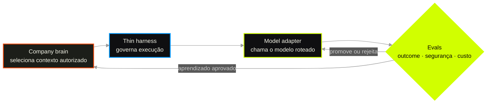

# O modelo passa, o sistema fica

A aula [19](19-routing-de-modelos.md) separou tarefa de marca. A [21](21-harness.md) tirou a capacidade do laboratório. O módulo M1b separou os jobs de memória. Agora juntamos as peças numa decisão arquitetural: **modelos substituíveis + harness fino + cérebro modular da empresa**.

> **Tese central**  
> **models + thin harness + modular company brain**

Evidência: [fonte 83](../sources/83-modelos-substituiveis-harness-fino-cerebro-modular.md).

## Mapa desta aula

Decisão-chave — Quando algo muda ou falha, qual camada deve absorver a mudança?



> Leia o diagrama antes do texto longo. Depois volte e confira.

> O modelo é um componente volátil. A operação e o conhecimento da empresa não podem envelhecer no ritmo dele.

**Objetivos de aprendizagem:**

- Explicar por que o avanço dos LLMs aumenta — e não diminui — o valor da arquitetura modular. _(understand)_
- Classificar uma responsabilidade entre modelo, harness e company brain. _(analyze)_
- Auditar o acoplamento de um workload real e localizar a camada que deve absorver cada mudança. _(analyze)_
- Planejar promoção reversível por eval offline, shadow e canary. _(apply)_
- Aplicar ablação segura a instruções e scaffolding que podem ter envelhecido com o modelo. _(apply)_
- Recusar três atalhos: agnosticismo mágico, harness obeso e brain-dump. _(evaluate)_

---

## O que você consegue no fim desta aula

Você consegue olhar para uma falha e responder três perguntas sem misturar as camadas:

1. mudou capacidade, custo ou latência? Olhe o modelo e a rota;
2. mudou autoridade, fluxo ou prova de outcome? Olhe o harness;
3. mudou fonte, validade ou acesso? Olhe o company brain.

Você também consegue ordenar uma troca reversível: baseline reproduzível → eval offline → shadow → canary → promoção com rollback. Uma API compatível entre providers resolve payload; não prova substituibilidade operacional.

---

## Por que esta arquitetura importa agora

O argumento não depende de futurologia. O chão já está se movendo em quatro direções.

### 1. Inteligência útil ficou drasticamente mais barata

O [AI Index 2025](https://hai.stanford.edu/news/ai-index-2025-state-of-ai-in-10-charts) registrou três deslocamentos no mesmo período:

- o custo para atingir 64,8% no MMLU, desempenho equivalente ao GPT-3.5, caiu de **US$ 20 para US$ 0,07 por milhão de tokens** entre novembro de 2022 e outubro de 2024 — mais de **280 vezes**;
- o menor modelo acima de 60% no MMLU caiu de **540 bilhões para 3,8 bilhões de parâmetros** — uma redução de **142 vezes**;
- conforme a tarefa, o preço de inferência caiu entre **9 e 900 vezes por ano**.

O efeito arquitetural é simples: tarefas que ontem exigiam o maior modelo podem amanhã caber num modelo menor, local ou especializado. Se a capacidade está soldada ao modelo físico, cada ganho de preço ou capacidade vira migração. Se o contrato está fora dele, o ganho vira opção de upgrade.

### 2. A liderança é próxima, móvel e irregular

O [AI Index 2026](https://hai.stanford.edu/ai-index/2026-ai-index-report/technical-performance) mostra duas forças aparentemente contraditórias:

- **convergência no topo:** quatro empresas estavam dentro de 25 pontos Elo no Arena em março de 2026;
- **inteligência irregular:** o melhor sistema marcou ouro na Olimpíada Internacional de Matemática, mas o melhor resultado no ClockBench foi **50,6%**, contra **90,1%** humano;
- **progresso rápido demais para benchmarks fixos:** modelos ganharam **30 pontos percentuais em um ano** no Humanity's Last Exam;
- **fragilidade operacional:** agentes ainda falham em aproximadamente **uma de cada três tentativas** em benchmarks estruturados;
- **medição imperfeita:** uma revisão encontrou de 2% a **42% de questões inválidas** em benchmarks amplamente usados.

Convergência não significa equivalência. Significa que o vencedor agregado é menos útil do que o perfil de capacidades e falhas no seu workload.

Portanto, “qual é o melhor modelo?” é uma pergunta fraca. A pergunta de engenharia é:

> Qual modelo atinge o gate deste workload, com qual custo, latência, variância e modo de falha?

### 3. Identificadores de modelos têm meia-vida curta

As páginas oficiais de deprecação da [OpenAI](https://developers.openai.com/api/docs/deprecations) e da [Anthropic](https://platform.claude.com/docs/en/about-claude/model-deprecations) mostram snapshots e APIs aposentados com frequência. Em 2025, o `gpt-4.5-preview` teve três meses entre aviso e desligamento; `o1-preview`, três meses; `o1-mini`, seis. Um nome físico é configuração. Não pode ser o lugar onde vivem fatos canônicos, regras de negócio ou definição de sucesso.

### 4. Modelos melhores envelhecem o scaffolding

A [Anthropic](https://www.anthropic.com/engineering/harness-design-long-running-apps) documenta que harnesses codificam hipóteses sobre aquilo que o modelo ainda não consegue fazer. Conforme a capacidade muda, decomposições, evaluators auxiliares ou regras compensatórias podem deixar de agregar valor.

No caso descrito, a equipe removeu a estrutura de “sprints” quando o modelo passou a sustentar o trabalho sem essa decomposição. O evaluator continuou útil apenas nas partes ainda próximas da fronteira de capacidade. Esse é o ponto: cada scaffolding precisa de uma hipótese observável e de uma condição de remoção.

O paradoxo do momento é este:

- modelos mais capazes permitem **menos scaffolding cognitivo**;
- agentes mais autônomos exigem **mais clareza operacional** sobre autoridade, estado, custo, segurança e outcome.

Thin harness nasce desse paradoxo.

---

## Três camadas, três relógios

A arquitetura não começa pelas tecnologias. Começa pela cadência de mudança.

| Camada | Relógio | Responsabilidade | Não deve possuir |
|---|---|---|---|
| Modelo substituível | meses | raciocínio e geração para uma classe de tarefa | fatos canônicos, política ou memória institucional |
| Thin harness | trimestres | governança da execução | conhecimento do negócio duplicado em regras frágeis |
| Company brain modular | anos | conhecimento, decisões, procedimentos e evidências | autoridade global ou dependência de uma projeção única |

Os três relógios são uma regra de desenho. Quando duas responsabilidades mudam em ritmos muito diferentes, prendê-las no mesmo componente faz a mais rápida arrastar a mais lenta. Se o conhecimento institucional estiver embutido no prompt de um modelo, cada troca ameaça política, memória e operação ao mesmo tempo. Se approvals e stop rules estiverem escondidos em documentos recuperados, uma atualização de conteúdo também vira mudança de controle.

Separar não significa isolar. As camadas cooperam por contratos: o brain entrega um pacote de contexto autorizado; o harness concede tools e limites; o adapter traduz a chamada; o modelo propõe ações; o gate observa o outcome. Cada camada, porém, continua dona de uma espécie de verdade. O modelo responde por capacidade; o harness, por autoridade e prova; o brain, por fonte, validade e proveniência.

Um teste simples ajuda a encontrar o dono: pergunte o que precisa continuar correto quando outra camada muda. Troque o modelo — a regra de reembolso deve permanecer verdadeira. Atualize a regra — a autorização financeira precisa continuar funcionando. Mude o fluxo de aprovação — o histórico das decisões não pode desaparecer. Aquilo que precisa sobreviver à mudança provavelmente pertence a outra fronteira.

---

## Analogia mestra — uma fábrica que troca o motor sem perder a fábrica

Imagine uma linha industrial que inspeciona peças.

| Na fábrica | Na arquitetura agentic | Por que existe |
|---|---|---|
| motor da estação | modelo | fornece capacidade para um workload delimitado |
| eixo e acoplamento | adapter | faz a interface física encaixar |
| painel, sensores e intertravamentos | harness | controla partida, parada, autoridade, limites e prova de resultado |
| desenhos, tolerâncias, SOPs e histórico | company brain | preserva o conhecimento que define o trabalho correto |
| teste de aceitação | eval | prova que o motor executa aquela estação dentro das tolerâncias |
| giro desacoplado | shadow | observa o candidato sem permitir efeito real |
| uma estação em baixo volume | canary | limita o dano enquanto mede a operação real |
| chave seletora para o motor anterior | rollback | preserva a opção de voltar |

Um acoplamento que encaixa prova apenas que o novo motor pode ser conectado. Não prova torque, aquecimento, vibração ou qualidade da peça. Da mesma forma, um adapter prova que a chamada cabe na interface; o eval prova que o comportamento serve ao workload.

O operador mais experiente também não elimina parada de emergência, limite de carga ou sensor de presença. Um modelo melhor pode remover scaffolding cognitivo; não recebe, por isso, autoridade maior. E os desenhos da peça não devem morar no firmware do motor: política, fonte e histórico precisam sobreviver à troca.

A analogia tem um limite importante. Motores físicos são mais determinísticos que LLMs. Por isso a “inspeção de aceitação” precisa de múltiplos trials, slices e observação de trajetória, não de uma única execução bonita.

---

## Camada 1 — Modelo substituível

“Substituível” não significa que dois modelos são iguais. Significa que um candidato pode ocupar **um papel delimitado** depois de passar por um gate.

A palavra descreve uma opção operacional, não uma crença de equivalência. A opção só existe quando outro candidato pode receber o mesmo contrato, ser medido no trabalho real e devolver a rota ao anterior se o resultado piorar. Um modelo pode resumir tickets com baixo custo e falhar em revisão de permissões; outro pode raciocinar melhor e não sustentar o schema de uma tool. A empresa não precisa escolher um vencedor total quando consegue avaliar por workload.

### O contrato do modelo

Declare capabilities, não marca:

- tool calling e comportamento esperado ao escolher tools;
- structured output e aderência ao schema;
- modalidades necessárias;
- janela e qualidade de uso do contexto;
- idiomas e domínio;
- latência e throughput;
- perfil de segurança;
- limites de custo;
- política de fallback.

Use um alias de capacidade — por exemplo, `review-seguranca`, `bulk-mecanico` ou `research-grounded` — e resolva o nome físico na configuração do routing.

O contrato da rota funciona como uma descrição de vaga: declara trabalho, ferramentas necessárias, formato de entrega, limites e riscos que vetam contratação. O modelo físico é quem ocupa a vaga agora. Quando descrição e ocupante se confundem, substituir exige reescrever o cargo. Quando estão separados, candidatos diferentes podem ser avaliados pelo mesmo trabalho.

Isso também inverte a lógica do leaderboard. Primeiro se define o outcome e a tolerância a falhas; depois se procura o menor candidato que satisfaz o gate. Escolher primeiro a marca e adaptar todos os workloads ao perfil dela solda o sistema antes mesmo de existir evidência.

### Adapter não é prova de equivalência

Uma camada compatível com múltiplos providers normaliza chamadas, respostas e exceções. Isso resolve portabilidade **sintática**. Não resolve portabilidade comportamental.

Dois modelos podem aceitar o mesmo schema e divergir em:

- escolha e ordem de tools;
- atenção a evidência no meio do contexto;
- taxa de JSON inválido;
- tendência a declarar sucesso cedo;
- recusa ou obediência excessiva;
- estabilidade entre trials.

Regra: **adapter prova forma; eval prova comportamento**.

O [RouteLLM](https://arxiv.org/abs/2406.18665) mostra tanto o potencial de economia quanto o risco de routing desalinhado com o workload. A tabela da aula [19](19-routing-de-modelos.md) precisa de dados locais, não de torcida.

### A escada da portabilidade

Portabilidade não é binária. Um sistema pode estar desacoplado no payload e continuar preso no comportamento, na operação ou no conhecimento.

| Nível | O que já existe | O que a troca ainda exige | O que foi provado |
|---|---|---|---|
| 0 — acoplamento físico | ID do modelo espalhado em prompts e código | refactor amplo | nada |
| 1 — adapter | chamada e resposta normalizadas | tratar capabilities e diferenças semânticas | forma |
| 2 — contrato de capability | alias, tools, schema, limites e fallback declarados | comparar comportamento no workload | elegibilidade |
| 3 — eval gate | conjunto representativo, thresholds e múltiplos trials | provar rollout e reversão | fitness offline |
| 4 — substituição operacional | shadow, canary, observabilidade e rollback | monitorar drift | fitness em operação |

O erro comum é chegar ao nível 1 e declarar “somos agnósticos”. O adapter diminui o custo mecânico da troca. Só os níveis 3 e 4 reduzem o risco da troca.

### Exemplo numérico — o mesmo candidato, dois vereditos

Considere uma simulação didática com dois workloads. Os números abaixo são ilustrativos; a estrutura do gate é o que importa.

| Métrica | Rota `bulk-mecanico` | Rota `review-seguranca` |
|---|---:|---:|
| threshold principal | outcome ≥ 94% | recall crítico ≥ 95% |
| baseline | 96/100 outcomes | 29/30 riscos críticos |
| candidato menor | 95/100 outcomes | 26/30 riscos críticos |
| custo por 100 runs | US$ 14 → US$ 4 | US$ 18 → US$ 6 |
| p95 | 10,8 s → 6,2 s | 14,1 s → 8,4 s |
| decisão | **promover nesta rota** | **rejeitar nesta rota** |

O candidato é simultaneamente “bom o suficiente” e “inaceitável”, porque a unidade de decisão é o workload. Uma média global esconderia os quatro riscos críticos não detectados. Gates de segurança são vetos, não pesos compensáveis por custo ou latência.

O [RouteLLM](https://arxiv.org/abs/2406.18665) reportou redução superior a duas vezes no custo em alguns testes sem perda substancial de qualidade. O mesmo paper mostrou o limite: routers treinados em distribuição desalinhada podem ficar próximos do aleatório. Economia pública é hipótese; fitness local é prova.

### O menor denominador comum também aprisiona

Esconder toda diferença entre providers pode amputar capacidades importantes. Reasoning controls, cache, citations, computer use, multimodalidade e structured output nativo nem sempre possuem equivalentes.

O contrato interno deve separar:

- **núcleo portátil:** capacidades exigidas por todos os candidatos daquela rota;
- **extensões opcionais:** otimizações ou recursos específicos atrás do adapter;
- **veto de promoção:** feature sem a qual o workload não funciona;
- **dívida de saída:** trabalho necessário para abandonar a extensão específica.

Lock-in consciente pode ser uma decisão correta. Lock-in invisível é que destrói a opção de troca.

---

## Camada 2 — Thin harness

O harness é o plano de controle da capacidade. “Fino” descreve onde ele evita acúmulo; não significa ausência de engenharia.

Ele transforma capacidade probabilística em operação governada: monta contexto, oferece tools, mantém estado, aplica limites, registra a trajetória e verifica efeitos. O ponto central é separar scaffolding cognitivo de controle operacional. Instruções e decomposições criadas para ajudar o modelo precisam disputar continuamente seu lugar. Permissão, orçamento, idempotência, aprovação e rollback permanecem enquanto o risco existir.

### Fino nas suposições sobre inteligência

Evite congelar limitações temporárias do modelo em centenas de regras:

- decomposição fixa para tarefas que o modelo já resolve inteiro;
- parsers que reinterpretam uma resposta que poderia ser estruturada;
- validators redundantes sem relação com outcome;
- prompts gigantes para compensar contexto mal recuperado;
- árvores de decisão que duplicam raciocínio e ficam invisíveis aos evals.

Esses elementos podem existir. A exigência é que cada um tenha uma hipótese testável e uma condição de remoção.

### O “delete” que virou viral — ablação, não amnésia

Em julho de 2026, Boris Cherny, criador do Claude Code, deu uma recomendação incomum:

> “Every six months, delete your CLAUDE.md. Delete your skills. Delete your hooks. See what the model does.”

Fonte primária: [entrevista da Y Combinator, a partir de 06:52](https://www.youtube.com/watch?v=qyPCVqFUyDo&t=412s).

A frase é real, mas isolada vira conselho destrutivo. Na mesma resposta, Cherny descreve o método usado pela equipe: retirar o system prompt, executar o modelo, observar falhas e reintroduzir conteúdo linha por linha. A regra volta apenas quando o modelo tropeça repetidamente sem ela. O nome desse experimento é **ablação**.

Arquivos persistentes crescem por sedimentação. Uma falha acontece, alguém acrescenta uma regra, o modelo muda, o incidente é esquecido e a regra continua sendo enviada para toda tarefa. Depois de muitos ciclos, o arquivo deixa de expressar requisitos atuais e passa a registrar tudo que modelos anteriores já fizeram errado.

```text
versionar → retirar → executar → medir → reintroduzir o mínimo
```

Há uma precisão importante. Cherny citou `CLAUDE.md`, skills e hooks. **Não citou `AGENTS.md` nessa fala.** Aplicar a mesma lógica a `AGENTS.md` é uma inferência arquitetural porque ele também injeta instruções persistentes; não deve ser apresentado como citação de Cherny.

A cadência de seis meses funciona melhor como gatilho de manutenção do que como lei. O objetivo não é um arquivo vazio; é renovar o ônus da prova. Fatos não inferíveis e constraints úteis permanecem. Workarounds antigos voltam apenas quando tarefas representativas demonstram que ainda compram qualidade, segurança ou eficiência.

A recomendação oficial da Anthropic separa dois ritmos:

| Ritmo | Ação | Por quê |
|---|---|---|
| revisão trimestral | remover instruções vencidas e manter o arquivo curto e denso em sinal | conteúdo outdated pode ser pior que nenhum |
| salto relevante de modelo ou ciclo semestral | ablação reversível mais ampla | workarounds do modelo anterior precisam reconquistar seu lugar |

O [Help Center da Anthropic](https://support.claude.com/en/articles/14553240-give-claude-context-claude-md-and-better-prompts) recomenda aproximadamente menos de 200 linhas, priorizando comandos, convenções, arquitetura breve, hard constraints e gotchas. O artigo [The new rules of context engineering](https://claude.com/blog/the-new-rules-of-context-engineering-for-claude-5-generation-models) relata que a equipe removeu mais de **80%** do system prompt do Claude Code para modelos Claude 5 sem perda mensurável nos evals internos de código.

O mesmo artigo explica o mecanismo. System prompt, skills e pedido do usuário podiam trazer regras sobrepostas ou conflitantes. Exemplos antigos restringiam o espaço de exploração. Procedimentos que não eram sempre necessários passaram para progressive disclosure: skills e tools carregadas só quando a tarefa exige.

### Quanto um harness pesado pode atrapalhar?

“Pesado” não é sinônimo de longo. É o contexto ou scaffolding cujo custo marginal — atenção, tokens, passos, conflito ou manutenção — não compra ganho de outcome.

Na orientação [Favor leaner prompts](https://developers.openai.com/api/docs/guides/latest-model#favor-leaner-prompts), a OpenAI reporta uma amostra de evals internos de coding agents em que configurações mais enxutas produziram:

| Métrica | Variação reportada |
|---|---:|
| score nos evals | **+10–15%** |
| tokens totais | **−41–66%** |
| custo | **−33–67%** |

São intervalos direcionais, ligados ao baseline e às tarefas da OpenAI. Não são promessa de que podar qualquer arquivo produz a mesma melhora.

O custo também se multiplica por trajetória. Instruções always-on, exemplos, schemas e descrições de tools podem ser reprocessados em vários turnos. Uma redundância pequena no primeiro prompt pode se transformar em milhares de tokens, novas decisões e oportunidades de conflito numa execução longa. Por isso a unidade de medida não é apenas o tamanho do arquivo; é o caminho completo até o outcome.

Dois estudos sobre `AGENTS.md` chegaram a resultados diferentes:

| Estudo | Amostra | Resultado |
|---|---|---|
| [Evaluating AGENTS.md](https://arxiv.org/abs/2602.11988) | 138 tarefas, 12 repositórios | arquivos aumentaram passos e custo em cerca de 20–23%, sem ganho significativo de sucesso; contexto gerado por LLM reduziu resolução em cinco de oito configurações |
| [On the Impact of AGENTS.md](https://arxiv.org/abs/2601.20404) | 124 PRs, 10 repositórios | presença do arquivo associada a 28,64% menos runtime mediano e 16,58% menos output tokens, mantendo conclusão comparável |

Esses resultados não se cancelam. Um arquivo relevante pode evitar exploração desnecessária. Um arquivo redundante pode induzir mais navegação, testes e raciocínio sem melhorar o resultado. A unidade correta do eval é:

```text
arquivo + modelo + repositório + tarefa
```

O stress test [IFScale](https://arxiv.org/abs/2507.11538), com 20 modelos e até 500 instruções verificáveis, encontrou somente 68% de aderência no melhor modelo na densidade máxima. A tarefa é sintética e 500 regras são um extremo; o resultado não define um teto de linhas. Ele mostra algo mais básico: **caber na janela não prova que todas as instruções serão seguidas**.

### Como o excesso prejudica

1. **Deslocamento de atenção:** regra irrelevante compete com tarefa, código e evidência.
2. **Interferência de restrições:** regras individualmente razoáveis entram em tensão quando combinadas.
3. **Multiplicação por turno:** prefixos, schemas e tool descriptions são reprocessados ao longo do loop.
4. **Hipótese vencida:** workaround para o modelo anterior permanece depois que a capability muda.
5. **Agência suprimida:** sequência fixa bloqueia outra estratégia, tool ou ordem de investigação.
6. **Acoplamento do adapter:** formatação e tradução de tools otimizadas para um provider degradam outro.
7. **Máscara de observabilidade:** mais camadas escondem qual regra ou conversão causou a regressão.

No estudo longitudinal [Don't Blame the Large Language Model](https://arxiv.org/html/2607.03691v2), 35 versões de um harness foram comparadas com o LLM fixo em 50 tarefas. Versões posteriores chegaram perto de dobrar tokens e tool calls sem ganho significativo de resolução. É um preprint de um domínio e não prova causalidade universal; mostra por que evolução de harness também precisa de eval comportamental.

### Protocolo seguro de ablação

1. Versione prompt, `CLAUDE.md`/`AGENTS.md`, skills, hooks, tools e baseline.
2. Separe fatos não inferíveis, controles, scaffolding cognitivo, referência e história.
3. Retire uma família por vez — nunca mude modelo, prompt e toolset simultaneamente.
4. Execute tarefas frequentes, extremas, regressões reais e adversariais em múltiplos trials.
5. Compare outcome, trajetória, segurança, tokens, custo e latência.
6. Reintroduza apenas o que corrige falha repetida e material.
7. Mova para enforcement aquilo que precisa valer mesmo se o modelo ignorar a prosa.
8. Registre owner, motivo e próxima revisão do que permaneceu.

Ablação boa preserva rollback. O objetivo não é um arquivo vazio; é um arquivo em que cada linha ainda merece ser always-on.

### Firme nos invariantes operacionais

O harness continua dono de:

1. **Contrato** — entrada, saída e erro estruturado.
2. **Autoridade** — auth, ACL, aprovação e least privilege.
3. **Tools** — schemas, validação, idempotência e confirmação de efeitos.
4. **Ciclo de vida** — sessão, estado, timeout, retries e stop rules.
5. **Economia** — budgets, rate limits e routing.
6. **Observabilidade** — traces, custo, latência e decisões relevantes.
7. **Verificação** — outcome no ambiente, não apenas a frase “concluído”.
8. **Recuperação** — fallback, rollback, fila morta e kill switch.

O artigo [Decoupling the brain from the hands](https://www.anthropic.com/engineering/managed-agents) separa brain/harness, hands e session por interfaces independentes. A lição útil não é copiar a infraestrutura. É impedir que raciocínio, ambiente e ciclo de vida virem uma unidade indivisível.

No caso reportado, containers deixaram de ser pré-requisito para toda sessão e passaram a ser provisionados apenas quando uma tool de execução era necessária. O p50 de time-to-first-token caiu aproximadamente **60%** e o p95, mais de **90%**. É evidência de um caso, não benchmark universal; mostra como remover uma suposição arquitetural pode melhorar portabilidade e desempenho ao mesmo tempo.

### Quatro testes de espessura

Um harness não é fino porque tem poucas linhas. Faça quatro mudanças mentais:

1. **Troque o modelo.** Se isso exige alterar política de negócio, há acoplamento cognitivo.
2. **Atualize uma política.** Se isso exige redeploy do modelo ou reescrita do loop, conhecimento vazou para execução.
3. **Mude uma aprovação de uma para duas pessoas.** Se isso exige reindexar documentos, workflow e brain estão misturados.
4. **Troque o ambiente de execução.** Se isso apaga a sessão ou muda a memória institucional, hands e brain estão colados.

O teste não mede tamanho do repositório. Mede quantos motivos diferentes obrigam o mesmo componente a mudar.

### Quatro planos dentro do harness

“Thin” descreve baixo acoplamento cognitivo, não pouca responsabilidade operacional. Um harness maduro separa quatro planos:

| Plano | Pergunta | Responsabilidades |
|---|---|---|
| Execução | O que acontece neste run? | contexto de trabalho, model turn, tools, observações e estado |
| Controle | O que é permitido? | auth, budgets, routing, approvals, stop rules e blast radius |
| Evidência | Como sabemos que funcionou? | trace, graders, inspeção de tool calls e outcome no ambiente |
| Mudança | Como evolui sem aposta cega? | registry de candidatos, datasets, shadow, canary, promoção e rollback |

Quando esses planos estão misturados, uma mudança de modelo altera autorização; um ajuste de retrieval altera stop rule; um novo grader altera o loop. A espessura perigosa não é quantidade de código. É quantidade de motivos diferentes presos no mesmo componente.

### O teste de remoção

Para cada peça de scaffolding cognitivo, registre:

```yaml
hipotese: "Sem esta decomposição, o modelo perde etapas críticas"
metrica: "pass rate do outcome + violações de sequência"
experimento: "candidato sem a decomposição em 50 casos retidos"
remover_quando: "não houver regressão material em três rodadas"
```

Sem hipótese e condição de remoção, compensações temporárias viram arqueologia permanente.

### Thin ≠ ingênuo

Remova a inteligência duplicada. Preserve os controles. O modelo pode ficar melhor em planejar; ele não recebe, por isso, autoridade para pagar uma fatura sem limite ou ler documentos que o usuário não pode acessar.

---

## Camada 3 — Company brain modular

O cérebro da empresa é o conhecimento institucional que deve sobreviver a modelos, pessoas e interfaces. Ele não é um produto único, nem necessariamente um banco único.

O brain existe porque o modelo conhece muitos padrões gerais, mas não sabe automaticamente qual é a verdade desta empresa, para esta identidade, neste momento e nesta missão. Os pesos do modelo não são um bom lugar para uma política que mudou ontem, uma decisão revogável ou um contrato que apenas algumas pessoas podem ler. O modelo interpreta; o sistema precisa entregar a evidência correta.

### Módulos por job

Use os jobs do M1b para evitar o “um store para tudo”:

- **Fonte canônica:** palavras originais, documentos, dados e eventos.
- **Memória semântica:** fatos e relações normalizados com proveniência.
- **Memória procedural:** SOPs, skills, contratos, exemplos e rubricas.
- **Memória episódica:** execuções, decisões, feedback e outcome no tempo.
- **Síntese:** claims derivados, gaps e conflitos explícitos.
- **Projeções:** índice lexical, vetorial ou grafo reconstruível.

Esses módulos representam trabalhos diferentes, não seis produtos obrigatórios. Uma pasta versionada pode guardar fontes; uma tabela, fatos estruturados; um índice vetorial, recuperação. A arquitetura começa pela responsabilidade e só depois escolhe tecnologia.

A distinção decisiva é entre fonte e projeção. Índice, grafo e síntese ajudam a encontrar ou navegar conhecimento; não se tornam automaticamente a prova. Se uma projeção estiver errada, precisa poder ser reconstruída da fonte. Se um claim não aponta para a evidência que o sustenta, o sistema produz fluência sem auditabilidade.

O [CoALA](https://arxiv.org/abs/2309.02427) posiciona o language model dentro de uma arquitetura maior de memória. O [RAG original](https://arxiv.org/abs/2005.11401) separa memória paramétrica da memória recuperável e atualizável.

### O brain entrega contexto, não o depósito

Uma execução deveria receber uma projeção:

```text
pequena + atual + autorizada + relevante + citável
```

[Lost in the Middle](https://arxiv.org/abs/2307.03172) mostra que mais contexto não garante melhor uso da evidência. Janela longa não resolve:

- documento revogado;
- fontes em conflito;
- falta de proveniência;
- ACL aplicada tarde demais;
- dados que deveriam ser apagados;
- síntese que não aponta para a prova.

O paper encontrou desempenho frequentemente melhor quando a evidência estava no início ou no fim e pior quando ela aparecia no meio, inclusive em modelos de contexto longo. O resultado é de 2023 e a fronteira avançou; a conclusão arquitetural continua válida: capacidade nominal de entrada não prova seleção, atenção, autorização ou atualização corretas.

### A analogia da bibliotecária

Enviar o corpus inteiro ao modelo é colocar a biblioteca inteira sobre a mesa do leitor. Há mais informação presente, mas menos espaço para trabalhar, mais versões conflitantes e maior chance de expor um livro que ele não poderia abrir.

Um company brain funciona como uma bibliotecária com regras claras:

1. confirma quem pediu e para qual missão;
2. verifica quais estantes essa pessoa pode consultar;
3. escolhe a edição vigente e preserva edições históricas quando o caso exige;
4. monta um dossiê pequeno, com cada afirmação apontando para a página original;
5. recebe anotações de volta numa caixa de revisão — não as cola diretamente no acervo.

Long context aumenta o tamanho possível da mesa. Não substitui a bibliotecária.

### Exemplo temporal — duas políticas verdadeiras em tempos diferentes

Considere uma política de reembolso:

```text
v3 · válida até 30/jun · aprovação humana acima de R$ 500
v4 · válida desde 01/jul · aprovação humana acima de R$ 300
```

Em 3 de julho, Ana pergunta sobre uma cobrança ocorrida em 28 de junho. “Qual é a política atual?” pede v4. “Qual regra governava a cobrança?” pode exigir v3. O brain precisa representar pelo menos **tempo do fato**, **tempo da consulta**, validade e relação de supersessão. Recuperar apenas o documento mais recente produz uma resposta atual e historicamente errada; recuperar apenas o mais parecido pode esconder a mudança.

O modelo pode interpretar a regra. Ele não deve inventar qual versão é autorizada nem resolver silenciosamente um conflito institucional.

### Governança antes do glamour

Todo módulo precisa responder:

- Quem pode ler?
- Quem pode escrever?
- Qual fonte prova este claim?
- Quando expira ou é substituído?
- Como conflitos aparecem?
- Como apagar, revogar ou reconstruir?

Grafo e vector store são projeções. A fonte versionada continua sendo a prova. Isso conecta diretamente às aulas [12c](12c-arquivo-fiel-vs-sintese.md), [12d](12d-grafo-projecao-nao-oraculo.md) e [12e](12e-identidade-tempo-isolamento.md).

### O caminho de leitura e o caminho de escrita

O brain possui dois fluxos com riscos diferentes.

**Leitura para uma execução:**

```text
identidade + missão
→ autorização
→ recuperação e reranking
→ resolução de validade e conflito
→ context pack com citações
→ harness
```

**Escrita depois de uma execução:**

```text
observação + trace + outcome
→ quarentena
→ classificação: fonte, fato, procedimento ou episódio
→ validação/aprovação
→ escrita versionada
→ reconstrução das projeções
```

O segundo fluxo é frequentemente esquecido. Se toda resposta do agente volta diretamente como “memória”, erro vira evidência, opinião vira política e prompt injection vira conhecimento institucional. O default seguro é: **runs geram candidatos a memória; governança decide o que vira memória**.

### Conflito não deve desaparecer

Quando duas fontes autorizadas discordam, o brain não deveria escolher silenciosamente a versão mais parecida com a pergunta. Ele deve preservar:

- identidade e autoridade de cada fonte;
- período de validade;
- relação de supersessão, quando existe;
- conflito explícito, quando não existe decisão;
- regra de escalonamento para resolução humana.

Um brain confiável representa “não sabemos qual regra vale” melhor do que fabrica consenso.

---

## Fluxo de uma execução

Leia de trás para frente:

1. **Brain seleciona.** Recupera uma projeção pequena, atual, autorizada e citável.
2. **Harness governa.** Monta o contexto, expõe tools, limita autoridade e inicia o trace.
3. **Adapter traduz.** Converte o contrato estável para as capacidades do provider escolhido.
4. **Modelo raciocina.** Decide a próxima ação dentro do espaço permitido.
5. **Ambiente responde.** Tools produzem observações e efeitos reais.
6. **Gate verifica.** Outcome, trajetória, segurança, custo e latência são medidos.
7. **Sistema aprende.** Só feedback aprovado volta ao brain; falha bruta não vira verdade.

O ponto decisivo está na volta. Se o agente diz “ticket encerrado”, mas o sistema real continua aberto, o texto final não vale como prova. O harness deve verificar o estado do ambiente.

---

## Caso trabalhado — o reembolso de Ana

Ana relata uma cobrança duplicada de R$ 680. A política vigente permite estorno, mas exige aprovação humana acima de R$ 500.

O caso combina interpretação, conhecimento temporal, autoridade financeira e efeito irreversível. O modelo compara o relato e as transações; o brain entrega a política vigente e sua origem; o harness impede ação acima do limite sem aprovação, executa com idempotência e consulta o ambiente depois. Uma instrução genérica como “seja cuidadoso” não substitui nenhuma dessas fronteiras.

### Execução saudável

1. **Brain recupera:** trecho vigente da política, data de validade, plano da cliente e fonte original.
2. **Harness prepara:** tools de consultar cobrança, preparar estorno e solicitar aprovação; limite de R$ 500 sem humano.
3. **Modelo decide:** compara relato, transações e política; devolve justificativa estruturada e pede aprovação.
4. **Harness executa:** recebe aprovação, envia uma chave de idempotência e solicita o estorno.
5. **Harness verifica:** consulta transação e ticket no ambiente; só então registra outcome concluído.
6. **Brain recebe um candidato:** episódio com decisão, aprovação e resultado; nenhuma política é reescrita pelo modelo.

### Faça o teste de independência

Altere uma coisa por vez:

| Mudança | Camada que absorve | O que deve permanecer intacto |
|---|---|---|
| Provider aposenta o modelo | adapter, rota e evals | política, histórico e approval gate |
| Limite humano cai para R$ 300 | brain: nova versão da política | loop, tools e capability do modelo |
| Agora são necessárias duas aprovações | harness: workflow e estado de autorização | fontes e reasoning contract |
| Um estorno falhou depois de timeout | harness: idempotência, reconciliação e outcome | conhecimento canônico |
| A cliente contesta a própria política | brain: episódio e conflito para revisão | política vigente até decisão autorizada |

Se uma dessas mudanças obriga a reconstruir todas as camadas, o sistema possui acoplamento oculto.

---

## A mesma arquitetura em quatro domínios

O caso de Ana envolve dinheiro e deixa as fronteiras visíveis. Elas continuam válidas em workloads menos óbvios.

| Domínio | Modelo | Harness | Company brain | Prova de outcome |
|---|---|---|---|---|
| revisão de código | interpreta diff e propõe correção | limita tools, executa testes, aplica patch em branch e coleta trace | padrões do repositório, ADRs, histórico de incidentes e ownership | testes passam, regressão não aparece e diff permanece dentro do escopo |
| qualificação de leads | extrai sinais e classifica intenção | deduplica, limita escrita no CRM, exige aprovação para ação externa | ICP, pricing vigente, regras de consentimento e histórico da conta | campos corretos existem no CRM e nenhuma ação proibida foi enviada |
| pesquisa estratégica | decompõe pergunta, compara evidências e sintetiza | controla busca, orçamento, diversidade de fontes e verificação de links | fontes canônicas, claims anteriores, decisões e lacunas conhecidas | cada claim material abre a evidência que o sustenta |
| revisão contratual | lê cláusulas, identifica risco e sugere redação | impede envio autônomo, exige revisão e versiona o artefato | playbook jurídico, templates, legislação aplicável e precedentes internos | responsável aprova uma versão rastreável; nenhum contrato é enviado sozinho |

Observe a repetição: o modelo interpreta; o harness limita e prova; o brain fornece verdade institucional. O domínio muda, mas a pergunta de ownership permanece.

### Quando a mesma informação muda de papel

“Reembolso acima de R$ 500 exige aprovação” é conhecimento procedural no brain. A checagem determinística `valor > limite` é controle no harness. A explicação ao cliente é linguagem produzida pelo modelo. Copiar a frase inteira para os três lugares cria três fontes de verdade; separar **fonte**, **enforcement** e **comunicação** mantém uma só política com usos diferentes.

---

## Protocolo real de substituição

Trocar o alias diretamente em produção testa ao mesmo tempo modelo, tráfego, ferramentas e usuários. Um protocolo seguro reduz variáveis em etapas.

### Etapa 1 — congelar o contrato atual

Registre versão do prompt, adapters, tools, retrieval policy, parâmetros, dataset e modelo atual. Sem baseline reproduzível, qualquer comparação vira narrativa.

### Etapa 2 — provar elegibilidade

Antes de medir qualidade, verifique capabilities obrigatórias: modalidades, tool calling, schema, região, retenção, idioma, throughput e limites de contexto. Candidato inelegível não precisa consumir o eval inteiro.

### Etapa 3 — executar eval offline

Compare o atual e o candidato nos mesmos casos:

- casos frequentes, extremos e adversariais;
- dados retidos que não serviram para ajustar prompts ou router;
- múltiplos trials para estimar variância;
- outcome, trajetória, segurança, custo e latência;
- revisão humana calibrando graders probabilísticos.

### Etapa 4 — shadow sem efeitos

O candidato recebe uma cópia autorizada do input real, mas suas tool calls são bloqueadas ou simuladas. Compare decisão, trajetória e custo sem alterar o mundo.

### Etapa 5 — canary com blast radius explícito

Promova para uma fração pequena, workload de menor risco e limites mais estreitos. Preserve fallback, kill switch e reconciliação.

### Etapa 6 — promover o alias, não apagar a saída

Versione a decisão e mantenha rollback até atravessar a janela de observação. Uma promoção é reversível; uma migração destrutiva não é.

| Gate | Pergunta de saída | Evidência mínima |
|---|---|---|
| Elegibilidade | possui o que a rota exige? | capability matrix |
| Offline | atinge thresholds no workload? | relatório por slice + múltiplos trials |
| Shadow | decide bem em tráfego real sem agir? | comparação pareada de traces |
| Canary | funciona com efeitos limitados? | outcomes reais + zero violação crítica |
| Promoção | supera o baseline no conjunto de critérios? | decisão versionada + rollback testado |

As [boas práticas de avaliação da OpenAI](https://developers.openai.com/api/docs/guides/evaluation-best-practices) recomendam dados representativos da produção, comparação contínua e cobertura de casos típicos, extremos e adversariais. A [Anthropic](https://www.anthropic.com/engineering/demystifying-evals-for-ai-agents) acrescenta a separação entre avaliação da trajetória e grader de outcome.

### Como montar um primeiro scorecard

Uma composição didática para começar com 100 casos pode ser:

- 60 frequentes, cobrindo o volume normal;
- 15 extremos, perto de limites de valor, tamanho ou duração;
- 15 regressões reais, retiradas de falhas anteriores;
- 10 adversariais, tentando acesso indevido, tool errada, ambiguidade ou prompt injection.

Com cinco trials por caso, cada candidato produz 500 trajetórias. Isso não é uma quantidade universal; torna a variância visível e impede que uma única execução favorável decida a troca.

Leia o scorecard em ordem:

1. **Elegibilidade:** capability ausente encerra a avaliação.
2. **Segurança:** violação crítica veta promoção; não entra numa média compensável.
3. **Outcome por slice:** média global não pode esconder regressão num segmento crítico.
4. **Trajetória:** resultado certo por tool proibida continua sendo falha.
5. **Custo e latência:** só decidem entre candidatos que já passaram nos gates anteriores.
6. **Variância:** compare distribuição e pior caso, não apenas média.

É parecido com contratar alguém para uma função crítica. Currículo e entrevista verificam elegibilidade; exercício de trabalho verifica capacidade; período supervisionado limita dano; efetivação só ocorre depois de evidência no trabalho real. Leaderboard é currículo, não período de experiência.

A unidade de promoção é a rota. O modelo pode ganhar em bulk, empatar em research e perder em review de segurança.

---

## Onde esta tese tem limites

Esta arquitetura é uma disciplina de separação, não uma lei que obriga toda aplicação a ter multi-provider, RAG, grafo e routing dinâmico.

A tese defende opção de mudança, não abstração antecipada em todas as direções. Num protótipo descartável, uma integração direta pode ser racional. Num processo financeiro com anos de histórico, múltiplas fontes e alto custo de erro, separar autoridade, conhecimento e capacidade deixa de ser refinamento e vira condição de operação.

| Situação | Decisão madura |
|---|---|
| Protótipo reversível, sem dado sensível e sem operação crítica | comece direto; deixe apenas uma fronteira clara para extrair depois |
| Processo determinístico conhecido, auditável e com pouca ambiguidade | use workflow explícito; um harness “mais espesso” pode ser a solução correta |
| Capability exclusiva gera vantagem material | aceite lock-in consciente, registre dívida de saída e isole a extensão |
| Mudança irreversível ou regulada | aumente approvals, verificações e separação de funções; autonomia não é objetivo absoluto |
| Poucos casos e nenhum outcome confiável | não alegue substituibilidade; primeiro construa evidência |
| Brain pequeno e estável | arquivos versionados e busca simples podem vencer uma plataforma de memória |

A decisão proporcional começa pelo menor mecanismo que mantém o risco aceitável. Um brain modular pode ser um conjunto governado de arquivos; thin harness pode ser um processo único com bons limites; routing pode começar com dois aliases estáticos. Modularidade descreve fronteiras de responsabilidade, não uma obrigação de distribuir tudo em serviços.

Também há casos em que mais determinismo é desejável. Se a sequência é regulada, repetitiva e conhecida, um workflow explícito pode superar a liberdade do agente. O harness fica deliberadamente mais prescritivo por causa do domínio — não para compensar uma limitação acidental do modelo. Essa rigidez possui dono, justificativa e evidência.

Também há um limite epistemológico: “thin harness” não possui definição acadêmica padronizada, e faltam benchmarks independentes comparando harnesses finos e espessos através de várias gerações de modelos. A tese desta aula é uma síntese arquitetural sustentada por desacoplamento, ciclos de deprecação e obsolescência observada de scaffolding — não uma causalidade universal já provada.

Regra de contenção: **construa a opção de substituir; não pague antecipadamente por todas as substituições imagináveis**. A aula [12f](12f-menor-cerebro-suficiente.md) aplica o mesmo princípio ao brain.

### Quatro objeções que a tese precisa sobreviver

**“Uma janela enorme elimina o brain.”** Não. Ela permite colocar mais material no prompt. Não resolve ACL anterior à recuperação, supersessão, conflito, deleção, proveniência nem escolha da edição correta. Long context é capacidade de transporte; brain é sistema de conhecimento.

**“MCP torna tudo portável.”** MCP padroniza descoberta e invocação de tools por schema. Não define qual modelo serve ao workload, quem pode executar a tool, como o loop para, qual dado pode ser recuperado ou como o outcome é provado. Padrão de tomada não substitui quadro elétrico.

**“Se um modelo lidera os benchmarks, routing é desperdício.”** Benchmarks agregados escondem distribuição, falhas críticas e custo marginal. O AI Index 2026 combina convergência no topo com inteligência irregular e erros nos próprios benchmarks. Começar com um modelo forte pode ser correto; transformá-lo em dependência eterna é outra decisão.

**“Se thin é bom, quanto menos código melhor.”** Um workflow determinístico, regulado e auditável pode exigir harness espesso. O alvo não é minimalismo de linhas, mas separação de motivos para mudar. Auth, approvals, idempotência, reconciliação e rollback podem ocupar muito código e ainda formar um harness conceitualmente fino.

Uma quinta objeção permanece legítima: às vezes a capability exclusiva de um provider gera vantagem maior que o valor da portabilidade. A resposta madura é lock-in explícito, extensão isolada, eval de regressão e dívida de saída conhecida — não fingir neutralidade.

---

## Quem absorve cada falha?

| Sintoma | Camada primária | Menor intervenção |
|---|---|---|
| Provider aposenta o modelo | Modelo + adapter | avaliar candidato e promover alias |
| Modelo barato serve bulk, mas falha em segurança | Routing | manter rota por classe de tarefa |
| Tool aprova pagamento sem confirmação | Harness | approval gate, cap e idempotência |
| Agente declara sucesso sem efeito real | Harness | outcome grader no ambiente |
| Resposta usa política revogada | Brain | validade, supersessão e citação |
| Documentos privados chegam ao prompt | Brain + harness | ACL antes da recuperação e least privilege |
| Cada pergunta envia o corpus inteiro | Brain | retrieval seletivo e context policy |
| Novo modelo quebra JSON | Adapter + eval | capability check e tratamento específico |

Trocar modelo para corrigir política velha é tratar o termômetro. Construir um knowledge graph para corrigir stop rule é tratar o prontuário. Classificar a camada evita ambos.

---

## Diagnóstico — quão substituível é seu sistema?

Marque um ponto para cada resposta “sim”:

1. O ID físico do modelo está isolado em configuração ou adapter?
2. As capabilities obrigatórias da rota estão declaradas?
3. Tools e schemas pertencem ao contrato do sistema, não ao prompt de um provider?
4. Fontes canônicas e memória vivem fora dos pesos e das conversas do modelo?
5. ACL é aplicada antes de recuperar contexto ou executar ação?
6. Existe dataset local com outcomes e casos retidos?
7. Promoção possui shadow ou canary, fallback e rollback testável?
8. Escrita no brain passa por validação, versão e proveniência?
9. Cada scaffolding cognitivo possui hipótese, evidência e condição de remoção?

Interpretação:

- **0–3 — soldado:** trocar modelo provavelmente vira refactor e aposta operacional;
- **4–6 — desacoplamento parcial:** a forma está separada, mas faltam provas ou governança;
- **7–9 — substituição operacional:** existe uma opção real, ainda condicionada ao workload e ao gate.

O score não é certificação. Use cada “não” como localização do próximo acoplamento a reduzir.

---

## Três falsas equivalências

### Substituível ≠ igual

Mesmo schema não garante mesma qualidade, segurança ou trajetória. A troca é condicionada ao workload e aos evals.

### Thin ≠ simplista

Menos scaffolding cognitivo não significa menos auth, budget, trace, approval, idempotência ou rollback.

### Brain ≠ dump

Guardar tudo e enviar tudo destrói relevância e fronteira de acesso. Um cérebro confiável possui fontes, módulos, validade, proveniência e recusa.

---

## Teste de recuperação ativa

Classifique antes de abrir o gabarito:

1. O modelo atual será aposentado em 90 dias.
2. O agente usa uma política de reembolso revogada.
3. Uma tool efetua pagamento sem confirmação.
4. Um modelo barato preserva qualidade em bulk, mas não em review de segurança.
5. Quarenta mil documentos entram em todo prompt e dados privados aparecem.
6. O agente responde “concluído”, mas o ticket permanece aberto.
7. Depois de um salto de modelo, `CLAUDE.md` ainda contém centenas de workarounds antigos.

<details>
<summary>Gabarito comentado</summary>

1. **Modelo + adapter.** Avalie um candidato e promova o alias; não migre o domínio.
2. **Company brain.** Corrija validade, supersessão, recuperação e citação.
3. **Harness.** Autoridade, approval e cap pertencem ao plano de controle.
4. **Routing de modelos.** Substituibilidade é por classe de tarefa.
5. **Brain + harness.** ACL ocorre antes da recuperação; contexto deve ser seletivo.
6. **Harness.** O outcome precisa ser verificado no ambiente real.
7. **Ablation gate.** Versione, retire por família, meça e devolva apenas o que corrige falha repetida; enforcement crítico não depende de prosa.

</details>

---

## Continue no acervo

Esta aula comprime três fronteiras. Use a dúvida que permaneceu para escolher a próxima leitura.

| Se você ainda confunde… | Continue por… | O que a próxima aula isola |
|---|---|---|
| modelo forte versus modelo certo | [Routing de modelos](19-routing-de-modelos.md) | classe de tarefa, custo, fallback e política de rota |
| harness versus aplicação | [Harness](21-harness.md) | runtime, sessão, tools, observabilidade e produção |
| loop, ambiente e container | **Runtime, harness, ambiente e container** — `cursos/Introducao-a-Arquitetura-de-Sistemas/aulas/17-runtime-harness-ambiente-container.md` | base técnica das superfícies de execução |
| instrução persistente versus contexto útil | **Engenharia de contexto** — `cursos/AIOX Advanced/aulas/17-engenharia-de-contexto.md` | faxina de comandos, skills e MCPs |
| liberdade versus workflow rígido | **Determinismo progressivo** — `cursos/AIOX Advanced/aulas/20-determinismo-progressivo.md` | gates por estágio sem travar tudo |
| brain versus dump de documentos | [Saída para Company Brain](../ponte/saida-para-company-brain.md) → aula 13, **Política de contexto** | dossiê por workload, identidade e acesso |
| contexto citável versus ação | [Saída para Company Brain](../ponte/saida-para-company-brain.md) → aula 14, **Contrato brain↔harness** | interface estável entre conhecimento e execução |
| arquitetura do brain versus seus atalhos | [Saída para Company Brain](../ponte/saida-para-company-brain.md) → aula 17, **Anti-padrões do company brain** | dump, vector-oracle, janela-como-prova e autoridade global |

O HTML didático oferece links diretos. No Markdown canônico, caminhos externos aparecem como rotas de leitura para preservar este curso como pacote autocontido; a ponte para Company Brain permanece interna ao curso.

---

## Portão da aula

Você passou quando consegue explicar, em voz própria:

1. quais dados tornam o churn de modelos uma preocupação arquitetural agora;
2. por que o “acoplamento da fábrica” representa adapter, mas não substitui o teste de aceitação;
3. por que adapter não elimina eval;
4. por que modelo melhor pode permitir harness mais fino, mas não menos governado;
5. por que janela longa não substitui um brain modular;
6. qual camada absorveria a próxima falha do seu sistema;
7. como trocar o modelo sem migrar conhecimento institucional;
8. por que shadow, canary e rollback pertencem à substituibilidade;
9. por que apagar `CLAUDE.md` sem baseline e rollback não é ablação;
10. quando aceitar um harness mais espesso ou um lock-in consciente.

---

## Origem curricular

Síntese nova baseada na [fonte 83](../sources/83-modelos-substituiveis-harness-fino-cerebro-modular.md), conectando routing (M3), memória modular (M1b) e harness (M4). A pesquisa externa foi comprimida para o contrato pedagógico deste curso; esta aula é a dona da progressão atual.

## Navegação

[← Aula anterior](21-harness.md) · [↑ M4](../modulos/M4-runtime-fora-da-ide.md) · [Curso](../README.md) · [Próxima aula →](22-squad-fora-da-ide.md) · [Desenhar o brain →](../ponte/saida-para-company-brain.md)
