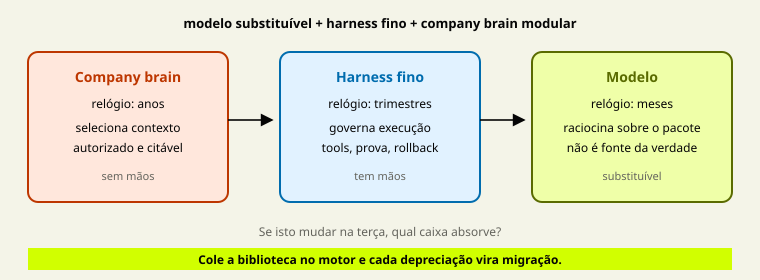

# Company Brain — Cérebro Digital Modular da Empresa

> Projetar e especificar o conhecimento institucional que alimenta agents — fora dos pesos do modelo, governado e citável.




Curso de aplicação para quem já opera o método AIOX e precisa do **cérebro digital modular da empresa**, não de mais um vector store nem de um vault de estudo.

**Aulas:** 18 · **Módulos:** 6 · **Quizzes:** 5 · **Questões:** 20 · **Leitura:** aulas densas; cada uma marca **núcleo obrigatório** e **aprofundamento**. Reserve uma sessão por núcleo; o resto é aprofundamento.

- [Avaliações](Assessments.md) · [Projeto integrador](Projeto-Integrador.md) · [Rubrica](Rubrica.md)
- [Fontes](FONTES.md) · [Proveniência](PROVENIENCIA.md) · [Glossário](Glossario.md)
- [Guia para agentes](AGENT-GUIDE.md)
- [Caso Atlas Assist](casos/atlas-assist.md) · [Norte Log](casos/norte-log.md) · [Templates](templates/README.md)
- [Ponte de entrada](ponte/entrada-de-agent-engineering.md)

## Para quem

- Quem concluiu o AIOX Advanced — ou prova o mesmo gate com método e evidência.
- Quem já opera agents e vê política velha, dump de corpus ou conhecimento preso no modelo.
- Recomendado: M1b e aula 21b em `cursos/AIOX-Agent-Engineering/`.

## Resultado

Especificação auditável de um company brain mínimo para um case real:

1. mapa dos seis módulos (job, autoridade, ritmo);
2. ledger de proveniência;
3. contrato de governança;
4. política de contexto e contrato brain↔harness;
5. veto ou justificativa de menor mecanismo;
6. rubrica de anti-padrões sem residual;
7. replay de mesa com quatro jogadas (claim autorizado, recusa de ACL, conflito ou buraco, feedback barrado).

O aluno entrega especificação, não cluster no ar.

## Não é

- Vault de estudo — `cursos/Obsidian-IA/`.
- Memória de uma capacidade no PRD — M1b em `cursos/AIOX-Agent-Engineering/`.
- Contrato de troca de modelo — aula 21b no mesmo curso.
- Tutorial de vendor, RAG em produção, preço ou infraestrutura mantida.

## Módulos

1. [M0 — Fundação](modulos/M0-fundacao-o-problema-e-a-tese.md) — aulas 01–03
2. [M1 — Anatomia](modulos/M1-anatomia-os-seis-modulos.md) — aulas 04–08
3. [M2 — Governança](modulos/M2-governanca-a-camada-de-confiabilidade.md) — aulas 09–12
4. [M3 — Interface](modulos/M3-interface-o-brain-alimentando-agents.md) — aulas 13–15
5. [M4 — Menor brain e anti-padrões](modulos/M4-menor-brain-e-anti-padroes.md) — aulas 16–17
6. [M5 — Projeto integrador](modulos/M5-projeto-integrador.md) — aula 18

## Sequência

```text
sintoma → relógio → promessa → fontes → claims → procedural → episódico
→ projeção → ACL → validade → conflito → ciclo de vida
→ política de contexto → contrato brain↔harness → gate de escrita
→ menor mecanismo → anti-padrões → especificação
```

### M0

1. [A empresa que vive nos pesos](aulas/01-empresa-vive-nos-pesos.md)
2. [A tese dos três relógios](aulas/02-tres-relogios.md)
3. [O que o brain entrega](aulas/03-o-que-o-brain-entrega.md)

### M1

4. [Fontes canônicas](aulas/04-fontes-canonicas.md)
5. [Fatos e sínteses com proveniência](aulas/05-fatos-e-sinteses.md)
6. [Memória procedural](aulas/06-memoria-procedural.md)
7. [Memória episódica](aulas/07-memoria-episodica.md)
8. [Projeções recuperáveis](aulas/08-projecoes-recuperaveis.md)

### M2

9. [ACL e autoridade](aulas/09-acl-e-autoridade.md)
10. [Validade e supersessão](aulas/10-validade-e-supersessao.md)
11. [Conflito e proveniência](aulas/11-conflito-e-proveniencia.md)
12. [Ciclo de vida](aulas/12-ciclo-de-vida.md)

### M3

13. [Política de contexto](aulas/13-politica-de-contexto.md)
14. [Contrato brain↔harness](aulas/14-contrato-brain-harness.md)
15. [Aprendizado de volta](aulas/15-aprendizado-de-volta.md)

### M4–M5

16. [O menor brain suficiente](aulas/16-menor-brain-suficiente.md)
17. [Anti-padrões](aulas/17-antipadroes-do-company-brain.md)
18. [Projeto integrador](aulas/18-projeto-integrador.md)

## Como estudar

1. Traga um case real. Use [Atlas Assist](casos/atlas-assist.md) só como treino declarado. [Norte Log](casos/norte-log.md) prova transferência sem memorizar IDs da Atlas.
2. Leia o **mapa visual** e a figura SVG da aula **antes** do texto longo — cada figura responde uma pergunta.
3. Preencha o template da aula **antes** de pedir crítica ao agente.
4. Não escolha vendor, índice nem fine-tune no lugar do mecanismo.
5. Feche cada módulo no quiz. Feche o curso na [rubrica](Rubrica.md).

Entre cursos, paths monoespaçados apontam para o hub: `cursos/README.md`.
