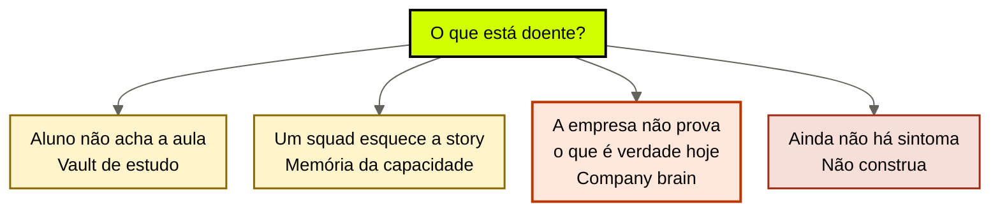
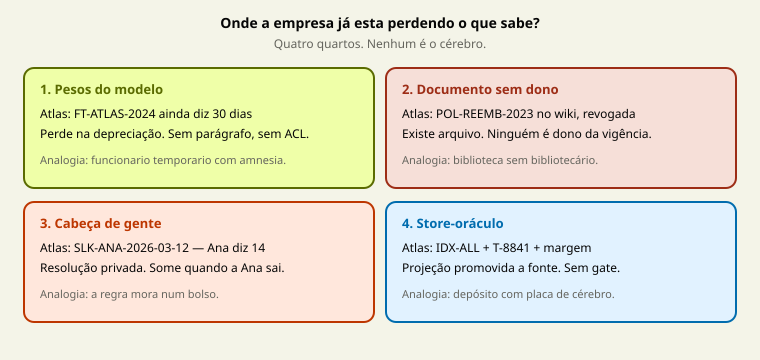
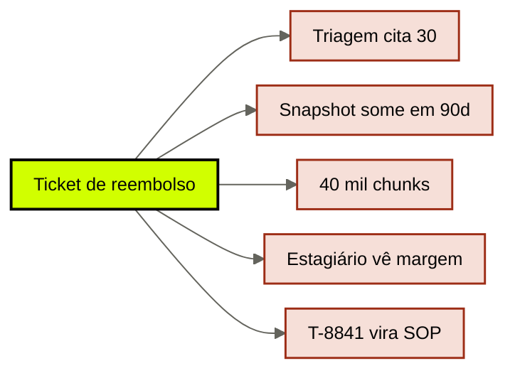

# A empresa que vive nos pesos

[↑ M0](../modulos/M0-fundacao-o-problema-e-a-tese.md) · [Curso](../README.md)

Caso de ensino: [Atlas Assist](../casos/atlas-assist.md). Transferência sem o vocabulário da Atlas: [Norte Log](../casos/norte-log.md). Fonte: [01](../sources/01-tese-company-brain.md). Termos: [Glossário](../Glossario.md).

## Resultado

Você sai com um **diagnóstico de sintoma** do seu case: onde o conhecimento institucional vive hoje, qual dos três “cérebros” você está curando por engano, e qual teste prova que o sintoma é da empresa — não da sessão, nem do vault de estudo.

```text
case:
outcome_observavel:
vive_hoje: {pesos | documentos_sem_dono | cabeca_de_gente | store_unico}
mecanismo_da_perda:
nao_e: {aiox-brain | memoria-da-capacidade | vector-oracle}
proximo_teste:
```

Se a conclusão for “vamos instalar um cérebro”, a aula falhou. O primeiro trabalho é nomear o lugar onde a empresa já está perdendo o que sabe — e o mecanismo dessa perda.

## Mapa visual

Decisão-chave — O que está doente?



> Leia o diagrama antes do texto longo. Depois volte e confira.

> O modelo é um **funcionário temporário com amnésia institucional**. Se a empresa só existe na cabeça dele, ela some na próxima deprecação.



**Objetivos**

- Distinguir vault de estudo, memória de uma capacidade e company brain por sintoma, não por marketing. _(analyze)_
- Explicar o mecanismo pelo qual conhecimento nos pesos, em documento sem dono, em pessoa ou em store único se perde. _(understand)_
- Diagnosticar um case real sem propor ferramenta. _(apply)_
- Recusar o desenho quando o sintoma ainda não é institucional. _(evaluate)_

**Núcleo obrigatório:** Resultado, mapa visual, seções 1–3, Prática e Evidência.
**Aprofundamento:** seções seguintes, papers, fronteira com Agent Engineering, teste de recuperação.

---

## 1. Terça-feira na Atlas

A Atlas Assist vende automação de suporte. Três agents já rodam. Na terça acontecem cinco coisas no mesmo dia. Nenhuma delas é “o modelo ficou burro”.

1. Um cliente pede reembolso. A **triagem** cita a política de 30 dias. O jurídico revogou isso em março. O wiki ainda diz 30. O GPT interno, fine-tunado em 2024, ainda diz 30. A líder jurídica, no Slack, já opera 14.
2. O provider anuncia: o snapshot do GPT interno some em 90 dias. O time comercial entra em pânico porque “é lá que está o jeito de vender da Atlas”.
3. A triagem manda ~40 mil chunks em todo ticket “para não perder contexto”. Um trecho de um contrato antigo, no meio do prompt, vence a política nova.
4. Um estagiário vê, no rascunho da **proposta**, a margem interna de um cliente. Ele não deveria ter acesso.
5. Alguém cola no vector store o transcript de um ticket mal fechado. No dia seguinte a triagem trata aquele erro como política.

O outcome que a Atlas precisa é observável: ticket com política **vigente**, proposta **sem dado que o autor não pode ver**, exceção de SLA **com fonte**. Hoje a empresa não consegue provar nenhum dos três.



Cinco falhas, um dia, **zero** “o modelo ficou burro”. Cada seta aponta um habitat — a figura acima nomeia o quarto.

Se o seu case não tem um outcome desses, não force. Esta aula não começa por arquitetura. Começa pelo lugar da perda.

---

## 2. Três coisas chamadas de cérebro

Este acervo já tem dois “cérebros”. Nenhum é o objeto deste curso.

| Nome | Dono | Pergunta | Falha típica | Curso |
|------|------|----------|--------------|-------|
| Vault de estudo | o aluno | “Onde anoto o que estudei?” | aula órfã, nota sem link | `cursos/Obsidian-IA/` |
| Memória da capacidade | um workload | “O que este agent precisa lembrar para fechar a story?” | compactação apaga o mapa da sessão | M1b em `cursos/AIOX-Agent-Engineering/` |
| **Company brain** | a empresa | “O que é verdade, válido, autorizado e citável para qualquer agent?” | política velha, dump, vazamento, deprecação | este curso |

A confusão não é semântica. Ela escolhe a cirurgia errada.

- Curar o vault quando o jurídico e o comercial discordam não muda a política do agent.
- Acrescentar um ledger de sessão no squad de triagem não impede o estagiário de ver margem.
- Fine-tunar de novo o GPT interno “com a política nova” devolve a empresa aos pesos: daqui a 90 dias o pânico se repete.

O teste prático: **quantos agents, times ou domínios dependem da mesma verdade?** Se a resposta for um workload só, você ainda está no M1b. Se a resposta for “a empresa”, você está aqui.

---

## 3. O mecanismo: paramétrico vs recuperável

[Lewis et al., 2020](https://arxiv.org/abs/2005.11401) separam dois tipos de memória. A distinção importa porque cada uma falha de um jeito.

**Memória paramétrica** é o que ficou nos pesos. Atualizar custa treino ou um snapshot novo. Inspecionar é opaco: você não aponta o parágrafo que o modelo “sabe”. Revogar é caro: o fato velho continua influenciando até o próximo treino. Na Atlas, o fine-tune de 2024 é memória paramétrica da política de 30 dias. A deprecação do snapshot não é um incidente de infra. É a empresa descobrindo que o comercial mora num arquivo que ela não controla.

**Memória recuperável** é o que se busca e se edita: documento, ledger, índice. Em tese, você troca a página e o próximo retrieve já vê o novo. Na prática, a Atlas tem wiki, Slack e vector store — e mesmo assim a triagem cita 30 dias. Recuperável sem dono, validade e citação **não é brain**. É depósito.

O paper de RAG não define company brain. Ele só autoriza a frase operacional desta aula: *o conhecimento que a empresa precisa atualizar, auditar e revogar não pode viver principalmente nos pesos*.

CoALA ([Sumers et al., 2023](https://arxiv.org/abs/2309.02427)) vai um passo além: o language model é uma peça dentro de uma arquitetura com memória de trabalho, episódica, semântica e procedural. A sessão do agent é memória de trabalho. O histórico de um squad é, no máximo, episódico de uma capacidade. O company brain é a versão **institucional** desses jobs: a mesma política precisa servir à triagem, à proposta e ao compliance, com identidade, tempo e permissão.

Limite da tese: um protótipo de um agent, reversível, pode viver um mês com prompt e três arquivos. Isso não autoriza fine-tune como estratégia da empresa. Autoriza não construir plataforma cedo. O veto vem na aula 16; o diagnóstico já precisa enxergar a diferença.

---

## 4. Quatro habitats da perda

Na Atlas — e na maior parte dos cases — o conhecimento institucional está em algum destes quatro lugares. Nenhum é company brain. Cada um tem um mecanismo de perda.

### 4.1 Pesos do modelo

Sintoma: “o modelo já sabe como a gente vende”, “não precisa de documento, está no GPT interno”.

Mecanismo: o fato virou estatística. Não há parágrafo para citar, data para expirar nem ACL para aplicar. Trocar o snapshot, o provider ou o adapter muda o comportamento sem migrar um ledger — porque não há ledger.

O que sobrevive a uma deprecação? Nada que só estava nos pesos. Por isso a aula 21b em `cursos/AIOX-Agent-Engineering/` trata o modelo como camada volátil. Aqui o recorte é outro: **o que a empresa acreditou ter guardado no motor**.

### 4.2 Documentos sem dono

Sintoma: wiki, pasta, PDF, ticket. “Está documentado.”

Mecanismo: o arquivo existe, mas ninguém é dono da vigência. Duas páginas dizem coisas diferentes. A busca devolve as duas. O agent escolhe pela posição no contexto, não pela autoridade. Na Atlas, o wiki de 30 dias não é mentira antiga: é verdade **sem supersessão**.

Documento sem dono é pior que ausência. Dá a impressão de prova.

### 4.3 Cabeça de gente

Sintoma: “pergunta para a Ana do jurídico.” A decisão real está no Slack, numa call, numa exceção que nunca virou página.

Mecanismo: o conflito foi resolvido uma vez, em privado. O agent não vê a resolução. Quando a Ana sai, a resolução sai. Quando o agent improvisa, a resolução é sobrescrita sem rastro.

Isso não se resolve com “vamos gravar as calls no índice”. Gravar sem classificar vira o habitat 4.

### 4.4 Store único tratado como oráculo

Sintoma: “já temos RAG”, “indexamos o Drive”, “o grafo sabe”.

Mecanismo: uma projeção (lexical, vetorial ou grafo) foi promovida a fonte. Ela não guarda validade. Não aplica ACL antes do retrieve. Não distingue SOP de transcript de falha. Na Atlas, o ticket mal fechado vira política no dia seguinte porque o store não tem gate de escrita.

O M1 vai separar fonte, claim, procedural, episódico e projeção. Nesta aula basta a recusa: **índice não é cérebro**.

---

## 5. Auditoria: “já temos um cérebro”

Antes de desenhar, passe o case por estas quatro frases. Se alguma for verdadeira e você ainda assim quiser “instalar o brain”, você está comprando produto para um job que já falhou.

| Frase que a Atlas diria | O que ela está confessando | Cirurgia errada |
|-------------------------|----------------------------|-----------------|
| “O GPT interno conhece a empresa” | memória paramétrica sem proveniência | fine-tune novo |
| “Está no wiki” | documento sem dono de vigência | mais páginas |
| “A Ana sabe” | resolução fora do sistema | gravar a Ana |
| “O vector store cobre tudo” | projeção sem governança | índice maior |

A cirurgia certa, neste ponto, ainda não é módulo. É o diagnóstico: *qual habitat produz o sintoma que o outcome não tolera?*

Na Atlas:

- 30 vs 14 dias → documentos sem dono **e** pesos **e** cabeça de gente, ao mesmo tempo. Três habitats, um claim.
- Deprecação em 90 dias → pesos.
- 40 mil chunks → store único + ausência de recorte (aula 03).
- Margem no rascunho → store único sem ACL.
- Transcript virando política → store único sem gate de escrita.

Um case real quase nunca tem um habitat só. O diagnóstico nomeia o **dominante** e o **que não pode ser curado na camada errada**. Fine-tunar de novo não resolve ACL. Indexar o Slack da Ana não resolve supersessão. Criar um vault Obsidian para o time de produto não resolve nenhum dos cinco.

---

## 6. Sintoma institucional vs os outros dois

Use a tabela quando o pedido chegar misturado.

| Se a pessoa diz | Pergunte | Se a resposta for… | Rota |
|-----------------|----------|--------------------|------|
| “O agent esquece o que fez ontem” | Isso acontece numa sessão / numa story? | sim, um workload | M1b, não aqui |
| “Não acho a aula / a nota” | Isso é estudo ou operação? | estudo | `cursos/Obsidian-IA/` |
| “Cada agent responde uma política” | A verdade deveria ser a mesma para todos? | sim | este curso |
| “Vamos ter RAG” | Qual sintoma o RAG cura? | nenhum nomeado | veto |
| “O modelo novo é pior nas regras da empresa” | As regras estão nos pesos ou numa fonte? | pesos | este curso + 21b |

Sinal forte de company brain: **mais de um chamador precisa da mesma afirmação, e hoje nenhum deles consegue apontar a prova vigente.**

Sinal fraco, que não basta: “queremos memória”, “queremos um grafo”, “o CEO pediu um cérebro”.

---

## Quando usar — e quando não usar

**Use quando** dois ou mais agents, times ou domínios dependem da mesma verdade institucional, e essa verdade hoje vive em pesos, documento sem dono, pessoa ou store-oráculo.

**Não use quando** o problema é achar aula, compactar sessão, ou vontade de ter a stack do momento. Sem outcome observável, o menor mecanismo é não construir. A aula 16 formaliza o veto; esta aula já deve produzi-lo se o case não tiver sintoma.

Limite: um único agent, um único time, um único documento versionado com dono pode ser “arquivo suficiente”. Isso é vitória. Não é atraso.

---

## Teste de recuperação

Classifique antes de abrir o gabarito. Use Atlas ou o seu case.

1. O agent de um squad perde o mapa da wave depois da compactação.
2. O aluno não encontra a nota da aula 21b no Graph.
3. Três agents citam três versões da mesma política.
4. O comercial diz que “o jeito Atlas” está no fine-tune e o snapshot vai morrer.
5. O índice devolve um transcript de falha como se fosse SOP.
6. Você quer Pinecone porque “toda empresa séria tem RAG”.

<details>
<summary>Gabarito comentado</summary>

1. **Memória da capacidade.** M1b / aula 20b em Agent Engineering. Não é company brain.
2. **Vault de estudo.** `cursos/Obsidian-IA/`. Não é company brain.
3. **Company brain.** Mesma verdade, vários chamadores, sem prova vigente.
4. **Company brain (habitat: pesos)** + contrato de substituição na 21b. O pânico é institucional.
5. **Company brain (habitat: store-oráculo).** Falta gate de escrita e distinção procedural vs episódico.
6. **Veto.** Ferramenta sem sintoma. A aula falhou se esta for a sua próxima ação.

</details>

---

## Prática

Escolha um case real. Se ainda não tiver, use a Atlas como treino e declare isso. Preencha o [diagnóstico de sintoma](../templates/diagnostico-de-sintoma.md).

Faça a prática sem o agente. Depois peça crítica.

**Funcionou se:**

- o outcome é observável (não “melhorar o conhecimento”);
- você nomeou o habitat dominante e o mecanismo da perda — não só a ferramenta visível;
- recusou pelo menos um vizinho (vault, memória de capacidade, vector-oracle);
- o próximo teste cabe em uma frase e não é “comprar índice”.

## Pergunte ao seu agente

```text
Contexto: case real (ou Atlas Assist) com agents que já rodam ou vão rodar.
Pedido: classifique o que estou chamando de cérebro entre vault de estudo, memória de uma capacidade e company brain. Para cada habitat (pesos, documento sem dono, cabeça, store-oráculo) diga se aparece no case e qual é o mecanismo da perda. Não proponha ferramenta.
Evidência que espero: o YAML do diagnóstico preenchido, com mecanismo_da_perda em linguagem própria.
```

## Evidência de conclusão

Você passou quando consegue, em voz própria, sem ler a tabela:

1. explicar por que memória paramétrica não aceita revogação barata;
2. mostrar no seu case um documento que *parece* prova e não é;
3. separar um sintoma de sessão de um sintoma da empresa;
4. escrever o próximo teste sem nome de vendor.

A [aula 02](02-tres-relogios.md) pega esse diagnóstico e pergunta qual relógio deve absorver a próxima mudança.

## Navegação

[↑ M0](../modulos/M0-fundacao-o-problema-e-a-tese.md) · [↑ Curso](../README.md) · [Próxima →](02-tres-relogios.md)
