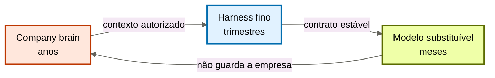
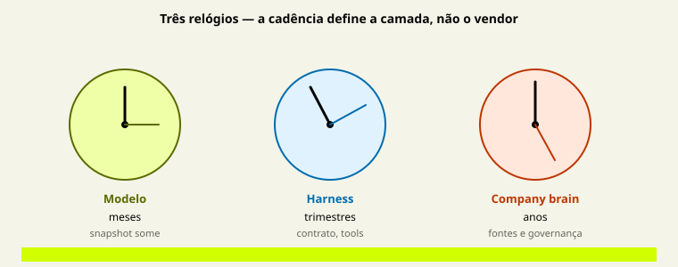

# A tese dos três relógios

[↑ M0](../modulos/M0-fundacao-o-problema-e-a-tese.md) · [Curso](../README.md)

Caso: [Atlas Assist](../casos/atlas-assist.md). Diagnóstico da [aula 01](01-empresa-vive-nos-pesos.md). Fonte: [01](../sources/01-tese-company-brain.md). Termos: [Glossário](../Glossario.md).


Esta é a âncora da aula e do curso. Três camadas, três relógios. Nada aqui é produto. Tudo aqui é cadência de mudança.

## Resultado

Você classifica a próxima mudança do case numa camada só, nomeia o que **não** pode viajar com ela, e aponta o acoplamento mais caro se a classificação estiver errada.

```text
workload:
proxima_mudanca:
camada_que_absorve: {modelo | harness | brain | routing}
o_que_nao_viaja:
acoplamento_se_errar:
recusa:
```

Esta aula não ensina a trocar de modelo. O contrato de substituição — adapter, eval, shadow, canary — já existe em `cursos/AIOX-Agent-Engineering/aulas/21b-modelos-substituiveis-harness-fino-cerebro-modular.md`. Aqui o relógio vira instrumento de **desenho do brain**: o que a empresa precisa possuir para sobreviver à troca que a 21b já sabe governar.

## Mapa visual

Decisão-chave — Se isso mudar na terça, qual relógio absorve?



> Leia o diagrama antes do texto longo. Depois volte e confira.

> **Motor, chassis e biblioteca viva.** Cole a biblioteca no motor e cada troca de snapshot vira migração da empresa.



**Objetivos**

- Explicar por que cadência, e não vendor, define a camada. _(understand)_
- Classificar uma mudança real sem mandar conhecimento para o modelo nem autoridade para o brain. _(apply)_
- Detectar acoplamento: uma mudança que obriga as três camadas a se mover juntas. _(analyze)_
- Recusar fine-tune, dump e “API compatível basta” como resposta-padrão. _(evaluate)_

**Núcleo obrigatório:** Resultado, mapa visual, seções 1–3, Prática e Evidência.
**Aprofundamento:** seções seguintes, papers, fronteira com Agent Engineering, teste de recuperação.

---

## 1. Por que relógio, não produto

A tentação é desenhar três caixas no Miro e pôr nomes: Claude, LangGraph, Pinecone. Isso não é arquitetura. É shopping.

O critério útil é **o que muda em ritmos diferentes**.

| Camada | Relógio | Por que esse relógio | O que explode se você mentir o relógio |
|--------|---------|----------------------|----------------------------------------|
| Modelo substituível | meses | snapshot, preço, capability e deprecação se movem neste prazo | a política da empresa some com o identificador |
| Harness fino | trimestres | contrato, tools, budget e prova mudam quando a operação muda — não quando o leaderboard muda | cada modelo novo ganha um segundo cérebro de regras frágeis |
| Company brain | anos | fontes, claims e governança deveriam acumular através de times e de motores | cada troca de ferramenta vira migração de memória |

“Meses / trimestres / anos” não é lei física. É ordem de grandeza. Um provider pode aposentar um modelo em seis semanas. Uma política jurídica pode viver três anos. O ponto é a **assimetria**: se você guardar o relógio lento no relógio rápido, a empresa inteira passa a ter a meia-vida do snapshot.

A aula 21b do Agent Engineering (`cursos/AIOX-Agent-Engineering/aulas/21b-modelos-substituiveis-harness-fino-cerebro-modular.md`) usa o AI Index e as páginas de deprecação para provar que o motor é volátil. Não repita esses números aqui como se fossem a aula. Use-os só como premissa: **o nome físico do modelo não pode ser o lugar da verdade**.

---

## 2. O que cada relógio possui — e o preço do roubo

### 2.1 Modelo: raciocínio para uma classe de tarefa

Possui: capacidade de planejar, escrever, escolher tool, obedecer a um schema, dentro do que o eval da rota aceita.

Não possui: o fato de que o reembolso da Atlas é 14 dias. Não possui a margem do cliente. Não possui a SOP de exceção de SLA.

Roubo típico: fine-tune “com o jeito Atlas”. O jeito vira peso. O relógio do jeito cai de anos para meses. Na terça da aula 01, o comercial entra em pânico porque alguém colou a biblioteca no motor.

### 2.2 Harness: governança da execução

Possui: contrato de entrada e saída, auth, ACL de *ação*, tools, timeout, budget, idempotência, prova de outcome no ambiente, fallback, rollback.

Não possui: o texto da política. Se o harness começar a ter `if reembolso > 14` hardcoded, ele vira um segundo modelo — opaco para eval, invisível para o jurídico, eterno depois que o modelo já saberia ler a política recuperada.

[Anthropic, harness de apps longos](https://www.anthropic.com/engineering/harness-design-long-running-apps) documenta o inverso útil: scaffolding que compensava limitação do modelo deve poder morrer. O que não pode morrer é invariante. Autoridade de pagar, cap de tool, verificação de ticket fechado — isso é harness. “O reembolso é 14 dias” — isso é brain.

[Decoupling the brain from the hands](https://www.anthropic.com/engineering/managed-agents) separa raciocínio, ambiente e sessão. A lição para esta aula: o brain **entrega contexto**; o harness **autoriza efeito**. Se o brain puder disparar reembolso, você uniu os relógios.

### 2.3 Company brain: o que deve acumular

Possui: fontes, claims com proveniência, procedimentos aprovados, episódios com identidade e tempo, projeções reconstruíveis, governança.

Não possui: autoridade global (“lê tudo”), nem um store único, nem o direito de completar lacuna com o modelo.

Roubo típico: “o brain decide”. Não. O brain cita. Quem decide um efeito no mundo é o harness, eventualmente com um humano. Quem raciocina sobre a citação é o modelo.

---

## 3. A terça da Atlas, agora com relógio

Pegue os cinco eventos da aula 01 e force uma camada. Se você precisar de duas, declare a primária.

| Evento | Primária | O que NÃO viaja | Se errar |
|--------|----------|-----------------|----------|
| Snapshot do GPT interno morre em 90 dias | modelo + adapter | a política de 14 dias, as SOPs, o histórico de exceções | fine-tune de emergência; a empresa migra de novo no próximo snapshot |
| Ticket cita 30 dias, jurídico já opera 14 | brain | o nome do modelo; o parser do harness | “vamos avisar o modelo no system prompt” — some na compactação e no próximo vendor |
| Triagem manda 40 mil chunks | brain + harness | a ideia de que “mais contexto = mais verdade” | janela maior; Lost in the Middle continua; o custo vira hábito |
| Estagiário vê margem | brain (ACL de leitura) + harness (least privilege da tool) | “o modelo foi indiscreto” como causa raiz | filtro de output; o próximo retrieve vaza de novo |
| Transcript de falha vira política | brain (gate de escrita) | “vamos treinar com os erros” | o modelo aprende o erro; o store amplifica o erro |

Três padrões aparecem.

**Padrão A — fato no motor.** Qualquer verdade que precisa sobreviver a deprecação e a troca de time não pode entrar no modelo como fonte. Pode entrar como *uso* naquela execução, via projeção.

**Padrão B — regra no chassis.** Qualquer verdade que muda com o negócio (política, preço, SOP) não pode virar `if` eterno no harness. O harness guarda o *direito de agir*, não o *conteúdo da regra*.

**Padrão C — efeito no bibliotecário.** Qualquer coisa que mexe no mundo (pagar, fechar ticket, mandar e-mail) não pode ser “o brain decidiu”. O brain não tem mãos. [Managed agents](https://www.anthropic.com/engineering/managed-agents) existe exatamente para essa fronteira.

---

## 4. Acoplamento: o relógio que mente

O desenho falhou quando **uma mudança obrigatória força as três camadas a se moverem juntas**.

Exemplos de acoplamento caro:

- A política vive no prompt do modelo A. Trocar para o modelo B exige reescrever o prompt, retestar o harness e “reindexar” porque alguém colou o mesmo texto no store. Três relógios, um fato.
- O harness tem 200 regras que duplicam o wiki. O wiki muda. Ninguém muda as regras. Os evals passam no texto do agent e falham no mundo.
- O vector store é a única cópia da SOP. Reconstruir o índice exige a SOP. A SOP *é* o índice. Não há fonte. Não há brain. Há um único ponto de falha com marketing de RAG.

Teste de acoplamento no seu case:

```text
Se o provider aposentar o modelo na sexta,
quais documentos, regras e índices eu sou obrigado a tocar?
```

Se a resposta for “quase tudo”, você não tem três camadas. Tem um monolith com três nomes.

Limite honesto: no começo, um arquivo versionado pode servir de brain **e** de fonte. Isso ainda é um relógio só — o lento — e está certo. Acoplamento ruim é o relógio lento soldado ao rápido, não a pobreza inicial.

---

## 5. O que esta aula não refaz

| Já resolvido na 21b | Dono daquela aula | O que esta aula acrescenta |
|---------------------|-------------------|----------------------------|
| Adapter ≠ equivalência | eval e capability | o brain não participa da promoção do modelo |
| Thin harness = invariantes, não scaffolding cognitivo | plano de controle | o brain não herda autoridade de tool |
| Gate de substituição | shadow, canary, rollback | o que deve estar *fora* do alias para o gate ser possível |
| Três falsas equivalências | substituível, thin, brain | o relógio como teste operacional do seu case |

Se você ainda não leu a 21b, leia o mapa de camadas e o contrato de substituição lá. Não copie o YAML de eval para o diagnóstico do brain. Routing, temperature e leaderboard continuam no Agent Engineering.

MCP ([spec de tools, 2026-07-28](https://modelcontextprotocol.io/specification/2026-07-28/server/tools)) também não resolve o relógio. Padroniza descoberta e invocação. Não padroniza memória, loop, eval nem ACL institucional. Protocolo reduz cola. Não cria company brain.

---

## 6. Protocolo: classificar a próxima mudança

Use o diagnóstico da aula 01. Escolha **uma** mudança dos próximos 90 dias. Percorra nesta ordem. Pare na primeira que couber.

1. **O identificador do modelo, o provider ou a capability da rota mudam?** → modelo / adapter / routing. O brain não se move. O harness só se move se o contrato de I/O quebrar.
2. **Uma tool passa a ter efeito que antes não tinha, ou um cap/approval some?** → harness. O brain não ganha mão. O modelo não ganha autoridade.
3. **Uma afirmação sobre o mundo da empresa muda (política, preço, SOP, organograma, precedente)?** → brain. System prompt não é supersessão.
4. **O mesmo fato precisa ser visto por mais de um agent e hoje cada um tem uma cópia?** → brain. Não “um prompt compartilhado”.
5. **Nenhuma das anteriores, só vontade de ferramenta?** → recusa. Volte à aula 01.

Registre o que **não viaja**. Essa linha é a evidência. Sem ela, a classificação é opinião.

---

## Quando usar — e quando não usar

**Use quando** precisar decidir se um incidente é de conhecimento, de governança da execução ou de fitness do modelo — antes de abrir ticket em três times.

**Não use quando** estiver escolhendo embedding, chunk, vendor ou framework. Isso é implementação de projeção (aula 08) ou de harness (Agent Engineering). O relógio não se mede em QPS.

Limite da metáfora: operações reguladas podem exigir harness mais explícito do que “thin” sugere. Capability exclusiva pode justificar lock-in consciente, com dívida de saída. Nenhum dos dois autoriza guardar a política no identificador do modelo.

---

## Teste de recuperação

Classifique a mudança. Nomeie o que não viaja.

1. O jurídico publica a política de 14 dias. O wiki e o fine-tune ainda dizem 30.
2. O agent de proposta chama a tool de desconto sem teto.
3. Um modelo menor acerta triagem L1 e falha em cláusulas de indenização.
4. O provider troca o nome do snapshot. Nada mais muda no negócio.
5. Você adiciona 80 `if` no harness para “o modelo não errar a política”.
6. Dois agents precisam do mesmo precedente de exceção; cada um tem um PDF diferente.

<details>
<summary>Gabarito comentado</summary>

1. **Brain.** Supersessão. O que não viaja: o snapshot, o parser. System prompt é paliativo.
2. **Harness.** Autoridade e cap. O que não viaja: o texto da política de desconto — esse texto, se existir, é brain; o direito de aplicar é harness.
3. **Routing.** Fitness por classe de tarefa. Não é “cérebro novo”.
4. **Modelo + adapter.** O que não viaja: claims, SOP, ACL, índices reconstruíveis.
5. **Roubo de relógio.** Você está colocando o lento no chassis. Volte o conteúdo ao brain; deixe no harness só o invariante.
6. **Brain.** Uma fonte canônica, um claim, um conflito explícito se ainda houver dois PDFs.

</details>

---

## Prática

No mesmo case da aula 01, preencha o [mapa de camadas](../templates/mapa-de-camadas.md).

**Funcionou se:**

- cada camada tem um exemplo do case, não uma definição;
- a próxima mudança nomeia uma primária e o que não viaja;
- o teste de acoplamento (“se o modelo morrer na sexta…”) tem resposta escrita;
- você recusou fine-tune, dump ou “API compatível basta” com uma frase.

## Pergunte ao seu agente

```text
Contexto: diagnóstico da aula 01 e uma mudança prevista em 90 dias.
Pedido: classifique no protocolo da aula 02 (cinco perguntas, na ordem). Diga o que NÃO viaja. Aponte o acoplamento se a Atlas (ou o meu case) guardar esse fato no lugar errado.
Evidência que espero: YAML do mapa de camadas + uma frase de recusa. Sem vendor.
```

## Evidência de conclusão

Você passou quando consegue:

1. recitar a âncora — modelo substituível + harness fino + company brain modular — e dizer o relógio de cada termo;
2. explicar por que regra de negócio no harness é roubo, não “determinismo”;
3. mostrar no case um acoplamento (uma mudança, três camadas);
4. classificar a próxima mudança sem abrir o gabarito.

A [aula 03](03-o-que-o-brain-entrega.md) fecha o M0: o que o relógio lento entrega numa execução — e o que recusa.

## Navegação

[← Anterior](01-empresa-vive-nos-pesos.md) · [↑ M0](../modulos/M0-fundacao-o-problema-e-a-tese.md) · [↑ Curso](../README.md) · [Próxima →](03-o-que-o-brain-entrega.md)
