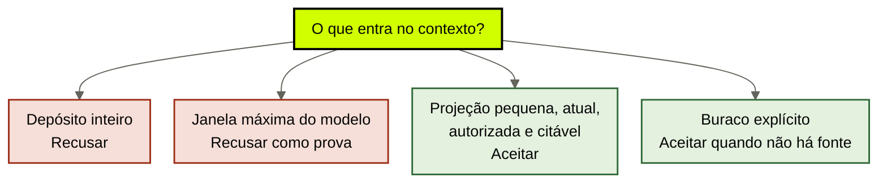
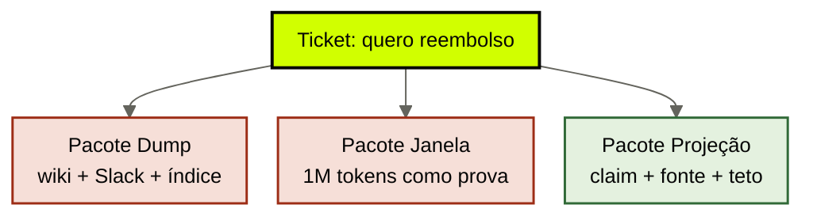

# O que o brain entrega

[↑ M0](../modulos/M0-fundacao-o-problema-e-a-tese.md) · [Curso](../README.md)

Caso: [Atlas Assist](../casos/atlas-assist.md). Relógios da [aula 02](02-tres-relogios.md). Fonte: [01](../sources/01-tese-company-brain.md). Termos: [Glossário](../Glossario.md).

O brain não é um arquivo que se anexa. É um **bibliotecário com recusa**: entrega o volume certo e diz não ao depósito.

## Resultado

Você escreve a **promessa do brain** para um workload: o pacote que entra no harness nesta execução, o critério de corte, o claim citável de exemplo e as três recusas que o depósito sempre tenta violar.

```text
promessa:
  entrega: pequena + atual + autorizada + citavel
  pacote_desta_execucao:
  corte:
  claim_exemplo: {afirmacao, fonte, trecho, data}
  recusa: [dump, janela_como_prova, claim_sem_fonte]
  se_nao_souber:
```

Se a frase final for “o agent recebe o conhecimento da empresa”, a aula falhou. Conhecimento sem recorte é depósito. Depósito no prompt é o habitat 4 da aula 01 com um nome mais educado.

## Mapa visual

Decisão-chave — O que entra no contexto desta execução?



> Leia o diagrama antes do texto longo. Depois volte e confira.


**Objetivos**

- Explicar cada adjetivo da promessa como recusa operacional, não como slogan. _(understand)_
- Montar, no papel, o pipeline query → filtro → ACL → projeção → teto para um ticket real. _(apply)_
- Distinguir o que os papers de contexto longo mostram do que eles não autorizam. _(evaluate)_
- Escolher o que o brain devolve quando não sabe — sem completar com o modelo. _(analyze)_

**Núcleo obrigatório:** Resultado, mapa visual, seções 1–3, Prática e Evidência.
**Aprofundamento:** seções seguintes, papers, fronteira com Agent Engineering, teste de recuperação.

---

## 1. Três pacotes para o mesmo ticket

Cliente da Atlas pede reembolso. A triagem precisa classificar e responder. Três times propõem três pacotes. Só um é company brain.



**Pacote Dump.** “Manda o wiki, o Drive, o Slack da Ana e o índice inteiro. O modelo é inteligente.” Resultado na terça: o trecho de 30 dias, no meio do prompt, vence a nota da Ana. O estagiário, se estiver no mesmo retrieve, vê margem. Custo vira hábito. Ninguém sabe qual parágrafo foi usado.

**Pacote Janela.** “O modelo novo tem 1M de tokens. Cabe tudo. Lost in the Middle é paper velho.” Resultado: cabe. Não é usado com a mesma fidelidade. ACL continua tarde. O claim continua sem fonte. Você comprou capacidade nominal e chamou isso de curadoria.

**Pacote Projeção.** Query = “política de reembolso vigente para este produto, este canal, esta data”. Filtro = tipo `politica`, produto X, não-revogado. ACL = o chamador da triagem pode ler política pública, não margem. Teto = 2 páginas ou N tokens, o que for menor. Saída = claim + trecho + fonte + data. Se as três fontes (wiki, fine-tune, Slack) divergem, o brain **não escolhe em silêncio**: devolve o conflito.

O restante desta aula é o mecanismo do terceiro pacote.

---

## 2. Quatro adjetivos, quatro falhas

A tese ([fonte 01](../sources/01-tese-company-brain.md)) resume a entrega em quatro palavras. Cada uma existe porque um atalho específico já quebrou um outcome.

### 2.1 Pequena

Significa: só o que este workload precisa **agora**. Não o que a empresa sabe. Não o que o índice contém. Não o que “pode ser útil”.

Falha se faltar: o modelo interpola. Interpolação sem fonte é devolver a empresa aos pesos.

Falha se sobrar: o trecho errado ganha posição. [Lost in the Middle](https://arxiv.org/abs/2307.03172) mede exatamente isso — a informação no meio do contexto é usada pior do que no começo ou no fim, em tarefas de recuperação. O paper não diz “nunca use contexto longo”. Diz que **mais texto não é mais uso**.

Na Atlas, 40 mil chunks não são generosidade. São uma aposta de que o modelo fará o trabalho que o brain recusou: selecionar.

### 2.2 Atual

Significa: vigente no instante da execução. “Atual” não é “o documento mais recente no índice”. É o claim que sobreviveu a supersessão.

Falha clássica: o wiki de março (30 dias) tem embedding mais “limpo” que o Slack da Ana (14 dias). O retrieve prefere o wiki. O agent está atualizado em relação ao índice e atrasado em relação à empresa.

Atual obriga a um metadado que o dump não tem: **validade**. Sem ele, “recente” é um acidente de crawl.

### 2.3 Autorizada

Significa: o chamador tem direito de ver. A ACL acontece **antes** do retrieve, não como pedido educado no prompt.

Falha clássica na Atlas: a proposta e a triagem compartilham o mesmo índice. A margem está no mesmo store. O estagiário é um chamador da proposta. O modelo “não deveria” citar margem. Cita. Filtrar o output é teatro: o dado já atravessou a fronteira.

Autorizada também limita o harness. Least privilege da tool é irmão da ACL do brain. Os dois relógios colaboram; nenhum substitui o outro. A [NSA, considerações de segurança em MCP](https://media.defense.gov/2026/Jun/02/2003943289/-1/-1/0/CSI_MCP_SECURITY.PDF), discute injeção, envenenamento de tool e exfiltração. O ponto útil aqui não é o protocolo. É que **dado a mais no contexto é superfície**. Thin harness sem ACL no retrieve não é thin. É ingênuo.

### 2.4 Citável

Significa: claim → trecho → fonte → data. Sem essa cadeia, a resposta pode estar certa e ainda assim ser inútil para o compliance da Atlas.

“O modelo já sabia” não é citação. “Está no índice” não é citação. “A Ana disse” só vira citação se o episódio tiver identidade, tempo e aprovação — memória episódica, aula 07, não um print de Slack solto.

Citável é o que permite auditoria *depois*. Sem isso, você não tem company brain. Tem um gerador plausível.

---

## 3. O que os papers autorizam — e o que não autorizam

Dois resultados são usados como muleta. Use-os no tamanho certo.

**Lost in the Middle (Liu et al., 2023).** Em tarefas de retrieve-in-context, a acurácia cai quando a evidência está no meio da janela. Extremos (começo e fim) se saem melhor. Isso autoriza recorte e ordenação. Não autoriza a frase “contexto longo é inútil”. Não autoriza “um vector store resolve posição”. O store que despeja 40 mil chunks *recria* o meio.

**Long Context RAG (2024).** Vinte modelos, contexto crescente. Capacidade nominal e uso confiável divergem. Isso autoriza a recusa do Pacote Janela como prova. Não autoriza um número mágico de tokens para o seu case. O teto da promessa é **do workload**, medido no outcome, não no datasheet.

O que nenhum dos dois cobre — declare a lacuna:

- ACL
- supersessão
- conflito entre fontes
- exclusão / direito de ser esquecido
- gate de escrita (transcript virando SOP)

Esses cinco são o M2. O M0 só precisa da consequência: **janela e índice não são governança**.

CoALA autoriza a vocabulário (episódica, semântica, procedural). Não autoriza um produto. GraphRAG (Microsoft Research) autoriza grafo como projeção para pergunta global. A aula 12d em Agent Engineering já recusou grafo-oráculo para uma capacidade. A recusa escala para a empresa: comunidade resumida não é fonte canônica.

---

## 4. Protocolo de montagem — no papel, sem chunker

Para um workload, escreva a esteira. Se não conseguir preenchê-la, você ainda não tem promessa. Tem desejo.

```text
1. query     o que esta execução pergunta, em termos de negócio
2. filtro    tipo, domínio, vigência — o que nem entra na busca
3. ACL       quem é o chamador e o que ele pode ver
4. projeção  lexical / vetorial / grafo / arquivo fiel — e por quê
5. teto      N tokens ou N documentos; o que cai fora
6. saída     claim + trecho + fonte + data (+ conflito se houver)
7. buraco    o que devolver se a esteira não achar prova
```

Três regras de saída.

**Achou uma fonte vigente e autorizada.** Entrega o pacote. O modelo raciocina sobre o pacote. O harness verifica o efeito.

**Achou duas fontes vigentes que divergem.** Entrega o conflito. Não pede ao modelo para “escolher a melhor”. Escolha sem regra é devolver a Ana ao prompt.

**Não achou.** Entrega o buraco: “não há fonte vigente para este produto nesta data.” Completar com o modelo é o habitat *pesos* com um passo extra. Na Atlas, isso é o que transforma 14 dias em 30 de novo — com confiança.

O M3 vai virar essa esteira em política de contexto e em contrato brain↔harness. O M0 trava a promessa para o contrato ter o que obedecer.

---

## 5. Projeção, não depósito — o mecanismo

Uma execução nunca precisa do cérebro inteiro. Precisa de um **recorte reconstruível**.

Reconstruível é a palavra que o vector-oracle não sobrevive. Se o índice queimar, você ainda tem a fonte e reconstrói. Se a fonte *é* o índice, você não tem brain. Tem backup de marketing.

Três projeções comuns, três mentiras comuns:

| Projeção | Serve quando | Mente quando |
|----------|--------------|--------------|
| Lexical | o termo importa (código de política, ID de produto) | a pergunta é relacional e o vocabulário diverge |
| Vetorial | a pergunta é semântica e o corpus é heterogêneo | você trata similaridade como vigência ou como ACL |
| Grafo | a pergunta é “como X se liga a Y” | o resumo da comunidade vira oráculo |

Arquivo fiel — as palavras originais, como na aula 12c de Agent Engineering (`cursos/AIOX-Agent-Engineering/aulas/12c-arquivo-fiel-vs-sintese.md`) — continua sendo a melhor prova. Síntese é útil *depois*, com gap explícito. No M0, não escolha o banco. Escolha a **mentira que o seu case já está comprando**.

Na Atlas, a triagem compra a mentira vetorial (“parecido = vigente”). A proposta compra a mentira do depósito compartilhado (“um store, vários chamadores, ACL no prompt”). O compliance compra a mentira da Ana (“a fonte sou eu”). Três mentiras, um outcome quebrado.

---

## 6. O que o brain ainda não entrega

Repita até ficar chato. O brain não:

- aprova pagamento, fecha ticket, envia e-mail — harness;
- escolhe o modelo da rota — routing;
- resolve conflito sem regra publicada — governança, aula 11;
- transforma falha bruta em SOP — gate de escrita, aula 15;
- inventa a política que falta — buraco explícito.

Se o time pedir “o brain inteligente”, pergunte qual desses cinco eles querem esconder. Quase sempre é o quinto.

---

## Quando usar — e quando não usar

**Use quando** for escrever o contrato de contexto de um workload: o que entra, o que fica de fora, como se cita, o que acontece na ausência.

**Não use quando** estiver dimensionando embedding, overlap, reranker ou janela do provider. Isso é implementação da projeção. Sem a promessa, qualquer número é estética.

Limite: um arquivo Markdown versionado, com dono e data, entregue inteiro a um único agent, pode ser “pequeno + atual + autorizado + citável”. Isso é um brain mínimo. Não é atraso. É a aula 16 começando cedo.

---

## Teste de recuperação

Para cada item, diga o adjetivo que falhou — ou se a falha é de outra camada.

1. O retrieve devolve a política de 30 dias, revogada, porque o embedding é “melhor”.
2. O estagiário vê margem no rascunho da proposta.
3. O agent responde certo e ninguém aponta o parágrafo.
4. O time aumenta a janela para 1M e declara o problema resolvido.
5. Não há fonte para o produto novo; o modelo “completa” a política.
6. A tool de reembolso dispara sem cap depois de uma resposta bem citada.

<details>
<summary>Gabarito comentado</summary>

1. **Atual.** Similaridade não é vigência. Falta supersessão no filtro.
2. **Autorizada.** ACL depois do retrieve é teatro. Camada irmã: harness / least privilege.
3. **Citável.** Acerto sem cadeia não serve ao compliance.
4. **Pequena** (e má leitura dos papers). Janela é capacidade, não curadoria.
5. **Buraco.** Completar é devolver a empresa aos pesos.
6. **Harness.** Citação boa não autoriza efeito. O brain fez a parte dele; as mãos não.

</details>

---

## Prática

No mesmo case das aulas 01 e 02, preencha a [promessa do brain](../templates/promessa-do-brain.md). Monte a esteira dos sete passos para **um** workload — não para a empresa inteira.

**Funcionou se:**

- os quatro adjetivos têm exemplo do case, não sinônimo;
- a esteira está preenchida até o buraco;
- há um claim com fonte e data reais (ou da Atlas, se for treino);
- você recusou dump, janela-como-prova e claim sem fonte em frases próprias;
- o teto tem número ou critério, não “o razoável”.

## Pergunte ao seu agente

```text
Contexto: diagnóstico, mapa de camadas e um ticket/workload real.
Pedido: monte a esteira query → filtro → ACL → projeção → teto → saída → buraco. Escreva o pacote desta execução e o pacote que você recusa (dump e janela). Aponte qual adjetivo falha em cada recusa.
Evidência que espero: template da promessa + esteira em sete linhas. Sem vendor, sem chunk size.
```

## Evidência de conclusão

Você passou quando consegue:

1. desenhar os três pacotes (dump, janela, projeção) para o mesmo ticket e dizer o que quebra em cada um;
2. usar Lost in the Middle no tamanho certo — posição, não “contexto longo é morto”;
3. escrever o que o brain devolve quando não sabe, sem completar;
4. separar falha de ACL (brain) de falha de cap (harness) num vazamento.

Feche o módulo no [Quiz M0](../avaliacoes/Quiz-M0.md). O M1 materializa os seis módulos. Não avance sem fechar a promessa do brain no seu case.

## Navegação

[← Anterior](02-tres-relogios.md) · [↑ M0](../modulos/M0-fundacao-o-problema-e-a-tese.md) · [↑ Curso](../README.md) · [Próxima →](04-fontes-canonicas.md)
