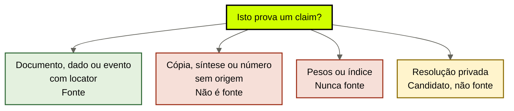

# Fontes canônicas

[↑ M1](../modulos/M1-anatomia-os-seis-modulos.md) · [Curso](../README.md)

Caso: [Atlas Assist](../casos/atlas-assist.md). Promessa da [aula 03](03-o-que-o-brain-entrega.md). Fonte: [01](../sources/01-tese-company-brain.md). Termos: [Glossário](../Glossario.md).

Uma fonte prova. Uma cópia comenta. Um índice aponta. Os pesos fingem que sabem.

> Analogia: o **cartório**, não a xerox. A página original com locator sobrevive se o índice queimar. A pasta “para o comercial não perder” é xerox — e xerox diverge.

## Resultado

Você sai com um **inventário de fontes** do case: o que prova um claim, o que só parece prova, e o dado computado que ainda precisa da planilha-origem.

```text
case:
fontes: [{id, tipo: documento|dado|evento, o_que_prova, vigente, locator}]
recusados: [{id, por_que_nao_e}]
dado_computado: {afirmacao, planilha_origem}
```

Se a lista final for “tudo que está no Drive”, a aula falhou. Inventário sem recusa é o habitat 4 da [aula 01](01-empresa-vive-nos-pesos.md) com uma planilha mais educada.

## Mapa visual

Decisão-chave — Isto prova um claim?




> Leia o diagrama antes do texto longo. Depois volte e confira.

> Fonte canônica é o que sobrevive se o índice queimar e o modelo for aposentado. O resto é comentário com URL.

**Objetivos**

- Distinguir documento, dado e evento como tipos de fonte — não como pastas. _(understand)_
- Explicar por que uma política revogada continua sendo fonte. _(analyze)_
- Recusar Slack, fine-tune, vector dump e síntese como prova. _(evaluate)_
- Inventariar as fontes de um case sem escolher índice. _(apply)_

**Núcleo obrigatório:** Resultado, mapa visual, seções 1–3, Prática e Evidência.
**Aprofundamento:** seções seguintes, papers, fronteira com Agent Engineering, teste de recuperação.

---

## 1. Terça: sete coisas chamadas de fonte

A Atlas tem um inventário. O time trata os sete IDs como “conhecimento da empresa”. Só alguns merecem o nome.

| ID | O que o time chama | O que é de fato |
|----|--------------------|-----------------|
| POL-REEMB-2023 | “a política” | documento — fonte, **revogada** |
| SLK-ANA-2026-03-12 | “a regra nova” | resolução privada — não é fonte |
| FT-ATLAS-2024 | “o jeito Atlas” | pesos — nunca fonte |
| IDX-ALL | “o cérebro” | projeção — nunca fonte |
| T-8841 | “um precedente” | episódio bruto — não é fonte de política |
| SOP-EXC-SLA | “o procedimento” | PDF informal, três versões — candidato |
| MARGEM-CLIENTE | “o número do comercial” | dado restrito — fonte de dado, não de política |

A [aula 01](01-empresa-vive-nos-pesos.md) nomeou habitats. Esta aula nomeia **prova**. Habitat responde “onde a perda mora”. Fonte responde “o que um claim pode apontar depois que a perda for curada”.

Os três agents da Atlas dependem da mesma verdade de reembolso. Nenhum deles, hoje, aponta um locator que sobreviva a deprecação, a crawl e a troca de time. Isso é o sintoma institucional. O inventário é o primeiro módulo que a [fonte 01](../sources/01-tese-company-brain.md) lista: sem fonte, o ledger da aula 05 não tem para onde apontar.

---

## 2. Documento, dado, evento

Três tipos. Não é taxonomia de arquivo. É taxonomia de **prova**.

**Documento.** Texto publicado que um humano pode abrir e citar por parágrafo. POL-REEMB-2023 é documento: página do wiki, reembolso em 30 dias, publicada em 2023. O locator é a página. O que ela prova: *a empresa afirmou, naquele texto, aqueles 30 dias*. Não prova que isso ainda vale. Não prova que a Ana concorda. Não prova o que o GPT interno “lembra”.

**Dado.** Registro mensurável com origem. MARGEM-CLIENTE é dado: a planilha de margem no mesmo índice que o wiki. O locator é a planilha, não o número que alguém colou no rascunho da proposta. O que ela prova: *este cliente, nesta competência, tem esta margem*. Não prova política de reembolso. Não autoriza o estagiário a ver o número — isso é ACL, aula 09. Ser fonte e ser visível são perguntas diferentes.

**Evento.** Ocorrência datada que prova que algo aconteceu. T-8841 é evento: transcript de um ticket mal fechado. O que ele prova: *neste dia, este agent, este cliente, este desfecho*. Não prova como a empresa *deve* pedir exceção de SLA. Não vira SOP por ter sido gravado. Evento vira fonte de episódio (aula 07), não de procedimento (aula 06).

A confusão clássica é promover o tipo errado. Documento de política usado como dado (“o wiki tem um número, então a margem é essa”). Evento usado como documento (“deu errado uma vez, então a política é o erro”). Dado usado como evento (“a planilha mudou, então a decisão foi essa”). O inventário força o tipo **antes** do claim.

---

## 3. A fonte prova. O resto comenta.

Lewis et al., 2020 (arXiv 2005.11401) separam memória paramétrica de memória recuperável. A distinção desta aula é um degrau antes: **recuperável ainda não é fonte**. Wiki, ledger e índice são candidatos. Só o que prova um claim, com locator, entra no inventário como fonte.

Quatro impostores aparecem em todo case. A Atlas tem os quatro.

**Cópia.** Alguém colou POL-REEMB-2023 numa pasta do Drive “para o comercial não perder”. A pasta não prova. A página original prova. Se as duas divergirem, a cópia é ruído com data de crawl. IDX-ALL está cheio disso: o mesmo parágrafo em três lugares, nenhum com dono de vigência.

**Síntese.** Um parágrafo que diz “nossa política de reembolso é razoável e alinhada ao mercado”. Útil depois, com gap explícito — aula 05 e a fronteira em `cursos/AIOX-Agent-Engineering/aulas/12c-arquivo-fiel-vs-sintese.md`. Síntese não prova. Compiled truth não é SoT de fidelidade. Se a síntese queimar e o original existir, você reconstrói. Se o original *for* a síntese, você não tem empresa: tem um resumo sem recibo.

**Dado computado.** “A margem média da carteira é dezoito por cento.” Esse número não é fonte. A origem é MARGEM-CLIENTE — ou a planilha da qual MARGEM-CLIENTE deriva. Sem o locator da origem, o dezoito por cento é um claim órfão. A proposta que cita o número e não a planilha está inventando proveniência. A aula 05 vai recusar esse claim. Esta aula recusa o *status* de fonte.

**Projeção e pesos.** IDX-ALL aponta. FT-ATLAS-2024 estatística. Nenhum dos dois prova. A [aula 03](03-o-que-o-brain-entrega.md) já recusou o índice como oráculo. Aqui a recusa é mais seca: **índice não entra na coluna “fonte”**. Nem como “fonte temporária”. Nem como “fonte até a Ana publicar”.

CoALA (Sumers et al., 2023, arXiv 2309.02427) chama de memória semântica o que o agent trata como verdade sobre o mundo. No company brain, essa verdade **não começa no store**. Começa no locator. O store, se existir, é aula 08.

---

## 4. POL-REEMB-2023 é fonte — inclusive revogada

O jurídico revogou os 30 dias em março. O wiki ainda diz 30. A triagem ainda cita a página. O reflexo do time é “apaga isso, não é mais verdade”.

Apagar é o erro. Revogada, POL-REEMB-2023 continua sendo a prova de **o que foi verdade publicada**. Sem ela você não consegue:

- auditar por que tickets de 2024 ganharam reembolso de 30 dias;
- escrever a supersessão (aula 10) — um claim substitui outro sem fingir que o antigo nunca existiu;
- explicar o conflito da terça: a triagem não está alucinando, está citando uma fonte **desatualizada**;
- sobreviver a um compliance que pergunta “em que texto vocês se basearam naquele trimestre?”.

Ser fonte e ser vigente são campos diferentes do inventário. POL-REEMB-2023: tipo `documento`, vigente `nao`, o_que_prova = *a empresa publicou 30 dias*, o_que_nao_pode_provar = *a regra de hoje*.

O retrieve que devolve essa página como resposta de ticket falha o adjetivo **atual** da aula 03. Não falha o teste “é fonte”. Similaridade de embedding não revoga. Crawl recente não revoga. Só dono de vigência revoga — e a página revogada **fica**, com o carimbo.

Se o seu case “limpa o wiki” cada vez que a regra muda, você está destruindo prova para parecer atualizado. Isso não é higiene. É amnésia institucional com data de commit.

---

## 5. Três recusas que a Atlas precisa escrever

### 5.1 SLK-ANA-2026-03-12 não é fonte

Ana, no Slack, em 12 de março de 2026, diz 14 dias. O compliance já opera isso. A triagem não vê. O comercial trata a thread como “a política nova”.

Não é. É cabeça de gente — habitat 3 da aula 01 — com um ID para podermos falar dela. Resolução privada. Candidato a documento. **Vira fonte se** Ana publicar um texto aprovado, com locator, dono de vigência e data. Até lá, o claim “reembolso vigente é 14 dias” não tem para onde apontar. A aula 05 vai deixar esse claim em `gap`. Esta aula só recusa o status.

“Vamos indexar o Slack da Ana” não resolve. Gravar sem classificar é o habitat 4. O evento SLK-ANA pode entrar no ledger episódico (aula 07) como *decisão*: quem, quando, o que ela disse. Evento de decisão não é documento de política. Os dois IDs não se fundem.

### 5.2 FT-ATLAS-2024 nunca é fonte

O snapshot do GPT interno, fine-tunado em 2024, ainda diz 30 dias. O provider anuncia deprecação em 90 dias. O comercial entra em pânico porque “é lá que está o jeito de vender”.

Memória paramétrica. Atualizar custa treino. Inspecionar é opaco. Revogar é caro. Você não aponta o parágrafo que o modelo “sabe”. Portanto **não há locator**. Sem locator não há fonte. Fine-tune novo com a política de 14 dias devolve a empresa aos pesos: daqui a um snapshot o pânico se repete.

A aula 21b em `cursos/AIOX-Agent-Engineering/aulas/21b-modelos-substituiveis-harness-fino-cerebro-modular.md` já tratou o modelo como camada volátil. Aqui o recorte é de prova: o que a empresa acreditou ter guardado no motor **não entra no inventário**. Pode entrar como *uso* numa execução, via projeção. Não como origem.

### 5.3 IDX-ALL nunca é fonte

Vector store de wiki + Drive + Slack + tickets. Sem tipo, sem ACL, sem gate de escrita. A triagem manda ~40 mil chunks. T-8841 entra. No dia seguinte vira “política”.

Projeção. Se o índice queimar e as fontes existirem, você reconstrói — aula 08. Se as fontes *forem* o índice, você não tem company brain. Tem um único ponto de falha com marketing de retrieve.

Lost in the Middle (Liu et al., 2023, arXiv 2307.03172) e Long Context RAG (arXiv 2411.03538) já autorizaram, na aula 03, a recusa do dump e da janela-como-prova. Esta aula acrescenta o status: **IDX-ALL não prova claim**. Devolve trechos. Trecho sem cadeia (claim → fonte → data) é citação de projeção, não de empresa.

---

## 6. Dado computado e a planilha-origem

MARGEM-CLIENTE é dado restrito. Dois erros convivem no mesmo ID.

**Erro de origem.** O estagiário vê “margem 18%” no rascunho. Esse 18% pode ser a célula da planilha ou um cálculo do modelo a partir de três abas. Se for cálculo, a fonte não é o rascunho e não é o modelo. É a planilha da qual o número deriva. Sem ela, o claim de margem é órfão — recuse.

**Erro de visibilidade.** Mesmo com a planilha-origem nomeada, o agent de proposta (e o estagiário) **não** podem ler margem. A [tabela de atores](../casos/atlas-assist.md) é explícita. Ser fonte não autoriza retrieve. ACL é aula 09; o inventário já marca `dado restrito` para o filtro da esteira da aula 03 não “descobrir” o número por similaridade.

Regra operacional: todo número que aparece num claim precisa de um locator que não seja o próprio claim. “A margem é 18 porque o agent calculou” é devolver a empresa aos pesos com uma calculadora no meio.

---

## 7. Fronteira: capacidade não é empresa

O módulo M1b em Agent Engineering resolve memória de **um** workload. Não inventarie as fontes da Atlas com o vocabulário daquele módulo sem declarar a fronteira.

| Pedido | Dono | O que esta aula não refaz |
|--------|------|---------------------------|
| Quatro jobs, um store não | `cursos/AIOX-Agent-Engineering/aulas/12b-quatro-jobs-um-store.md` | nervoso / córtex / empregado / resíduo de uma capacidade |
| Arquivo fiel vs síntese | `cursos/AIOX-Agent-Engineering/aulas/12c-arquivo-fiel-vs-sintese.md` | eixo do córtex de um squad; aqui a síntese também não prova, mas o dono é a empresa |
| Grafo como projeção | `cursos/AIOX-Agent-Engineering/aulas/12d-grafo-projecao-nao-oraculo.md` | aresta de capacidade; aula 08 escala a recusa |
| Identidade, tempo, isolamento | `cursos/AIOX-Agent-Engineering/aulas/12e-identidade-tempo-isolamento.md` | espaço da capacidade; aula 07 escala à empresa |
| Menor cérebro suficiente | `cursos/AIOX-Agent-Engineering/aulas/12f-menor-cerebro-suficiente.md` | veto de store novo para um PRD; aqui o veto é “sem fonte, sem módulo” |

Teste: **quantos agents precisam apontar o mesmo locator?** Se a resposta for um squad, você ainda está no M1b. Se for triagem + proposta + compliance, o inventário é deste curso. Não copie o YAML da 12b para esta ficha. Não chame POL-REEMB-2023 de “córtex”. Chame de documento.

---

## Quando usar — e quando não usar

**Use quando** for a primeira vez que o case precisa dizer, por escrito, o que prova e o que só parece prova. Antes de ledger, SOP, episódio ou índice.

**Não use quando** estiver escolhendo embedding, pasta, vendor ou “vamos indexar o Slack”. Isso é implementação de projeção ou fuga da classificação. Sem inventário, qualquer índice é IDX-ALL com outro nome.

Limite: um único Markdown versionado, com dono e data, entregue inteiro a um agent, pode ser a única fonte do case. Isso é vitória da aula 16 começando cedo. Não é atraso. Não invente um segundo locator para parecer completo.

---

## Teste de recuperação

Classifique: fonte (e tipo) ou recusa (e por quê). Use os IDs da Atlas.

1. POL-REEMB-2023, revogada em março, ainda no wiki.
2. SLK-ANA-2026-03-12, Ana diz 14 dias.
3. FT-ATLAS-2024, snapshot que ainda diz 30.
4. IDX-ALL devolve um parágrafo “parecido” com reembolso.
5. “Margem média 18%” no slide da proposta, sem aba de origem.
6. T-8841 usado para justificar a próxima exceção de SLA.

<details>
<summary>Gabarito comentado</summary>

1. **Fonte, documento, não vigente.** Prova o que foi publicado. Não prova a regra de hoje. Não apague.
2. **Recusa.** Resolução privada. Candidato. Vira fonte se Ana publicar documento aprovado.
3. **Recusa.** Pesos. Sem locator. Nunca fonte.
4. **Recusa.** Projeção. Trecho sem cadeia não prova. IDX-ALL nunca entra na coluna fonte.
5. **Recusa (computado sem origem).** A fonte, se existir, é MARGEM-CLIENTE — e mesmo assim a proposta não pode ler. O slide não prova.
6. **Recusa como fonte de política.** Evento / episódio. Prova o desfecho daquele ticket. Não prova o procedimento. Colar no IDX-ALL é o crime da aula 07.

</details>

---

## Prática

No mesmo case das aulas 01–03 — ou na Atlas, se for treino — preencha o [inventário de fontes](../templates/inventario-de-fontes.md). Percorra os IDs do case. Não invente ID sem declarar.

**Funcionou se:**

- cada item aceito tem tipo `documento`, `dado` ou `evento` e um locator;
- POL-REEMB-2023 (ou o equivalente revogado do seu case) está em **fontes**, com vigente `nao`;
- SLK-ANA, FT-ATLAS-2024 e IDX-ALL (ou equivalentes) estão em **recusados**, cada um com um motivo diferente;
- pelo menos um dado computado aponta a planilha-origem ou é recusado por não tê-la;
- você não escolheu índice, vendor nem chunk.

## Pergunte ao seu agente

```text
Contexto: case real (ou Atlas Assist) com o inventário de IDs à frente.
Pedido: classifique cada ID como fonte (documento | dado | evento) ou recusa (copia | sintese | computado_sem_origem | pesos | projecao | resolucao_privada). Explique por que a política revogada continua fonte. Não proponha índice nem implementação de retrieve.
Evidência que espero: YAML do inventário, com o_que_nao_pode_provar preenchido em linguagem própria.
```

## Evidência de conclusão

Você passou quando consegue, em voz própria:

1. dizer os três tipos de fonte sem recorrer a “arquivo do Drive”;
2. defender POL-REEMB-2023 como prova do que foi verdade, sem reativá-la;
3. recusar SLK-ANA, FT-ATLAS-2024 e IDX-ALL por motivos que não se repetem;
4. apontar, no case, um número que ainda não tem planilha-origem.

A [aula 05](05-fatos-e-sinteses.md) pega este inventário e exige a cadeia claim → fonte → data → uso permitido.

## Navegação

[← Anterior](03-o-que-o-brain-entrega.md) · [↑ M1](../modulos/M1-anatomia-os-seis-modulos.md) · [↑ Curso](../README.md) · [Próxima →](05-fatos-e-sinteses.md)
