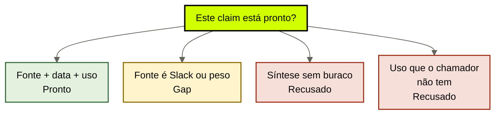
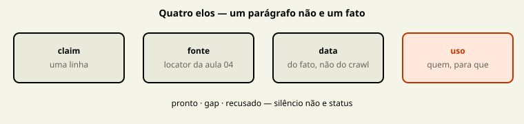

# Fatos e sínteses com proveniência

[↑ M1](../modulos/M1-anatomia-os-seis-modulos.md) · [Curso](../README.md)

Caso: [Atlas Assist](../casos/atlas-assist.md). Inventário da [aula 04](04-fontes-canonicas.md). Fonte: [01](../sources/01-tese-company-brain.md). Termos: [Glossário](../Glossario.md).

Um parágrafo não é um fato. Um fato sem fonte não é um fato. Uma síntese sem gap é uma mentira educada.

> Analogia: o **recibo**. O parágrafo é a despensa. O claim é o rótulo de uma linha. Sem data e sem uso, você tem uma conta sem CNPJ.

## Resultado

Você sai com um **ledger de proveniência**: três a cinco claims do case, cada um com fonte, data, uso permitido e status `pronto | gap | recusado`.

```text
claims: [{afirmacao, fonte, data, uso_permitido, uso_proibido, status, gap}]
sintese: {texto, gap_explicito}
```

Se a frase final for “o agent sabe que o reembolso é 14 dias”, a aula falhou. Saber sem cadeia é devolver a empresa aos pesos. A [aula 03](03-o-que-o-brain-entrega.md) exigiu citável. Esta aula materializa a cadeia.

## Mapa visual

Decisão-chave — Este claim está pronto?





> Leia o diagrama antes do texto longo. Depois volte e confira.

> Claim é afirmação normalizada. Parágrafo é matéria-prima. Síntese é leitura com recibo do que ainda não está estabelecido.

**Objetivos**

- Separar claim de parágrafo, de fonte e de síntese. _(understand)_
- Montar a cadeia claim → fonte → data → uso permitido para o case. _(apply)_
- Deixar explícito o gap quando a fonte ainda é Slack. _(analyze)_
- Recusar uso de margem na proposta e recusar síntese sem buraco. _(evaluate)_

**Núcleo obrigatório:** Resultado, mapa visual, seções 1–3, Prática e Evidência.
**Aprofundamento:** seções seguintes, papers, fronteira com Agent Engineering, teste de recuperação.

---

## 1. Claim não é parágrafo

POL-REEMB-2023 é uma página. Dentro dela cabem preâmbulo, exceções, um número e um tom de voz. A triagem não precisa da página. Precisa de uma afirmação que caiba numa linha e aponte para um locator.

**Claim.** Afirmação normalizada: sujeito, predicado, escopo. “A política publicada em 2023 estabelecia reembolso em 30 dias.” Ou, se estivesse pronta: “O reembolso vigente para o produto X é de 14 dias.”

**Parágrafo.** O texto da página, a thread, o PDF. Matéria-prima. Não entra no ledger como linha. Entra como fonte se a aula 04 aceitou.

**Síntese.** Leitura que junta mais de um claim e declara o que falta. “A Atlas opera 14 dias na prática jurídica e ainda publica 30 no wiki; não há documento aprovado de 14.” Isso é útil. Não é prova. A prova continua sendo POL-REEMB-2023 (do que foi publicado) e, se existir, o documento que a Ana ainda não escreveu.

A falha da terça começa aqui. A triagem trata o parágrafo do wiki como claim vigente. O compliance trata a frase da Ana como claim vigente. O GPT interno trata um estatística de 2024 como claim vigente. Três parágrafos, zero cadeia, um ticket errado.

CoALA (Sumers et al., 2023, arXiv 2309.02427) chama de memória semântica o que o agent toma por verdade do mundo. No company brain, essa memória **só aceita linha com proveniência**. Sem a linha, o modelo interpola. Interpolação sem fonte é o habitat *pesos* da [aula 01](01-empresa-vive-nos-pesos.md).

---

## 2. A cadeia de quatro elos

A [fonte 01](../sources/01-tese-company-brain.md) define o segundo módulo: fatos e sínteses — claims normalizados com proveniência. Proveniência, neste curso, não é “tem URL”. É quatro elos. Quebre um, o claim não está `pronto`.

| Elo | Pergunta | Falha na Atlas |
|-----|----------|----------------|
| Claim | Qual afirmação, em uma linha? | “está no wiki” não é afirmação |
| Fonte | Qual locator da aula 04? | SLK-ANA e FT-ATLAS-2024 não servem |
| Data | Quando isso foi verdadeiro? | “recente no índice” não é data |
| Uso permitido | Quem pode usar isto, para quê? | margem no rascunho da proposta |

**Data** não é a data do crawl. É a data do fato. POL-REEMB-2023: 2023, publicação. SLK-ANA-2026-03-12: 12 de março de 2026, fala da Ana — e mesmo com data estrita o elo *fonte* quebra. IDX-ALL não tem data de fato: tem data de ingestão. Long Context RAG (arXiv 2411.03538) já mostrou que janela maior não cura staleness. Aqui o ponto é mais seco: sem data no ledger, “atual” da aula 03 é um acidente.

**Uso permitido** não substitui a ACL da aula 09. É o recorte que o ledger já consegue escrever: *este claim serve à triagem para classificar ticket; não serve à proposta para precificar; não serve a ninguém como autorização de pagamento*. O harness continua com as mãos. O claim só declara a vitrine.

Três status, sem eufemismo:

- **pronto** — os quatro elos fecham e a fonte é vigente para o uso pedido;
- **gap** — a afirmação existe no mundo (alguém opera assim) mas falta fonte aceita, ou falta data, ou falta uso;
- **recusado** — a afirmação pede um uso que o chamador não tem, ou a “fonte” é projeção, peso ou síntese sem buraco.

Gap não é vergonha. Gap é o produto honesto do M1. Completar o gap com o modelo é a recusa da aula 03: buraco explícito, não interpolação.

---

## 3. Cinco claims da Atlas

Não invente ID. Trabalhe os que o caso já nomeou. Se o seu case real precisar de um sexto, declare.

### 3.1 “A política publicada em 2023 estabelecia reembolso em 30 dias”

- Fonte: POL-REEMB-2023.
- Data: 2023 (publicação).
- Uso permitido: auditoria, histórico, treinamento de supersessão.
- Uso proibido: classificar ticket **hoje**; redigir resposta vigente; fine-tunar FT-ATLAS-2024 de novo.
- Status: **pronto** para o uso histórico. **recusado** para a triagem vigente.

Este é o claim que a Atlas já tem e trata como se fosse o outro. A página é fonte. O claim histórico fecha. O claim vigente (“reembolso é 30”) **não** fecha — a vigência morreu em março. Dois claims, um locator. Não fundir.

### 3.2 “O reembolso vigente é 14 dias”

- Fonte pedida: SLK-ANA-2026-03-12.
- Data da fala: 2026-03-12.
- Uso que o compliance já faz: operar 14.
- Status: **gap**.

A fonte é Slack. A aula 04 recusou. Portanto o claim **ainda não está pronto**, mesmo que Ana esteja certa, mesmo que o jurídico inteiro já cobre 14, mesmo que o ticket da terça fique errado por causa disso. Verdade operacional sem documento aprovado não entra como `pronto`. Entra como gap com texto explícito: *falta documento aprovado que superseda POL-REEMB-2023*.

A triagem que “já usa 14 porque a Ana disse” está mentindo o ledger para parecer atualizada. A triagem que cita 30 está atrasada. As duas falham. Só o gap é honesto.

### 3.3 Como ficaria se Ana publicasse

Não invente um ID de política nova. Declare o buraco: **documento ainda inexistente no case**.

Se Ana publicasse um documento aprovado — locator, dono de vigência, data, texto que afirma 14 dias — o claim 3.2 passaria a `pronto` para a triagem. POL-REEMB-2023 permaneceria fonte do claim 3.1, vigente `nao`. A supersessão formal é aula 10; o ledger desta aula já precisa de duas linhas, não de uma página sobrescrita.

A síntese permitida, **com gap**, caberia assim: “A Atlas publicou 30 dias em 2023 (POL-REEMB-2023). O jurídico opera 14 desde 12 de março de 2026 (SLK-ANA-2026-03-12, não é fonte). Não há documento aprovado de 14. Não estabelecido: a regra vigente citável.”

Síntese sem essa última frase é o compliance vestido de wiki. Recuse.

### 3.4 “A margem deste cliente é N”

- Fonte: MARGEM-CLIENTE, se for a planilha-origem — aula 04.
- Data: competência da aba, não a data do rascunho.
- Uso permitido: nenhum dos três agents do case. A [tabela de atores](../casos/atlas-assist.md) recusa leitura de margem para triagem, proposta, compliance, Ana e estagiário.
- Status: **recusado** para a proposta. Se um quarto chamador (financeiro, fora deste case) existir no seu case real, declare. Na Atlas didática, o claim de margem **não entra no pacote de nenhum agent que já roda**.

O estagiário viu o número porque IDX-ALL não filtra. Isso não autoriza o claim. Autoriza o diagnóstico da aula 01 e o veto de uso nesta linha. “O modelo não deveria citar” não é uso permitido.

### 3.5 “Exceção de SLA segue o procedimento do PDF da Ana”

- Fonte pedida: SOP-EXC-SLA.
- Problema: três versões, nenhuma aprovada — aula 06 vai catalogar.
- Status: **gap**. Não há claim procedural citável. O compliance que “pergunta para a Ana” está operando cabeça de gente, não ledger.

T-8841 não fecha este claim. Transcript de falha prova o desfecho daquele ticket, não o procedimento da empresa. Promover T-8841 a “como pedimos exceção” é o crime que a aula 07 nomeia. Aqui, no ledger semântico, a linha simplesmente não fecha.

---

## 4. Síntese com gap — o único resumo que esta aula aceita

A fronteira com `cursos/AIOX-Agent-Engineering/aulas/12c-arquivo-fiel-vs-sintese.md` é de dono, não de ideia. Lá, o córtex de **uma** capacidade escolhe arquivo fiel, síntese ou camadas. Aqui, a empresa pode sintetizar **depois** dos claims, nunca no lugar deles.

Regras desta aula, sem implementar retrieve:

1. Toda síntese lista os claims que usa.
2. Toda síntese declara um gap ou declara “não há gap”. Silêncio não vale.
3. Síntese não vira fonte. Se o original queimar, a síntese não reconstrói a empresa — a aula 04 já disse isso.
4. Síntese não escolhe entre POL-REEMB-2023 e a Ana. Escolha sem regra publicada é aula 11. Sem a regra, o brain devolve o conflito, como a aula 03 mandou.

Lost in the Middle (Liu et al., 2023, arXiv 2307.03172) mede posição, não proveniência. Serve de aviso: se você despejar os cinco parágrafos no prompt e pedir “uma política”, o meio perde e o modelo elege um claim. Síntese feita pelo dump não é síntese desta aula. É Pacote Dump com um título melhor.

Lewis et al., 2020 (arXiv 2005.11401) autorizam memória recuperável. Não autorizam “o retrieve já sintetiza, então o ledger é opcional”. O ledger é o que torna a recuperação auditável *depois*.

---

## 5. Uso permitido é recorte, não educação do modelo

Três usos da Atlas, três respostas do ledger.

**Triagem.** Pode receber claims de política pública vigente — quando existirem. Hoje pode receber o claim 3.1 como histórico e o gap do 3.2. Não pode receber MARGEM-CLIENTE. Não pode receber T-8841 como se fosse política.

**Proposta.** Pode receber o que for público e comercialmente citável. Não usa margem. O estagiário é o mesmo chamador, com a mesma recusa. Fine-tune FT-ATLAS-2024 não é um jeito de “lembrar o tom” que autorize smuggle de número.

**Compliance.** Pode receber o conflito explícito (30 publicado vs 14 operado) e o gap. Pode registrar SLK-ANA como *episódio de decisão* (aula 07), não como fonte do claim 3.2. Não pode transformar SOP-EXC-SLA em procedimento aprovado por vontade.

Uso permitido escrito no ledger é o que a esteira da aula 03 consulta no passo “filtro” e no passo “ACL”. Sem esse campo, o Pacote Projeção não tem o que cortar. O M2 formaliza autoridade. O M1 já recusa a linha que a terça quebrou.

---

## 6. Fronteira: córtex de capacidade não é ledger da empresa

Não refaça o M1b. Cite e pare.

| Já resolvido no Agent Engineering | Path | O que esta aula acrescenta |
|-----------------------------------|------|----------------------------|
| Job 2 = verdade do mundo de um workload | `cursos/AIOX-Agent-Engineering/aulas/12b-quatro-jobs-um-store.md` | a mesma verdade para **vários** agents, com uso por chamador |
| Síntese + citação + gap | `cursos/AIOX-Agent-Engineering/aulas/12c-arquivo-fiel-vs-sintese.md` | gap institucional (“14 ainda sem documento”), não gap de reunião de um squad |
| Identidade e tempo do fato | `cursos/AIOX-Agent-Engineering/aulas/12e-identidade-tempo-isolamento.md` | data do claim da empresa; isolamento por agent vem na aula 07 e na 09 |
| Menor cérebro | `cursos/AIOX-Agent-Engineering/aulas/12f-menor-cerebro-suficiente.md` | três linhas de ledger podem ser o menor módulo; não peça store |

Se o claim só serve a um cartão de story, você está no resíduo da capacidade — job 4 da 12b — e não nesta aula. Se o claim precisa ser o mesmo para triagem e compliance, você está aqui.

---

## Quando usar — e quando não usar

**Use quando** o case já tem inventário (aula 04) e você precisa dizer quais afirmações os agents podem citar. Um workload de cada vez.

**Não use quando** estiver redigindo a política que falta, escolhendo modelo para “inferir 14” ou pedindo ao índice que “una as versões”. Inferir é completar. Unir sem regra é aula 11. Redigir a política é trabalho da Ana, não do ledger.

Limite: um claim único, com um Markdown vigente e um uso só, pode ser o ledger inteiro. Cinco claims da Atlas são pedagogia do conflito. Não reproduza o conflito no seu case se ele não existir.

---

## Teste de recuperação

Para cada linha, dê status e o elo que quebra — ou os quatro elos, se fechar.

1. “Reembolso vigente é 30 dias”, fonte POL-REEMB-2023, uso: ticket de hoje.
2. “Reembolso vigente é 14 dias”, fonte SLK-ANA-2026-03-12, uso: ticket de hoje.
3. A síntese “a política é 14, ponto”, sem mencionar o wiki.
4. “Margem do cliente é N”, fonte MARGEM-CLIENTE, uso: rascunho da proposta.
5. “Exceção de SLA segue SOP-EXC-SLA”, as três versões na pasta.
6. Ana publica um documento aprovado de 14 dias (ID inexistente no case; declare). O que muda no ledger?

<details>
<summary>Gabarito comentado</summary>

1. **Recusado para o uso pedido.** Fonte existe, data existe, vigência não. O claim histórico (30 em 2023) estaria pronto para auditoria.
2. **Gap.** Afirmação operacional verdadeira no jurídico. Elo fonte quebra: Slack não é fonte. Não complete com o modelo.
3. **Recusado.** Síntese sem gap. Esconde POL-REEMB-2023 e finge fonte que não há.
4. **Recusado.** Elo uso. Planilha pode ser fonte de dado; proposta e estagiário não podem ler.
5. **Gap.** Sem versão aprovada não há claim procedural citável. T-8841 não fecha esta linha.
6. **3.2 vira pronto** para a triagem, se o documento for fonte aceita. 3.1 permanece. Duas linhas. Sem ID novo no case até você declarar. IDX-ALL e FT-ATLAS-2024 continuam recusados como fonte.

</details>

---

## Prática

Com o inventário da aula 04, preencha o [ledger de proveniência](../templates/ledger-de-proveniencia.md). Três a cinco claims. Na Atlas, use os desta seção — não invente um sexto ID.

**Funcionou se:**

- cada claim cabe em uma linha e não é um parágrafo colado;
- “reembolso é 14 dias” está em `gap`, com o Slack nomeado como *não-fonte*;
- a síntese tem gap explícito ou você recusou a síntese;
- margem tem uso proibido na proposta, mesmo que a planilha seja origem;
- nenhum claim aponta para FT-ATLAS-2024 ou IDX-ALL como fonte.

## Pergunte ao seu agente

```text
Contexto: inventário da aula 04 e o case (Atlas ou o meu).
Pedido: escreva 3–5 claims com cadeia fonte → data → uso permitido. Marque pronto, gap ou recusado. Mostre a síntese permitida do conflito 30 vs 14, com gap. Mostre como o claim de 14 ficaria se Ana publicasse um documento aprovado — sem inventar ID. Não implemente retrieve.
Evidência que espero: YAML do ledger + uma síntese de no máximo cinco frases.
```

## Evidência de conclusão

Você passou quando consegue:

1. transformar um parágrafo da Atlas numa linha de claim sem perder o locator;
2. defender o gap de 14 dias sem “já usar 14 no prompt”;
3. recusar margem na proposta pelo elo *uso*, não pelo “bom senso do modelo”;
4. escrever uma síntese que o compliance aceitaria — porque o buraco está visível.

A [aula 06](06-memoria-procedural.md) troca a pergunta: não o que é verdade, e sim como a empresa trabalha — e por que T-8841 não é esse como.

## Navegação

[← Anterior](04-fontes-canonicas.md) · [↑ M1](../modulos/M1-anatomia-os-seis-modulos.md) · [↑ Curso](../README.md) · [Próxima →](06-memoria-procedural.md)
