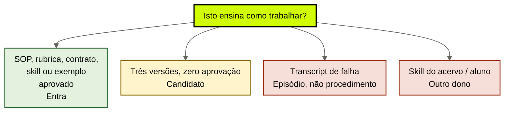

# Memória procedural

[↑ M1](../modulos/M1-anatomia-os-seis-modulos.md) · [Curso](../README.md)

Caso: [Atlas Assist](../casos/atlas-assist.md). Ledger da [aula 05](05-fatos-e-sinteses.md). Fonte: [01](../sources/01-tese-company-brain.md). Termos: [Glossário](../Glossario.md).

Como a empresa trabalha não é o que a empresa afirma. Um transcript de falha não é um procedimento. Uma skill deste acervo não é SOP da Atlas.

> Analogia: a **receita** não é o jantar de ontem. SOP-EXC-SLA quer ser receita. T-8841 é o prato queimado fotografado e colado no cardápio.

## Resultado

Você sai com um **catálogo procedural** do case: o que é SOP, rubrica, contrato, skill ou exemplo aprovado; o que ainda é rascunho; o que é episódio disfarçado de instrução.

```text
procedimentos: [{id, tipo, versao, aprovado, dono, nao_e}]
recusados: [{id, classificacao_correta}]
fronteira_skills_acervo:
```

Se a linha final for “indexamos os PDFs da Ana e os tickets ruins para o agent aprender”, a aula falhou. Procedural sem aprovação é pasta. Pasta no retrieve é IDX-ALL com outro chapéu.

## Mapa visual

Decisão-chave — Isto ensina como trabalhar?



> Leia o diagrama antes do texto longo. Depois volte e confira.

> Procedimento é instrução vigente de como a empresa age. Episódio é o que aconteceu. Skill de aluno é como *você* opera o acervo. Os três não compartilham prateleira.

**Objetivos**

- Distinguir SOP, rubrica, contrato, skill e exemplo aprovado por job, não por extensão de arquivo. _(understand)_
- Recusar SOP-EXC-SLA como procedimento usável enquanto nenhuma versão estiver aprovada. _(evaluate)_
- Classificar T-8841 como episódio, não como instrução. _(analyze)_
- Separar `skills/` deste acervo da memória procedural da empresa. _(apply)_

**Núcleo obrigatório:** Resultado, mapa visual, seções 1–3, Prática e Evidência.
**Aprofundamento:** seções seguintes, papers, fronteira com Agent Engineering, teste de recuperação.

---

## 1. O que é verdade vs como se faz

A aula 05 fechou claims: o que a empresa afirma, com fonte. Esta aula fecha o **como**. CoALA (Sumers et al., 2023, arXiv 2309.02427) chama de memória procedural o conhecimento de *como agir*. No language agent, isso pode ser uma tool, um prompt, uma policy de ação. No company brain, isso é a versão institucional: a empresa precisa do mesmo *como* para o compliance, para a triagem quando escala, e para o humano que cobre o plantão.

Misturar os dois módulos é o erro da terça, em outra roupa. POL-REEMB-2023 (mesmo revogada) responde “o que foi publicado sobre prazo”. SOP-EXC-SLA deveria responder “como se pede uma exceção de SLA”. T-8841 responde “o que aconteceu naquele ticket”. Três perguntas. Um store. IDX-ALL devolve as três no mesmo ranking de similaridade.

A [fonte 01](../sources/01-tese-company-brain.md) lista memória procedural como terceiro módulo de propósito. Autoridade e ritmo são outros: um claim de política muda quando o jurídico publica; um SOP muda quando operação aprova uma versão; um episódio **não deveria** mudar o SOP só porque foi indexado. Ritmos diferentes. Prateleiras diferentes.

Lewis et al., 2020 (arXiv 2005.11401) continuam no fundo: o *como* também não pode viver principalmente nos pesos. FT-ATLAS-2024 “saber vender” é procedural paramétrico. Some no snapshot. Não cataloga. Não versiona. Não aprova.

---

## 2. Cinco tipos, cinco recusas

Não force os cinco no case. A Atlas didática só tem um candidato explícito a SOP. Os outros tipos existem para você **não** nomear tudo de SOP.

| Tipo | Job | Entra quando | Recusa típica |
|------|-----|--------------|---------------|
| **SOP** | como executar um trabalho repetível | versão única, aprovada, dono, locator | PDF informal, três arquivos, zero carimbo |
| **Rubrica** | como julgar qualidade | critérios observáveis, não gosto | “responde como a Ana responderia” |
| **Contrato** | o que precisa ser verdade entre partes | cláusula, escopo, data | slide comercial colado no índice |
| **Skill** | procedimento reutilizável de um agent da **empresa** | aprovada como o SOP, com dono institucional | skill de aluno / runtime deste acervo |
| **Exemplo aprovado** | padrão permitido, não exceção crua | alguém com autoridade disse “faça assim” | ticket mal fechado tratado como padrão |

**SOP.** Instrução de execução. “Para pedir exceção de SLA, preencha X, anexe Y, espere Z.” SOP-EXC-SLA *quer* ser isso. Ainda não é — seção 3.

**Rubrica.** Instrução de julgamento. A Atlas do case não publica uma. Não invente. Se o seu case real tiver “o que é uma proposta aceitável”, isso é rubrica, não SOP. Julgar e executar são jobs diferentes. Colocar os dois no mesmo PDF é o monólito da 12b em miniatura.

**Contrato.** O que precisa ser verdade entre a Atlas e o cliente, ou entre agents e harness. “O brain não dispara reembolso” é contrato de interface (aula 14), não SOP de atendimento. Não catalogue contrato como procedimento de mesa.

**Skill da empresa.** Procedimento que um agent institucional reutiliza — com aprovação, versão e dono *da Atlas*. Não é o diretório `skills/` deste repositório. A seção 5 existe só para essa fronteira.

**Exemplo aprovado.** Um caso que a autoridade apontou: “quando o cliente for X e o sintoma for Y, este desfecho é o padrão”. T-8841 não foi apontado. Foi colado. Exemplo sem aprovação é episódio. Episódio sem classificação é o crime da aula 07.

---

## 3. SOP-EXC-SLA: três versões, zero aprovação

O inventário do caso é seco: PDF na pasta da Ana, “como pedir exceção”, três versões, nenhuma aprovada. O agent de compliance, hoje, não lê o PDF. Lê a Ana no Slack.

Três arquivos na mesma pasta não são versionamento. Versionamento tem sucessor, data e quem aprovou. Três arquivos são conflito informal. A aula 11 trata conflito entre claims. Aqui o ponto é mais básico: **sem aprovação, o tipo SOP não fecha**. O catálogo marca `aprovado: false` e `nao_e: procedimento usável`.

O que o compliance faz na terça — perguntar para a Ana — é habitat *cabeça de gente*. Catalogar os três PDFs como “já temos SOP” é habitat *documento sem dono*. Indexar os três no IDX-ALL é habitat *store-oráculo*. As três cirurgias erradas cabem numa frase só: “está documentado”.

O que esta aula aceita, no papel:

```text
id: SOP-EXC-SLA
tipo: sop
versao: tres_arquivos_sem_sucessor
aprovado: false
dono: Ana (de fato); ninguem (de direito)
o_que_ensina_a_fazer: candidato a "como pedir excecao de SLA"
nao_e: procedimento vigente; nao e fonte de claim; nao e episodio
uso_permitido: nenhum agent ate haver uma versao aprovada
```

Não escolha qual dos três PDFs “parece melhor”. Escolha sem regra é o modelo no lugar da Ana. O brain, na esteira da aula 03, devolve o buraco: *não há procedimento aprovado de exceção de SLA*. Completar com FT-ATLAS-2024 ou com T-8841 é o atalho que o outcome não tolera: exceção **com fonte**.

Quando uma versão for aprovada — trabalho da operação, não desta aula — o catálogo ganha `aprovado: true`, uma versão, um locator. As outras duas ficam como histórico, iguais a POL-REEMB-2023: prova do que foi usado informalmente, não instrução de hoje.

Três arquivos na mesa, três mentiras que o time conta para não aprovar nenhuma:

1. “A mais recente é a certa.” Recência de pasta não é aprovação. O PDF de junho pode ser um rascunho pior que o de março.
2. “A Ana usa a do meio.” Isso é SLK-ANA com outro chapéu: cabeça de gente apontando um arquivo. Apontar não carimba.
3. “O retrieve escolhe.” IDX-ALL escolhe por similaridade com o ticket. Similaridade não é dono.

O compliance da terça já sabe disso — por isso pergunta para a Ana. O catálogo honesto apenas escreve o que o time já pratica e não admite: *não há procedimento aprovado*. Mentir o catálogo para o agent “ter o que ler” devolve a empresa aos pesos, agora com PDF.

---

## 4. T-8841 não é procedural

T-8841 é transcript de ticket mal fechado, colado no IDX-ALL. No dia seguinte a triagem trata o erro como política. A aula 01 chamou isso de store sem gate de escrita. A aula 05 recusou o claim “exceção segue o transcript”. Esta aula fecha o tipo: **não é SOP, não é rubrica, não é contrato, não é skill, não é exemplo aprovado**.

É episódio. A aula 07 preenche quem, quando, decisão, outcome. O catálogo desta aula só precisa da recusa:

```text
id: T-8841
aparenta_procedimento: "foi assim que fechamos, façam igual"
classificacao_correta: episodio
por_que_nao_entra: falha bruta nao e padrao; ninguem aprovou o desfecho como exemplo
```

A tentação de “aprender com o erro” é justa. O mecanismo errado é colar o erro no mesmo índice da política. Aprendizado de volta — classificação, aprovação, versão — é aula 15. Sem esse gate, o retrieve promove a falha porque o embedding do transcript é “parecido” com a pergunta de exceção. Similaridade não é aprovação. Lost in the Middle (Liu et al., 2023, arXiv 2307.03172) ainda piora: se o transcript cair no extremo do prompt e o PDF no meio, o erro ganha posição.

Regra que você deve conseguir recitar: **execução ruim gravada não vira instrução**. Gravar é certo. Classificar é obrigatório. Aprovar é outro ato.

---

## 5. Fronteira: `skills/` não é SOP da Atlas

Este repositório tem procedimentos em `skills/` — `skills/teach/SKILL.md`, `skills/aiox-brain/SKILL.md`, `skills/study-capture/SKILL.md` e o restante do catálogo. Eles ensinam o aluno e o runtime a operar o acervo e, quando copiados, o projeto da pessoa. **Não** são memória procedural da Atlas Assist.

A confusão é sedutora porque a palavra é a mesma. Skill, SOP, playbook, runbook. Se você copiar um SKILL.md do acervo para o “cérebro da empresa”, você misturou vault de estudo com company brain — a primeira linha da tabela da aula 01. O dono da skill de aluno é o aluno. O dono do SOP da Atlas é a operação da Atlas. Ritmos diferentes. Autoridades diferentes. Outcomes diferentes.

O que esta aula aceita dizer, e só isso:

- `skills/` deste acervo = procedimento de estudo ou de runtime **do aluno**.
- Skill da empresa = procedimento aprovado de um agent **institucional**, catalogado como as outras quatro espécies, com dono da Atlas.
- M1b em `cursos/AIOX-Agent-Engineering/aulas/12b-quatro-jobs-um-store.md` trata memória de **uma** capacidade (empregado, resíduo, córtex). Não catalogue o “como eu trabalho” de um operator como SOP da firma.
- `cursos/AIOX-Agent-Engineering/aulas/12f-menor-cerebro-suficiente.md` veta store novo quando um mapa de sessão basta. Aqui o veto é simétrico: se a Atlas ainda não aprovou SOP-EXC-SLA, o menor mecanismo é o buraco, não uma skill copiada do acervo “para o agent ter algo”.

Escreva no template a linha `fronteira_skills_acervo`. Se ficar vazia, a prática falhou: você ainda acha que procedimento é procedimento.

---

## 6. O catálogo não executa

Repita até ficar chato, no tom da aula 03. Memória procedural do company brain **não**:

- pede a exceção, fecha o ticket, dispara e-mail — harness;
- escolhe entre as três versões de SOP-EXC-SLA sem regra publicada — governança;
- transforma T-8841 em exemplo aprovado — aula 15;
- substitui o claim de reembolso — aula 05; prazo de 14 ou 30 continua sendo fato, não SOP;
- autoriza o estagiário a ver MARGEM-CLIENTE — ACL, aula 09.

O catálogo diz *como a empresa quer que se trabalhe*, quando isso estiver aprovado. Quem age é o harness. Quem raciocina sobre a instrução é o modelo. Quem inventa a instrução que falta é o buraco, não o snapshot.

A esteira da aula 03 ganha um filtro a mais: tipo `procedimento`, aprovado, vigente, autorizado para aquele chamador. Sem esse filtro, SOP-EXC-SLA e T-8841 empatam no retrieve. Empate é a terça.

---

## Quando usar — e quando não usar

**Use quando** o outcome depender de *como se faz* — exceção com fonte, proposta com roteiro, triagem com escada — e hoje isso vive em PDF informal, em pessoa ou em ticket.

**Não use quando** o problema for “qual é a regra vigente” (aula 05), “o que aconteceu naquele ticket” (aula 07) ou “qual índice buscar” (aula 08). Também não use para importar o catálogo deste acervo para o case.

Limite: zero SOP aprovado é um catálogo válido. É o da Atlas hoje. A vitória é a recusa escrita, não a invenção de uma quarta versão.

---

## Teste de recuperação

Classifique o tipo correto — ou a recusa.

1. SOP-EXC-SLA, três PDFs na pasta da Ana, nenhum carimbo.
2. T-8841 colado no IDX-ALL como “jeito de fechar exceção”.
3. POL-REEMB-2023 usada como “procedimento de reembolso”.
4. `skills/aiox-brain/SKILL.md` copiada para o Drive da Atlas “para o agent ter playbook”.
5. Uma proposta antiga que o diretor marcou “façam assim daqui pra frente”.
6. FT-ATLAS-2024 “já sabe como a gente pede exceção”.

<details>
<summary>Gabarito comentado</summary>

1. **Candidato a SOP, não entra como usável.** Três versões, zero aprovação. Buraco explícito para o compliance.
2. **Episódio, não procedural.** Recusa. Gate de escrita é aula 15; classificação é aula 07.
3. **Fonte / claim, não SOP.** A página prova o que foi publicado sobre prazo. Não ensina o passo a passo da mesa.
4. **Skill de aluno / vault.** Outro dono. Não é SOP da Atlas. Confusão aula 01.
5. **Exemplo aprovado** — se a marcação tiver autoridade, data e locator. Sem isso, é slide. Não invente o ID; declare se o seu case tiver.
6. **Pesos.** Procedural paramétrico. Nunca entra no catálogo. Some no snapshot.

</details>

---

## Prática

No mesmo case, preencha o [catálogo procedural](../templates/catalogo-procedural.md). Na Atlas, SOP-EXC-SLA e T-8841 são obrigatórios na ficha — um como candidato, o outro como recusa.

**Funcionou se:**

- SOP-EXC-SLA está com `aprovado: false` e uso vazio;
- T-8841 não aparece como procedimento;
- a linha `fronteira_skills_acervo` recusa pelo menos uma skill deste repositório como SOP da empresa;
- você não elegeu “o melhor” dos três PDFs;
- nenhum item aponta IDX-ALL ou FT-ATLAS-2024 como origem do *como*.

## Pergunte ao seu agente

```text
Contexto: inventário, ledger e o case (Atlas ou o meu).
Pedido: classifique cada item que o time chama de “procedimento” em sop | rubrica | contrato | skill | exemplo_aprovado | recusa. Trate SOP-EXC-SLA e T-8841 explicitamente. Separe skills/ do acervo da memória da empresa. Não implemente retrieve. Não aprove versão.
Evidência que espero: YAML do catálogo + uma frase de buraco para o compliance.
```

## Evidência de conclusão

Você passou quando consegue:

1. explicar por que três PDFs não são uma SOP versionada;
2. recusar T-8841 como instrução sem negar que o ticket deve ser lembrado;
3. apontar um item do acervo em `skills/` e dizer por que ele não entra no brain da Atlas;
4. escrever o que o brain devolve hoje quando alguém pede “o procedimento de exceção”.

A [aula 07](07-memoria-episodica.md) pega T-8841 no tipo certo: identidade, tempo, outcome — e o crime de colá-lo sem classificação.

## Navegação

[← Anterior](05-fatos-e-sinteses.md) · [↑ M1](../modulos/M1-anatomia-os-seis-modulos.md) · [↑ Curso](../README.md) · [Próxima →](07-memoria-episodica.md)
