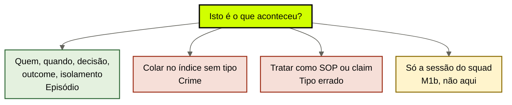
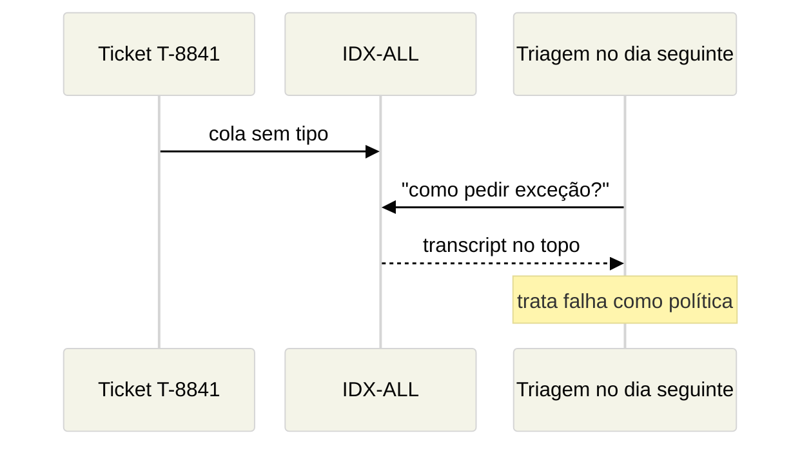

# Memória episódica — identidade, tempo e outcome

[↑ M1](../modulos/M1-anatomia-os-seis-modulos.md) · [Curso](../README.md)

Caso: [Atlas Assist](../casos/atlas-assist.md). Catálogo da [aula 06](06-memoria-procedural.md). Fonte: [01](../sources/01-tese-company-brain.md). Termos: [Glossário](../Glossario.md).

O que aconteceu não é o que vale. Quem fez, quando fez, o que decidiu e no que deu são da empresa — não da sessão do agent.

> Analogia: a **câmera de segurança** não é o código de obras. T-8841 é a fita. SOP é o código. Colar a fita no código é o crime desta aula.

## Resultado

Você sai com um **ledger episódico**: execuções, decisões, feedbacks e outcomes com identidade, tempo e isolamento por agent ou ator. T-8841 entra aqui. Não entra no IDX-ALL como se fosse SOP.

```text
episodios: [{id, tipo, quem, quando, decisao, outcome, isolamento, nao_virar}]
recusa_de_classificacao: {item, crime_se_colar_sem_tipo}
```

Se a linha final for “gravamos tudo no vector store”, a aula falhou. Gravar sem classificar é o crime da terça. A aula 06 recusou T-8841 como procedimento. Esta aula o aceita como episódio — e recusa o dump.

## Mapa visual

Decisão-chave — Isto é o que aconteceu, ou o que vale?



> Leia o diagrama antes do texto longo. Depois volte e confira.

> Episódio institucional tem nome, relógio e cerca. Transcript sem cerca é veneno com timestamp.

**Objetivos**

- Preencher execução, decisão, feedback e outcome para um episódio real. _(apply)_
- Aplicar identidade, tempo e isolamento no nível da empresa, sem refazer a sessão. _(analyze)_
- Explicar por que T-8841 no IDX-ALL sem classificação quebra o outcome. _(evaluate)_
- Separar esta aula de `cursos/AIOX-Agent-Engineering/aulas/12e-identidade-tempo-isolamento.md`. _(understand)_

**Núcleo obrigatório:** Resultado, mapa visual, seções 1–3, Prática e Evidência.
**Aprofundamento:** seções seguintes, papers, fronteira com Agent Engineering, teste de recuperação.

---

## 1. Terça de novo, agora pelo transcript

Alguém cola T-8841 no IDX-ALL. O texto é um ticket mal fechado: cliente pediu exceção de SLA, o agent improvisou, o desfecho foi ruim. Não há carimbo de “exemplo aprovado”. Não há dono dizendo “não façam isso”. Há um arquivo e um embed.

No dia seguinte a triagem recebe um ticket parecido. O retrieve devolve o transcript no topo — similaridade alta, vocabulário de exceção, posição boa no prompt. Lost in the Middle (Liu et al., 2023, arXiv 2307.03172) não precisa se esforçar: o erro está no extremo. A triagem trata T-8841 como política. O outcome observável da Atlas — exceção **com fonte** — quebra sem ninguém “alucinar”. O store mentiu o tipo.

A aula 06 já disse o que T-8841 não é. Esta aula diz o que ele é: **um episódio**. Precisa de cinco campos para existir no company brain. Sem eles, o transcript é lixo tóxico. Com eles, é memória que a empresa pode auditar sem promovê-la a regra.

CoALA (Sumers et al., 2023, arXiv 2309.02427) descreve memória episódica como o registro do que o agent viveu. A sessão, o cartão, a wave. Isso é M1b. Aqui o dono muda: a empresa precisa lembrar o que **aconteceu no mundo institucional**, através de agents, de times e de snapshots. FT-ATLAS-2024 não guarda isso. IDX-ALL sem tipo finge que guarda.

---

## 2. Quatro espécies de episódio

Não são pastas. São jobs do registro. Um ID pode carregar mais de um, mas você nomeia o dominante.

| Tipo | Pergunta | Na Atlas |
|------|----------|----------|
| **Execução** | O que foi feito, por quem, em que ticket ou proposta? | o agent de triagem fechou T-8841 de um jeito |
| **Decisão** | O que ficou escolhido, por qual ator? | Ana, em SLK-ANA-2026-03-12, afirma 14 dias |
| **Feedback** | O que alguém disse sobre a execução? | cliente reclamou; jurídico recusou o desfecho |
| **Outcome** | O que o mundo ficou depois? | ticket mal fechado; exceção sem fonte; risco de SLA |

T-8841, preenchido sem romance:

```text
id: T-8841
tipo: execucao
quem: agent de triagem (não Ana; não o estagiário)
quando: data do ticket — estrita; "outro dia" não serve
decisao: improvisou fechamento de exceção sem procedimento aprovado
outcome: desfecho ruim; no dia seguinte o retrieve ensinou o erro
isolamento: compliance pode ler o episodio; proposta nao precisa; estagiario nao
nao_virar: sop | claim_vigente | dump_no_indice
```

SLK-ANA-2026-03-12 também é episódio — de **decisão**. A aula 04 recusou como fonte. A aula 05 deixou o claim de 14 em gap. Esta aula **aceita o registro**: Ana, 2026-03-12, decidiu operar 14. Aceitar o episódio não promove a thread a documento. Os módulos não se fundem porque o ID se repete. Fonte ≠ episódio ≠ claim. Três linhas, um acontecimento.

MARGEM-CLIENTE não é episódio. É dado. O episódio da terça, se você precisar nomeá-lo, é outro: *o estagiário da proposta leu margem no rascunho*. Quem = estagiário + agent de proposta. Outcome = vazamento. Isolamento que falhou = o dado atravessou a cerca. Não invente ID para esse vazamento; descreva-o no ledger como episódio sem código novo, ou declare um ID se o seu case real tiver.

---

## 3. Identidade, tempo, isolamento — nível empresa

A fronteira com `cursos/AIOX-Agent-Engineering/aulas/12e-identidade-tempo-isolamento.md` é a frase mais importante desta aula. Leia o path. Não reescreva aquela aula.

Lá, o contrato é de **capacidade**: tipo + apelido + espaço da capacidade; supersede de estado mutável; isolamento entre usuários, stories e caderno do empregado. Job de um PRD. Sessão, cartão, wave.

Aqui, as mesmas três palavras mudam de dono.

**Identidade (empresa).** Ana, líder jurídica, não é o agent de compliance, não é o agent de triagem, não é uma cliente que também se chama Ana. “Ana disse 14” sem tipo de ator é merge por nome — o I6 da 12d/12e, agora entre papéis institucionais. O ledger episódico marca o ator: humano jurídico, agent, estagiário. Nome igual não funde. O space não é o da capacidade: é o da **firma** (Atlas) e do **domínio** (reembolso, SLA, margem).

**Tempo (empresa).** Data estrita. SLK-ANA-2026-03-12 já traz o dia. T-8841 precisa do dia do ticket, não da data de ingestão no IDX-ALL. “Ontem”, “em março”, “recente no índice” não fecham episódio. Long Context RAG (arXiv 2411.03538) mostrou que janela longa não cura tempo. Crawl não é relógio. O relógio lento da [aula 02](02-tres-relogios.md) acumula episódios em anos; o ingest do store acumula em minutos. Não use o segundo como se fosse o primeiro.

**Isolamento (empresa).** Quem pode **ler o episódio**, não só o dado. Triagem não lê episódios de margem. Proposta (e o estagiário) não lê T-8841 como se fosse playbook — e não lê MARGEM-CLIENTE em hipótese nenhuma. Compliance lê T-8841 como falha, não como instrução. Ana lê o que o jurídico precisa para revogar ou aprovar; não lê margem. A tabela de atores do [caso](../casos/atlas-assist.md) é o começo da cerca. A aula 09 vira isso em ACL. Esta aula já escreve `agents_que_podem_ler` / `agents_que_nao_podem`.

Isolamento de sessão (“não vazar o cartão da story B”) continua sendo 12e. Isolamento de empresa (“não vazar margem para o intern; não vazar falha como SOP”) é aqui. Se você responder a um incidente de compactação de wave com este template, errou o curso.

---

## 4. O crime: colar sem classificar



O crime não é gravar T-8841. O crime é **escrever no IDX-ALL sem tipo**. Sem tipo, o retrieve só tem similaridade. Similaridade não distingue SOP de falha, claim de transcript, margem de wiki. Lewis et al., 2020 (arXiv 2005.11401) descrevem retrieve como memória editável. Editável sem gate é depósito. Depósito que aceita qualquer escrita é o habitat 4.

Três atos diferentes, três aulas:

| Ato | Aula | O que faz com T-8841 |
|-----|------|----------------------|
| Classificar | esta | episódio de execução, com cerca |
| Recusar como SOP | [06](06-memoria-procedural.md) | não entra no catálogo usável |
| Aprovar como aprendizado | 15 | só então vira candidato a exemplo — nunca automático |

IDX-ALL hoje faz um quarto ato, ilegítimo: **promover**. Promoção por embed. Sem dono, sem vigência, sem ACL. A triagem do dia seguinte é a vítima. O outcome “exceção com fonte” não tem fonte: tem um vizinho no espaço vetorial.

A recusa que o template pede cabe em duas linhas:

```text
item: T-8841
crime_se_colar_sem_tipo: a triagem ensina o erro como politica; o compliance perde a prova do desfecho
```

GraphRAG (Microsoft Research) não cura isso. Comunidade resumida de tickets ruins é um oráculo de falhas. A aula 08 trata grafo como projeção. Esta aula só precisa da frase: **projeção sem classificação herda o veneno**.

---

## 5. Quem, quando, decisão, outcome, cerca — no mesmo ticket

Force os cinco campos em voz alta para T-8841 e para a thread da Ana. Se um campo faltar, o episódio não está pronto. “O modelo completa” é o habitat pesos.

**Quem.** Ator nomeado e tipado. Agent de triagem ≠ Ana ≠ estagiário. Se o transcript não diz quem fechou, o gap é do episódio, não do claim de política.

**Quando.** Data estrita. Se T-8841 não tiver dia no case didático, o ledger marca o buraco: *falta timestamp do fechamento; a data de ingestão no IDX-ALL não substitui*. Não invente o dia.

**Decisão.** O que ficou escolhido naquele instante. Em T-8841: improvisar o fechamento. Em SLK-ANA: operar 14. Decisão episódica não é claim vigente. A Ana decidiu; o claim continua em gap até haver documento.

**Outcome.** O que o mundo ficou. Ticket ruim. Retrieve envenenado. Cliente exposto. Sem outcome, o episódio é diário. Diário não serve ao compliance.

**Isolamento.** Lista positiva e negativa de chamadores. Sem a negativa, a cerca é um comentário. Comentário no prompt não é isolamento — a 12e já recusou header opcional; aqui a recusa escala: “o agent não deveria usar isso como SOP” escrito no system prompt **depois** do retrieve é teatro.

Os três agents da Atlas leem o mesmo outcome institucional (“exceção com fonte”) e episódios diferentes. Se o ledger episódico for um store único sem cerca, você reconstruiu IDX-ALL com metadados de blog.

Cerca da terça, no papel — sem inventar ID:

| Episódio | Triagem lê? | Proposta lê? | Compliance lê? | Estagiário lê? |
|----------|-------------|--------------|----------------|----------------|
| T-8841 (execução ruim) | não como SOP; no máximo “isto falhou, não copie” se o dono autorizar | não | sim, como falha | não |
| SLK-ANA (decisão de 14) | não como política vigente | não | sim, como decisão ainda sem documento | não |
| Leitura de MARGEM-CLIENTE | não | não | não | não — ele *é* o vazamento |

A linha do estagiário não é pedagogia. É o outcome “proposta sem dado que o autor não pode ver”. Episódio de vazamento que o intern ainda pode retrieveiar é o crime da aula 04/09 em forma de histórico. Isolamento que só esconde o dado e deixa o relato do vazamento no mesmo índice falha duas vezes.

---

## 6. Fronteira explícita com a 12e e com o resíduo

Não duplique o M1b. A tabela é o contrato.

| Já resolvido no Agent Engineering | Path | O que esta aula não refaz |
|-----------------------------------|------|---------------------------|
| Identidade = tipo + apelido + espaço da **capacidade** | `cursos/AIOX-Agent-Engineering/aulas/12e-identidade-tempo-isolamento.md` | merge de entidades no PRD; caderno do empregado; story A vs story B |
| Resíduo = o que **este cartão** já fez | `cursos/AIOX-Agent-Engineering/aulas/12b-quatro-jobs-um-store.md` | ledger de wave, issue, “agora / feito” |
| Grafo com recibo, aresta sem base | `cursos/AIOX-Agent-Engineering/aulas/12d-grafo-projecao-nao-oraculo.md` | I1–I8 de uma capacidade; aula 08 escala projeção |
| Menor cérebro se o sintoma é sessão | `cursos/AIOX-Agent-Engineering/aulas/12f-menor-cerebro-suficiente.md` | mapa da aula 76 / compactação |

Teste de roteamento: o agent do squad perdeu o mapa depois da compactação? **12e / 12f / 20b, não aqui.** A empresa não consegue provar o que aconteceu num ticket que três agents deveriam poder auditar, com cerca? **Aqui.**

Síntese da 12c (`cursos/AIOX-Agent-Engineering/aulas/12c-arquivo-fiel-vs-sintese.md`) também não substitui episódio. “Resumo: a triagem errou um SLA” sem quem/quando/outcome é compiled truth de falha. Arquivo fiel do transcript pode ser o locator do episódio. O ledger é a linha. Os dois não se fundem.

---

## Quando usar — e quando não usar

**Use quando** o case precisa lembrar execução, decisão, feedback ou outcome **através** de agents e de tempo institucional — e hoje isso some na sessão, mora na cabeça da Ana ou vira SOP por acidente de índice.

**Não use quando** o problema for compactação de wave, caderno pessoal do operator, ou vontade de “memória de conversa”. Isso é capacidade. Também não use para gravar calls no IDX-ALL “para não perder”.

Limite: um episódio classificado, com cerca, num Markdown versionado, pode ser o ledger inteiro. A Atlas tem pelo menos T-8841 e a decisão da Ana. Não invente o terceiro ID.

---

## Teste de recuperação

Responda com tipo, um campo que não pode faltar, e o que **não** vira.

1. T-8841 no Drive da Ana, ainda não classificado.
2. T-8841 colado no IDX-ALL, sem tipo, retrieve de manhã.
3. SLK-ANA-2026-03-12 como “fonte da política de 14”.
4. O squad de triagem esquece o mapa da wave depois da compactação.
5. O estagiário vê MARGEM-CLIENTE no rascunho.
6. “Ana” no transcript de um cliente chamado Ana, fundida com a líder jurídica.

<details>
<summary>Gabarito comentado</summary>

1. **Episódio candidato.** Faltam quem/quando/outcome/isolamento. Ainda não está pronto. Não é SOP.
2. **Crime.** Promoção por similaridade. A triagem ensina o erro. Classificar antes de projetar.
3. **Tipo errado.** É episódio de decisão. Fonte continua recusada (aula 04). Claim de 14 continua em gap (aula 05).
4. **M1b / 12e / 12f.** Sessão e resíduo de capacidade. Não é company brain.
5. **Episódio de vazamento + falha de isolamento.** Dado continua sendo MARGEM-CLIENTE. O episódio é a leitura indevida. Proposta e estagiário na lista negativa.
6. **Falha de identidade.** Mesmo nome, tipo diferente. Não fundir. A 12e ensinou isso na capacidade; aqui a cerca é da empresa.

</details>

---

## Prática

Preencha o [ledger episódico](../templates/ledger-episodico.md). Na Atlas, T-8841 é obrigatório. SLK-ANA-2026-03-12 entra como decisão, não como fonte. Não invente ID.

**Funcionou se:**

- T-8841 tem quem, quando (ou gap de timestamp), decisão, outcome e cerca;
- `nao_virar` inclui SOP e dump no índice;
- a thread da Ana é episódio de decisão e o claim de 14 continua em gap no ledger da aula 05;
- um item recusa o roteamento para sessão / M1b;
- você não colou transcript em projeção nesta prática.

## Pergunte ao seu agente

```text
Contexto: case (Atlas ou o meu) + inventário, ledger de claims e catálogo procedural.
Pedido: preencha T-8841 como episódio (quem, quando, decisão, outcome, isolamento por agent). Classifique SLK-ANA como decisão, não como fonte. Explique o crime de colar T-8841 no IDX-ALL sem tipo. Distinga esta ficha da aula 12e (capacidade ≠ empresa). Não implemente índice.
Evidência que espero: YAML do ledger episódico + duas frases de fronteira com a 12e.
```

## Evidência de conclusão

Você passou quando consegue:

1. recitar os quatro tipos (execução, decisão, feedback, outcome) com um exemplo da Atlas cada — ou declarar a ausência;
2. aplicar identidade/tempo/isolamento sem copiar o YAML da 12e;
3. explicar o crime do IDX-ALL sem recair em “o modelo alucinou”;
4. manter T-8841 fora do catálogo procedural **e** dentro deste ledger.

A [aula 08](08-projecoes-recuperaveis.md) escolhe como buscar o que as aulas 04–07 já classificaram — e qual mentira cada busca compra.

## Navegação

[← Anterior](06-memoria-procedural.md) · [↑ M1](../modulos/M1-anatomia-os-seis-modulos.md) · [↑ Curso](../README.md) · [Próxima →](08-projecoes-recuperaveis.md)
