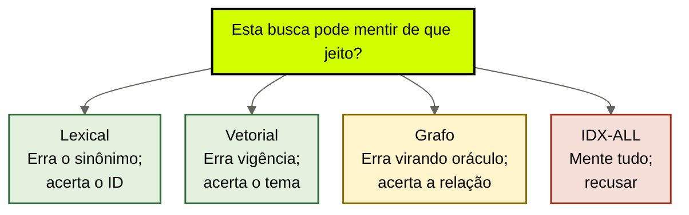
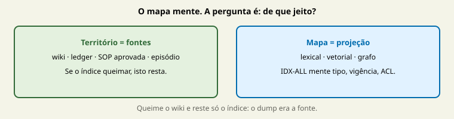

# Projeções recuperáveis

[↑ M1](../modulos/M1-anatomia-os-seis-modulos.md) · [Curso](../README.md)

Caso: [Atlas Assist](../casos/atlas-assist.md). Módulos das [aulas 04](04-fontes-canonicas.md)–[07](07-memoria-episodica.md). Fonte: [01](../sources/01-tese-company-brain.md). Termos: [Glossário](../Glossario.md).

O índice aponta. A fonte prova. Se o índice queimar e a fonte existir, você reconstrói. Se a fonte *for* o índice, você não tem brain.

> Analogia: o **mapa não é o território**. Toda busca mente. A pergunta útil é *de que jeito* — e se o outcome tolera essa mentira.

## Resultado

Você escolhe **uma ou duas projeções** para um workload da Atlas, escreve a mentira que cada uma compra, e recusa IDX-ALL como oráculo. Sem vendor. Sem chunk size. Sem implementar retrieve.

```text
projecoes: [{tipo: lexical|vetorial|grafo, pergunta, reconstruivel_de, mentira, recusa}]
indice_recusado: {id: IDX-ALL, mentira_atual}
se_a_projecao_queimar:
```

Se a frase final for “vamos ter RAG”, a aula falhou. RAG é família de projeções. Esta aula especifica a mentira. Implementação é outro curso, outro tempo, outro contrato.

## Mapa visual

Decisão-chave — Esta busca pode mentir de que jeito?





> Leia o diagrama antes do texto longo. Depois volte e confira.

> Projeção é recorte reconstruível. Oráculo é recorte que se pretende fonte. A Atlas já comprou o segundo e chamou de cérebro.

**Objetivos**

- Distinguir lexical, vetorial e grafo pela mentira, não pelo vendor. _(understand)_
- Exigir reconstrução a partir das fontes das aulas 04–07. _(analyze)_
- Tratar GraphRAG (Microsoft Research) como projeção para pergunta global, não como verdade. _(evaluate)_
- Escolher uma ou duas projeções para um workload da Atlas, com a mentira escrita. _(apply)_

**Núcleo obrigatório:** Resultado, mapa visual, seções 1–3, Prática e Evidência.
**Aprofundamento:** seções seguintes, papers, fronteira com Agent Engineering, teste de recuperação.

---

## 1. IDX-ALL mente — o mecanismo, não o slogan

IDX-ALL é o vector store de wiki + Drive + Slack + tickets. Sem tipo, sem ACL, sem gate de escrita. A triagem manda ~40 mil chunks. Cinco mentiras convivem no mesmo identificador. Nomeie-as; não as resuma como “RAG ruim”.

**Mente o tipo.** POL-REEMB-2023, SLK-ANA-2026-03-12, T-8841, SOP-EXC-SLA e MARGEM-CLIENTE entram no mesmo ranking. Similaridade não leu as aulas 04–07. Um transcript de falha compete com uma política revogada e com uma planilha restrita.

**Mente a vigência.** O embedding “limpo” da página de 30 dias vence a thread de 14. A aula 03 chamou isso de falha do adjetivo *atual*. Aqui: a projeção **não tem campo de supersessão**. Recência de crawl não é vigência.

**Mente a autorização.** O estagiário da proposta retrieveia o mesmo store que a triagem. MARGEM-CLIENTE atravessa. Filtrar o output é teatro.

**Mente a escrita.** T-8841 entra. Amanhã é “política”. A aula 07 chamou de crime. A projeção sem gate é cúmplice.

**Mente a posição.** Quarenta mil chunks recriam o meio. Lost in the Middle (Liu et al., 2023, arXiv 2307.03172) mede exatamente o uso pior da evidência no centro da janela. Long Context RAG (arXiv 2411.03538) mede a divergência entre capacidade nominal e uso confiável. IDX-ALL compra as duas falhas e chama isso de cobertura.

Lewis et al., 2020 (arXiv 2005.11401) autorizam memória recuperável *como camada*. Não autorizam um dump sem tipo como cérebro. A [fonte 01](../sources/01-tese-company-brain.md) lista projeções como quinto módulo: lexical, vetorial ou grafo, **reconstruíveis a partir das fontes**. IDX-ALL inverte a frase: as fontes é que seriam reconstruídas a partir do índice, se o índice fosse a única cópia. Não é. E se fosse, não haveria módulo 1.

---

## 2. Três projeções, três mentiras honestas

Toda busca mente. A pergunta útil é *de que jeito*, e se o outcome da Atlas tolera essa mentira. A aula 03 já pôs a tabela curta. Esta aula a usa para escolher.

| Projeção | Serve quando | Mente quando | Mentira que a Atlas já comprou |
|----------|--------------|--------------|--------------------------------|
| **Lexical** | o termo importa — ID, código, cláusula | a pergunta usa outro vocabulário | quase não usa; por isso perde POL-REEMB-2023 quando o ticket diz “reembolso” e não o ID |
| **Vetorial** | a pergunta é semântica e o corpus é heterogêneo | similaridade vira vigência, ACL ou tipo | IDX-ALL inteiro; 30 dias “parecem” a resposta |
| **Grafo** | a pergunta é relacional — o que se liga a quê | o resumo da comunidade vira oráculo | ainda não tem; o risco é pular para GraphRAG como cura |

**Lexical.** Busca por token, código, âncora. POL-REEMB-2023 como string. Útil quando o chamador *já sabe o ID* ou quando o filtro da esteira restringe a `tipo: documento` + `id`. A mentira: se o cliente (ou o modelo) só diz “devolver meu dinheiro”, o hit lexical some. Isso é aceitável na triagem **se** um passo anterior normalizar o ID. Não é aceitável como único caminho sobre wiki heterogêneo.

**Vetorial.** Busca por vizinhança semântica. Útil no wiki da Atlas, que mistura tom, exceção e preâmbulo. A mentira: vizinho ≠ vigente ≠ autorizado ≠ aprovado. SOP-EXC-SLA e T-8841 são vizinhos de “exceção”. POL-REEMB-2023 e a Ana são vizinhos de “reembolso”. Sem os filtros das aulas 04–07 **antes** do retrieve, a vizinhança é IDX-ALL. Com os filtros, a vizinhança é uma projeção honesta — e ainda mente vigência se você não carimbar validade.

**Grafo.** Arestas entre entidades: política–produto, episódio–ator, claim–fonte. Serve à pergunta global ou relacional: “quais tickets de exceção a Ana já recusou?”. A mentira: atravessar demais e tratar o caminho como prova. A fronteira está na seção 4.

Arquivo fiel — as palavras originais, eixo da 12c — continua sendo a melhor *prova*. Não é uma quarta projeção concorrente: é o que a projeção deve devolver quando acerta. Síntese é aula 05, com gap. Nenhum dos três índices substitui o locator.

---

## 3. Reconstruível é o teste que o oráculo não passa

Escreva a frase no template: `se_a_projecao_queimar`. Se a resposta for “perdemos a empresa”, você não tem projeção. Tem SoT acidental.

Reconstruível significa:

1. as fontes da aula 04 existem fora do índice;
2. os claims da aula 05 apontam para essas fontes, não para o embed;
3. o catálogo da aula 06 e o ledger da aula 07 não moram *só* no store;
4. um humano consegue, no papel, dizer de onde o índice seria gerado de novo.

IDX-ALL falha os quatro. T-8841 só existe como chunk. SOP-EXC-SLA existe como PDF, mas o índice não sabe qual versão. POL-REEMB-2023 existe no wiki, mas o dump também tem três cópias sem dono. MARGEM-CLIENTE existe como planilha — e como número solto no rascunho, que o índice trata como documento.

A esteira da aula 03 ganha, aqui, o passo 4 preenchido de verdade: não “vetorial porque todo mundo usa”. *Vetorial no wiki heterogêneo, depois de filtro de tipo e vigência, teto N, ciente de que similaridade ≠ 14 dias.* Ou: *lexical no ID de política, ciente de que o ticket sem ID precisa de outro passo.*

Não implemente o passo. Não escolha overlap. Não nomeie banco. Especifique a mentira e a reconstrução. Se não conseguir, volte à aula 04: falta fonte.

Duas queimas, duas respostas — use-as no campo `se_a_projecao_queimar`:

**Queima o índice, restam wiki + ledgers.** A Atlas reconstrói lexical em cima dos IDs (POL-REEMB-2023) e, se quiser, vetorial em cima das páginas classificadas. T-8841 volta como episódio, não como chunk. SOP-EXC-SLA volta como candidato não aprovado. MARGEM-CLIENTE volta como dado com ACL, ou não volta para a proposta. Isso é projeção.

**Queima o wiki, resta só IDX-ALL.** Ninguém aponta o parágrafo publicado em 2023. O claim histórico da aula 05 fica órfão. A Ana continua na cabeça. O transcript continua sem tipo. Isso não é “backup”. É a empresa confessando que a fonte era o dump. A aula 04 já recusou. Esta aula só cobra a frase escrita *antes* de alguém vender o segundo índice.

---

## 4. GraphRAG é projeção para pergunta global — não oráculo

GraphRAG (Microsoft Research) constrói um grafo e resume comunidades para perguntas que não cabem num retrieve local: “qual o tema desta base?”, “como estes assuntos se ligam?”. Isso autoriza **uma** frase operacional: grafo + resumo de comunidade pode ser projeção útil para pergunta *global*.

Isso **não** autoriza:

- tratar o resumo da comunidade como fonte canônica — aula 04;
- citar a aresta no lugar do original — recusa já escrita em `cursos/AIOX-Agent-Engineering/aulas/12d-grafo-projecao-nao-oraculo.md`;
- achar que “zero arestas” é erro quando o recusar for correto;
- curar T-8841, margem e política velha com uma passagem de community detection;
- promover o grafo a SoT (“o grafo sabe”).

A 12d é fronteira de **capacidade**: recibo, disposição de candidatos, predicado forte sem trecho, identidade no espaço do PRD. Esta aula escala a recusa à empresa: comunidade resumida de tickets da Atlas não é SOP, não é claim vigente, não é ACL. Se a pergunta da triagem for local — “qual política de reembolso vigente para este produto, hoje?” — GraphRAG é a ferramenta errada, mesmo que o paper seja bonito. Pergunta local pede filtro + teto + claim, aula 03. Pergunta global (“como exceções de SLA se ligam a reembolso no último ano?”) *pode* pedir grafo — ainda como projeção, ainda reconstruível, ainda com a mentira escrita.

Não há paper neste curso que defina company brain como grafo. Não invente avaliação. Use GraphRAG no tamanho do rótulo: **projeção, não oráculo**.

---

## 5. Escolher uma ou duas — com a mentira à vista

Um workload. Não a empresa inteira. Na Atlas, comece pela **triagem**: classificar e responder ticket L1 com política vigente.

Duas projeções que este case tolera, se os filtros existirem:

**Lexical para ID de política.** Pergunta: “abra POL-REEMB-2023”. Reconstruível a partir da página do wiki. Mentira que compra: o ticket que só diz “quero meu dinheiro de volta” não acha o ID. Recusa: usar lexical como único caminho sobre Slack, PDF e transcript.

**Vetorial para wiki heterogêneo.** Pergunta: “trechos de política de reembolso deste produto”. Reconstruível a partir das páginas, não a partir do embed. Mentira que compra: o trecho de 30 dias continua vizinho do de 14, se 14 um dia for publicado; similaridade não revoga POL-REEMB-2023. Recusa: o mesmo índice para margem, T-8841 e SOP-EXC-SLA; 40 mil chunks; janela como prova.

As duas, lado a lado, para a ficha não virar slogan:

| Campo | Lexical (ID) | Vetorial (wiki) |
|-------|----------------|-----------------|
| Pergunta | “abra POL-REEMB-2023” | “trechos de reembolso deste produto” |
| Reconstrói de | a página do wiki | as páginas classificadas, não o embed |
| Mentira | ticket sem ID some | 30 continua vizinho de 14 |
| Recusa | único caminho sobre Slack/PDF/transcript | mesmo índice que margem e T-8841 |

O que esta aula **não** recomenda para a triagem agora: grafo. A pergunta do ticket não é global. Pular para GraphRAG é cirurgia de capacidade (`cursos/AIOX-Agent-Engineering/aulas/12d-grafo-projecao-nao-oraculo.md` e `cursos/AIOX-Agent-Engineering/aulas/12f-menor-cerebro-suficiente.md`) com marketing de empresa. Se o compliance, depois, tiver pergunta relacional (“quais episódios de exceção a Ana recusou?”), declare uma segunda ficha, outro workload, mentira de oráculo à vista. Não misture as duas no mesmo IDX-ALL.

Proposta e margem: a projeção correta, hoje, é **não projetar** MARGEM-CLIENTE para aquele chamador. ACL antes do retrieve. Ausência é uma projeção válida. É a única que o estagiário deveria receber.

FT-ATLAS-2024 não é projeção. É peso. Não “complementa o RAG”. Some em 90 dias e ainda diz 30.

---

## 6. Fronteira: grafo da capacidade não é projeção da empresa

Não refaça o M1b. Não implemente o que a 12d já recusou.

| Já resolvido no Agent Engineering | Path | O que esta aula acrescenta |
|-----------------------------------|------|----------------------------|
| Grafo = projeção regenerável com recibo | `cursos/AIOX-Agent-Engineering/aulas/12d-grafo-projecao-nao-oraculo.md` | a mesma recusa no relógio da empresa; GraphRAG no tamanho global |
| Arquivo fiel vs síntese | `cursos/AIOX-Agent-Engineering/aulas/12c-arquivo-fiel-vs-sintese.md` | a projeção devolve trecho; a síntese continua com gap na aula 05 |
| Quatro jobs, um store não | `cursos/AIOX-Agent-Engineering/aulas/12b-quatro-jobs-um-store.md` | IDX-ALL é o store único institucional; a recusa escala |
| Identidade / tempo / isolamento | `cursos/AIOX-Agent-Engineering/aulas/12e-identidade-tempo-isolamento.md` | filtro da projeção lê o ledger da aula 07, não o espaço da story |
| Menor cérebro suficiente | `cursos/AIOX-Agent-Engineering/aulas/12f-menor-cerebro-suficiente.md` | um Markdown vigente entregue inteiro ainda pode ser a projeção |

CoALA (Sumers et al., 2023, arXiv 2309.02427) nomeia as memórias. Não nomeia o índice. O índice é detalhe desta camada. Se o menor mecanismo for “mandar POL-REEMB-2023 inteira, com carimbo de não vigente, e o gap de 14”, você já cumpriu pequena + atual + autorizada + citável. Isso é vitória. Não é atraso. A aula 16 formaliza; esta aula já deve produzir o veto de IDX-ALL.

---

## Quando usar — e quando não usar

**Use quando** o inventário, o ledger de claims, o catálogo e o ledger episódico já disserem o que existe — e você precisa escolher *como buscar* num workload, com a mentira à mostra.

**Não use quando** estiver dimensionando embedding, overlap, reranker, janela de provider ou cluster. Não use para “adicionar grafo porque a 12d mencionou”. Sem pergunta global, grafo é estética. Sem fonte, qualquer projeção é IDX-ALL.

Limite: zero projeções novas é resposta válida. Arquivo fiel único, teto = o arquivo, mentira = “não busca o que não está nesta página”. A Atlas de terça não está nesse limite. O seu case pode estar.

---

## Teste de recuperação

Para cada item, nomeie a projeção — ou a recusa — e a mentira.

1. Ticket chega com o texto “POL-REEMB-2023”.
2. Ticket chega com “quero reembolso”, wiki heterogêneo, IDX-ALL sem filtro.
3. Compliance pergunta como exceções de SLA se ligam a reembolso no último ano.
4. Estagiário da proposta retrieveia o mesmo store e vê MARGEM-CLIENTE.
5. Time propõe GraphRAG “para o grafo saber a empresa”.
6. Provider aposenta o índice; as páginas do wiki e os ledgers existem.

<details>
<summary>Gabarito comentado</summary>

1. **Lexical.** Mentira: se o ID estiver errado ou ausente, some. Aceitável como um dos caminhos, não como único.
2. **Vetorial sem filtro = IDX-ALL.** Mentira plena: tipo, vigência, ACL, escrita, posição. Recusar o dump. Vetorial só depois do filtro.
3. **Grafo candidato**, pergunta global. Mentira: comunidade ≠ fonte. Recibo da 12d. Não substitui claim vigente.
4. **Falha de autorização**, não de embedding. A projeção correta é não projetar margem para esse chamador.
5. **Oráculo.** GraphRAG não autoriza isso. Projeção para pergunta global, se houver; nunca SoT.
6. **Reconstruível passou.** As projeções reconstroem. Se a resposta fosse “perdemos a empresa”, IDX-ALL era a fonte — aula 04 de novo.

</details>

---

## Prática

No workload de triagem (ou no seu equivalente), preencha a [escolha de projeção](../templates/escolha-de-projecao.md). Uma ou duas entradas. IDX-ALL entra em `indice_recusado`.

**Funcionou se:**

- cada projeção tem pergunta, lista `reconstruivel_a_partir_de` e uma mentira em linguagem própria;
- você não escolheu as três “para cobrir”;
- grafo, se aparecer, tem pergunta global — não “para ter grafo”;
- MARGEM-CLIENTE não é projetada para a proposta;
- não há vendor, chunk size nem implementação de retrieve.

## Pergunte ao seu agente

```text
Contexto: case (Atlas ou o meu) + os quatro templates das aulas 04–07.
Pedido: escolha 1–2 projeções para um workload. Para cada uma, escreva a mentira que compra e de onde reconstrói se o índice queimar. Recuse IDX-ALL com as cinco mentiras. Trate GraphRAG como projeção global, não oráculo. Cite a fronteira com a 12d em uma frase. Não implemente retrieve.
Evidência que espero: YAML da escolha + a frase se_a_projecao_queimar.
```

## Evidência de conclusão

Você passou quando consegue:

1. recitar lexical / vetorial / grafo pela mentira, não pelo produto;
2. explicar as cinco mentiras do IDX-ALL sem usar a palavra “alucinação”;
3. usar GraphRAG (Microsoft Research) no tamanho certo — pergunta global, nunca fonte;
4. escolher uma ou duas projeções da Atlas e viver com a mentira escrita.

O M2 começa em [09 — ACL e autoridade](09-acl-e-autoridade.md). Governança não é índice maior. Anatomia sem ACL, validade e ciclo ainda não é operação.

## Navegação

[← Anterior](07-memoria-episodica.md) · [↑ M1](../modulos/M1-anatomia-os-seis-modulos.md) · [↑ Curso](../README.md) · [Próxima →](09-acl-e-autoridade.md)
