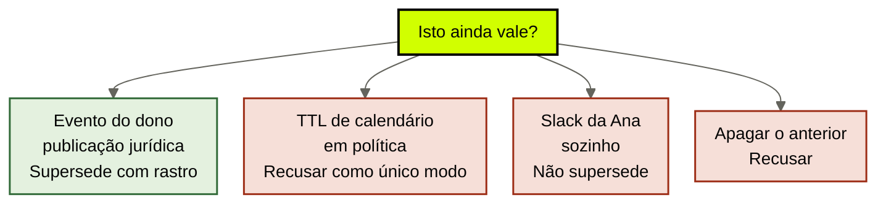
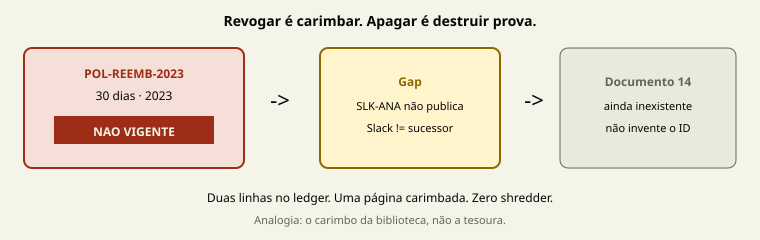

# Validade e supersessão

[↑ M2](../modulos/M2-governanca-a-camada-de-confiabilidade.md) · [Curso](../README.md)

Caso: [Atlas Assist](../casos/atlas-assist.md). Matriz da [aula 09](09-acl-e-autoridade.md). Fonte: [01](../sources/01-tese-company-brain.md). Termos: [Glossário](../Glossario.md).

Revogar é carimbar. Apagar é destruir prova. Slack não é sucessor.

> Analogia: o **carimbo da biblioteca**, não a tesoura do arquivo morto. POL-REEMB-2023 fica na prateleira com “não vigente”. Sem ela você não audita 2024.

## Resultado

Você sai com uma **política de validade** do case: o que morre por evento, o que um TTL não substitui, e a supersessão 30→14 que **ainda não fechou** porque SLK-ANA-2026-03-12 não publica.

```text
regras: [{id, modo: ttl|evento, trigger, vigente, supersede_de, apagar: false}]
sucessor: {id_publicado, id_recusado_como_sucessor: SLK-ANA-2026-03-12}
ttl: {onde_serve, onde_recusa}
```

Se a frase final for “apagamos o wiki de 30 dias para o agent não se confundir”, a aula falhou. A [aula 04](04-fontes-canonicas.md) já exigiu POL-REEMB-2023 como prova do que *foi* verdade. Esta aula escreve o carimbo que a 04 só nomeou.

## Mapa visual

Decisão-chave — Isto ainda vale, e o que acontece com o anterior?





> Leia o diagrama antes do texto longo. Depois volte e confira.

> Vigente e fonte são campos diferentes. Sucessor e conversa são atos diferentes.

**Objetivos**

- Distinguir validade por evento de validade por TTL. _(understand)_
- Revogar POL-REEMB-2023 sem apagá-la. _(apply)_
- Recusar SLK-ANA-2026-03-12 como sucessor. _(evaluate)_
- Declarar a lacuna: não há benchmark público de governança de company brain. _(analyze)_

**Núcleo obrigatório:** Resultado, mapa visual, seções 1–3, Prática e Evidência.
**Aprofundamento:** seções seguintes, papers, fronteira com Agent Engineering, teste de recuperação.

---

## 1. Terça: três relógios no mesmo prazo

O outcome da Atlas pede política **vigente**. A triagem cita POL-REEMB-2023. Jurídico já opera 14 dias. FT-ATLAS-2024 ainda diz 30. Três relógios, um ticket. A [aula 02](02-tres-relogios.md) ensinou a não mover as três camadas juntas. Esta aula ensina o relógio *dentro* do brain: quando um claim deixa de ser o de hoje sem fingir que nunca foi o de ontem.

A [aula 03](03-o-que-o-brain-entrega.md) chamou o adjetivo *atual* de “o claim que sobreviveu a supersessão”. Até o M1 isso era slogan. Aqui vira regra com dono e trigger.

Três erros da terça, três recusas desta aula.

**O retrieve trata recência de crawl como vigência.** IDX-ALL prefere o embedding “limpo” da página de 2023. Recência de índice não é validade. Long Context RAG e Lost in the Middle — já citados no M0 — medem uso de janela, não carimbo jurídico. Não os reuse como muleta de validade.

**O time quer apagar os 30 dias.** “Assim o agent não se confunde.” Sem POL-REEMB-2023 você não audita 2024, não escreve a supersessão e não explica a terça. A triagem não alucinou: citou fonte **desatualizada**. Apagar a fonte apaga o diagnóstico.

**O comercial trata a thread da Ana como válido.** SLK-ANA-2026-03-12 tem data. Tem dono de fato. Não tem locator de documento aprovado. Data não é sucessor.

Não há benchmark público de ACL, supersessão, conflito e retenção de um company brain real. A [fonte 01](../sources/01-tese-company-brain.md) declara isso sem eufemismo. Não há paper que ranqueie “TTL de 90 dias” contra “evento jurídico”. Esta aula ensina o contrato da Atlas, não um vencedor empírico.

---

## 2. TTL vs evento

Dois modos. Não são dois vendors. São duas respostas para “quando isto morre?”.

**Evento.** A vigência cai quando um ato nomeado acontece. Para política de reembolso da Atlas, o ato é **publicação jurídica** aprovada: documento com locator, dono de vigência, data, texto que afirma o sucessor. Ana no Slack não é o ato. Fine-tune novo não é o ato. Crawl do wiki não é o ato. Provider anunciando deprecação de FT-ATLAS-2024 em 90 dias é evento do *modelo* — relógio da aula 02 — não evento de política.

**TTL.** A vigência cai quando um relógio de calendário estoura. Serve a coisa que *nasce* com prazo: snapshot de dado com competência (“margem desta aba, abril”), sessão, cache de projeção, talvez um rascunho. Não serve como único modo de uma política institucional. “POL-REEMB-2023 expira em 90 dias” é inventar um funeral que o jurídico não marcou. A página de 2023 morreu em março *porque alguém revogou*, não porque um cron passou.

A confusão clássica é usar TTL como desculpa de evento.

| Pergunta | Modo honesto | Modo que a Atlas já comprou |
|----------|----------------|-----------------------------|
| Quando 30 dias param de valer para ticket de hoje? | Evento: publicação (ainda faltando) + revogação da Ana | “quando o índice achar texto mais novo” |
| Quando o embedding de POL-REEMB-2023 deve sumir da projeção vigente? | Depois do carimbo `vigente: nao` | “quando o crawl envelhecer” |
| Quando FT-ATLAS-2024 some? | Evento do provider / troca de modelo | o time trata 90 dias como se fosse validade da política |
| Quando MARGEM-CLIENTE de abril deixa de ser a margem de abril? | TTL de competência da aba, ou evento de fechamento contábil | nunca; o número solto no rascunho não expira |

TTL de projeção é higiene da aula 08: se o índice queimar, você reconstrói. TTL de política é ficção. Evento de política é Ana (aula 09) publicando. Os dois podem coexistir no case — em IDs diferentes. Não funda POL-REEMB-2023 e o cache do IDX-ALL num único “expire_at”.

---

## 3. Revogar sem apagar

POL-REEMB-2023 continua fonte. A aula 04 foi explícita. O campo que muda é `vigente`.

```text
id: POL-REEMB-2023
tipo: documento
vigente: nao
apagar: false
prova_do_que_foi_verdade: a empresa publicou reembolso em 30 dias
o_que_nao_pode_provar: a regra de hoje
dono_da_revogacao: Ana
```

Sem essa linha você perde quatro coisas que o outcome ainda exige *depois* da terça:

- auditoria dos tickets de 2024 que ganharam 30 dias de verdade;
- a cadeia da aula 05: o claim histórico fica `pronto` para uso histórico, `recusado` para ticket de hoje;
- o material da supersessão — um claim substitui outro **sem** fingir que o antigo nunca existiu;
- a conversa com compliance: “em que texto vocês se basearam naquele trimestre?”.

A [tabela de atores](../casos/atlas-assist.md) já deu o dono: só Ana revoga. A aula 09 trancou a célula. Esta aula descreve o **efeito do carimbo**. Triagem ainda *pode ler* a página — política pública, leitura permitida — e **não pode usá-la como vigente**. Uso permitido da aula 05 e vigência desta aula são elos diferentes. Fundi-los é “apaga, então ninguém lê” ou “deixa, então ainda vale”. Os dois quebram o outcome: ticket com política vigente **e** exceção com fonte citável, inclusive fonte velha quando a pergunta for histórica.

Apagar para “não confundir o modelo” devolve a empresa aos pesos. O modelo, sem a página, interpola 30 ou 14 com confiança. Interpolação sem fonte é o habitat da [aula 01](01-empresa-vive-nos-pesos.md). Manter a página com `vigente: nao` é o que permite a esteira devolver o claim histórico *ou* o buraco vigente, em vez de um chute.

---

## 4. O trigger é publicação jurídica — 30→14 ainda não aconteceu

O time fala “passamos de 30 para 14” como se a supersessão tivesse fechado. Não fechou. Houve uma fala. Houve operação informal. Não houve sucessor publicado.

Supersessão, neste curso, é ato formal: um claim **substitui** outro, com rastro do anterior. O [Glossário](../Glossario.md) já definiu. Formal exige o que a aula 04 exige de fonte: documento, locator, dono, data. O trigger da Atlas para prazo de reembolso é **publicação jurídica**, não calendário, não Slack, não fine-tune.

O que existiria se Ana publicasse — **sem inventar ID** no case:

1. Documento aprovado (ID inexistente; declare o buraco).
2. Claim “reembolso vigente é 14 dias” vira `pronto` (aula 05).
3. POL-REEMB-2023 permanece, `vigente: nao`, `supersede_de` apontando o sucessor quando ele existir.
4. FT-ATLAS-2024 continua recusado como fonte; o snapshot de 30 dias não “passa a 14” sozinho.
5. IDX-ALL, se ainda existir como oráculo, continua recusado; projeção nova só depois do carimbo.

O que existe hoje:

```text
anterior: POL-REEMB-2023 (fonte, vigente nao — se Ana já revogou de direito;
           vigente no retrieve, se só o wiki ainda publica 30)
sucessor_publicado: (vazio)
candidato_informal: SLK-ANA-2026-03-12
supersessao: aberta
```

Cuidado com o “se Ana já revogou de direito”. No case, o jurídico *opera* 14. A página *ainda diz* 30. Operar não é carimbar o inventário. A política de validade que você escreve precisa escolher uma frase honesta: *revogação de fato no jurídico; carimbo de vigência ainda não aplicado à fonte; sucessor ainda não publicado*. Três estados. Uma página. Não comprima.

30→14 não é um diff de número. É dois claims, um rastro, um buraco. A aula 11 trata o conflito enquanto o buraco existir. Esta aula só impede que você chame o buraco de supersessão.

---

## 5. Slack não supersede sozinho

SLK-ANA-2026-03-12 é resolução privada. A aula 04 recusou como fonte. A aula 05 deixou o claim de 14 em `gap`. A aula 07 pode guardá-lo como episódio de **decisão**: quem, quando, o que ela disse. Nenhuma dessas linhas publica sucessor.

Quatro tentações. Recuse as quatro na ficha.

**“A Ana é o dono, então a thread vale.”** Dono de revogação (aula 09) não torna o canal fonte. Ana *pode* revogar e *pode* publicar. Enquanto publica só no Slack, o brain tem episódio + gap, não claim vigente.

**“Vamos indexar o Slack dela.”** Habitat 4. Gravar a thread como episódio é certo. Tratar o retrieve da thread como sucessor é a terça com timestamp.

**“O compliance já cobra 14, então está supersedido.”** Verdade operacional sem documento é o gap honesto. Mentir o campo `vigente` para o ticket “ficar certo” quebra citável. O outcome pede fonte citável, não consenso de corredor.

**“O fine-tune ainda diz 30, então 30 vence.”** Pesos nunca supersedem e nunca são supersedidos por política. FT-ATLAS-2024 é relógio de modelo. Deprecação em 90 dias não reabre POL-REEMB-2023 e não fecha 14. Trocar o snapshot para “dizer 14” devolve a empresa aos pesos — aula 04, de novo.

Anthropic, *Decoupling the brain from the hands* (`https://www.anthropic.com/engineering/managed-agents`), separa o que se sabe do que se faz. Slack da Ana pode mudar o desenho *futuro* das mãos (compliance já opera 14). Não muda, sozinho, o que o brain pode **citar** como vigente. Hands adiantadas + brain atrasado = a terça. Hands e brain “alinhados” por um prompt que finge publicação = a terça com confiança.

---

## 6. O que validade não é

Validade não é ACL. A aula 09 responde *quem*. Esta aula responde *até quando*. O estagiário autorizado a ler política pública ainda recebe POL-REEMB-2023 com o carimbo de não vigente. Autorizado ≠ atual.

Validade não é conflito. Duas fontes *vigentes* que divergem são aula 11. Uma vigente e uma revogada não são conflito: são rastro. A Atlas de terça mistura os dois porque 14 ainda não é vigente citável. Não chame o gap de “duas políticas vigentes”.

Validade não é retenção. A aula 12 decide quanto tempo o registro *fica* e quando o direito de apagar vence o dever de auditar. `vigente: nao` não autoriza `delete`. `delete` não é o jeito de revogar.

Validade não é benchmark. Declare na ficha, em linguagem própria, a lacuna da [fonte 01](../sources/01-tese-company-brain.md): não há comparação pública entre políticas de validade de company brain. Você não está escolhendo o vencedor de um paper. Está escrevendo o trigger da Atlas — publicação jurídica — e recusando o atalho que o retrieve já tomou.

A CSI da NSA sobre MCP (junho 2026, `https://media.defense.gov/2026/Jun/02/2003943289/-1/-1/0/CSI_MCP_SECURITY.PDF`) fala de injeção e de dado que não deveria estar no contexto. Aplicação aqui: um claim **revogado** projetado como vigente é o irmão institucional da superfície a mais. Não é exploit. É esteira sem carimbo. Tire o carimbo do retrieve, não do arquivo.

---

## 7. Fronteira: relógio do modelo não é relógio do claim

Não use deprecação de snapshot como política.

| Já resolvido noutro lugar | Path | O que esta aula acrescenta |
|---------------------------|------|----------------------------|
| Relógio do modelo / harness / brain | [aula 02](02-tres-relogios.md) e `cursos/AIOX-Agent-Engineering/aulas/21b-modelos-substituiveis-harness-fino-cerebro-modular.md` | trigger de vigência *dentro* do módulo de fatos |
| Data do claim | [aula 05](05-fatos-e-sinteses.md) | data de morte (revogação) ≠ data de publicação |
| Mentira de vigência do vetorial | [aula 08](08-projecoes-recuperaveis.md) | campo que a projeção deve ler, não inferir |

Se a próxima mudança for “o provider mata FT-ATLAS-2024”, a camada é modelo. Se for “Ana publica 14 dias”, a camada é brain, evento desta aula. Se as duas viajarem juntas “para o agent já nascer certo”, você acoplou o que a aula 02 proibiu.

---

## Quando usar — e quando não usar

**Use quando** o inventário já distingue fonte de vigente e você precisa escrever *como* a vigência muda — trigger, dono, rastro.

**Não use quando** estiver redigindo o documento que falta, escolhendo cron de reindex ou pedindo ao modelo para “considerar 14 a partir de agora”. Redigir é Ana. Cron é projeção. “Considerar” é supersessão falsa.

Limite: um Markdown único, ainda vigente, sem sucessor à vista — a política de validade cabe em “modo evento, trigger = publicação do dono, apagar = false”. Não invente 30→14 no seu case se ele não existir.

---

## Teste de recuperação

Para cada item, diga: vigente ou não; apagar ou não; supersessão fechada ou aberta.

1. POL-REEMB-2023 no wiki, jurídica já opera 14, sem documento novo.
2. Time apaga a página de 30 “para limpar o retrieve”.
3. SLK-ANA-2026-03-12 citada como política vigente.
4. TTL de 90 dias colado em POL-REEMB-2023 porque o fine-tune morre em 90.
5. Ana publica documento aprovado de 14 (ID inexistente; declare). O que acontece com POL-REEMB-2023?
6. IDX-ALL devolve o parágrafo de 30 porque o crawl é recente.

<details>
<summary>Gabarito comentado</summary>

1. **Fonte não vigente para ticket de hoje** (se o carimbo existir) **ou vigente no retrieve por omissão**. Sucessor vazio. Supersessão **aberta**. Slack não fecha.
2. **Recusa.** Apagar destrói prova do que foi verdade. Revogue. Não delete.
3. **Não supersede.** Episódio / gap. Não é sucessor.
4. **TTL recusado como modo da política.** Os 90 dias são do modelo. Evento jurídico é outro relógio.
5. **Supersessão fecha.** 14 `pronto`. POL-REEMB-2023 fica, `vigente: nao`, rastro. Sem ID novo até você declarar.
6. **Falha de atual.** Recência ≠ validade. A projeção deveria ler o carimbo, não o crawl.

</details>

---

## Prática

Com a matriz da aula 09, preencha a [política de validade](../templates/politica-de-validade.md). Na Atlas, o ID obrigatório é POL-REEMB-2023. O recusado-como-sucessor é SLK-ANA-2026-03-12.

**Funcionou se:**

- POL-REEMB-2023 tem `apagar: false` e prova do que foi verdade;
- o modo da política é `evento` e o trigger é publicação jurídica;
- Slack está em `id_recusado_como_sucessor`, com motivo em linguagem própria;
- TTL, se aparecer, não é o modo da política de reembolso;
- a ficha declara a lacuna de benchmark, sem fingir paper vencedor.

## Pergunte ao seu agente

```text
Contexto: case (Atlas ou o meu) + inventário da aula 04 + matriz da aula 09.
Pedido: escreva a política de validade. Revogue POL-REEMB-2023 sem apagar. Recuse Slack como sucessor. Distinga TTL de evento. Mostre 30→14 como supersessão ainda aberta. Declare que não há benchmark público de governança de company brain. Não redija a política nova e não invente ID.
Evidência que espero: YAML da política + uma frase sobre o trigger.
```

## Evidência de conclusão

Você passou quando consegue:

1. defender POL-REEMB-2023 como prova histórica sem reativá-la;
2. recusar TTL como único funeral de uma política;
3. explicar por que a Ana no Slack ainda não supersede;
4. escrever 30→14 como dois claims e um buraco, não como um número atualizado.

A [aula 11](11-conflito-e-proveniencia.md) trata o que fazer enquanto wiki, Ana e fine-tune discordam — sem pedir ao modelo a melhor.

## Navegação

[← Anterior](09-acl-e-autoridade.md) · [↑ M2](../modulos/M2-governanca-a-camada-de-confiabilidade.md) · [↑ Curso](../README.md) · [Próxima →](11-conflito-e-proveniencia.md)
