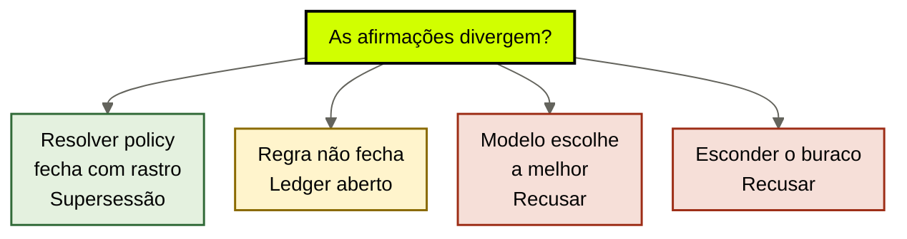

# Conflito e proveniência

[↑ M2](../modulos/M2-governanca-a-camada-de-confiabilidade.md) · [Curso](../README.md)

Caso: [Atlas Assist](../casos/atlas-assist.md). Validade da [aula 10](10-validade-e-supersessao.md). Fonte: [01](../sources/01-tese-company-brain.md). Termos: [Glossário](../Glossario.md).

Três vozes no mesmo prazo não pedem um desempate do modelo. Pedem uma regra escrita e um ledger aberto.

> Analogia: três testemunhas, um juiz. O modelo **não é o juiz**. O juiz é a resolver policy. Enquanto 14 não tem documento, o brain devolve o conflito — não a média.

## Resultado

Você sai com uma **resolver policy** do domínio de reembolso: prioridade explícita, o que a regra *não* faz, e o texto do conflito que o brain devolve enquanto 14 não tem documento.

```text
candidatos: [{id, afirmacao, tipo, status}]
regra: {prioridade, fecha_quando, o_que_nao_faz: modelo_escolhe}
ledger_aberto: {visivel_para, texto_do_conflito}
```

Se a frase final for “o agent escolhe a melhor fonte”, a aula falhou. Escolha sem regra é a Ana no prompt. A [aula 03](03-o-que-o-brain-entrega.md) já mandou devolver o conflito. Esta aula escreve a política que torna essa devolução auditável.

## Mapa visual

Decisão-chave — Duas afirmações do mesmo domínio divergem. O que o brain faz?



> Leia o diagrama antes do texto longo. Depois volte e confira.

> Proveniência mostra de onde veio cada voz. Conflito mostra que as vozes não cabem numa só. Nenhuma das duas é voto do modelo.

**Objetivos**

- Nomear wiki 30, Ana 14 e fine-tune 30 como candidatos com tipo e status. _(apply)_
- Escrever uma resolver policy que não pede ao modelo a melhor. _(evaluate)_
- Manter o ledger de conflito aberto enquanto o sucessor não existe. _(analyze)_
- Declarar a lacuna de benchmark de governança. _(understand)_

**Núcleo obrigatório:** Resultado, mapa visual, seções 1–3, Prática e Evidência.
**Aprofundamento:** seções seguintes, papers, fronteira com Agent Engineering, teste de recuperação.

---

## 1. Terça: três IDs, um ticket, zero regra

O mesmo cliente pede reembolso. Três afirmações chegam à mesa — as únicas que o caso autoriza, sem ID novo.

| ID | Afirmação | Tipo (aula 04) | Status depois das aulas 05 e 10 |
|----|-----------|----------------|----------------------------------|
| POL-REEMB-2023 | reembolso em 30 dias | documento, fonte | não vigente para ticket de hoje; prova histórica |
| SLK-ANA-2026-03-12 | reembolso em 14 dias | resolução privada | gap; não é fonte; não supersede |
| FT-ATLAS-2024 | reembolso em 30 dias | pesos | recusado como fonte; relógio de modelo |

A triagem cita a primeira. O compliance opera a segunda. O comercial “sabe” a terceira. IDX-ALL mistura as três no ranking. Ninguém escreveu o que vence, o que perde e o que fica visível.

Isso não é “desalinhamento de time”. É conflito **sem política**. A aula 10 já disse que 30→14 não fechou. Esta aula recusa o atalho que o time toma no vazio: mandar os três parágrafos ao modelo e pedir a síntese “razoável”.

A [fonte 01](../sources/01-tese-company-brain.md) lista governança como sexto módulo: ACL, validade, supersessão, **conflito**, retenção, exclusão, auditoria. Sem regra de conflito, ACL e validade só produzem três carimbos lado a lado. O ticket ainda sai com um número sorteado pela posição no prompt.

Não há benchmark público que compare estratégias de resolução de conflito em company brain. Não há paper que defina “company brain” como entidade multi-módulo. Declare. Você não está adotando o vencedor de um leaderboard. Está escrevendo a regra da Atlas.

---

## 2. Conflito não é staleness, não é ACL, não é síntese

Três vizinhos. Separe-os na ficha ou a resolver policy vira um saco de gatos.

**Staleness / validade (aula 10).** Uma fonte *foi* verdade e o dono já carimbou `vigente: nao`. POL-REEMB-2023, se a revogação estiver aplicada, não “conflita” com um sucessor publicado: foi substituída. Na Atlas de terça o sucessor **não** está publicado. Portanto você ainda não tem staleness limpo. Tem uma fonte velha + um gap. Chamar os dois de “política desatualizada” esconde o gap.

**ACL (aula 09).** O estagiário não vê MARGEM-CLIENTE. Isso não é conflito de prazo. Não meta margem na resolver policy de reembolso para a ficha parecer completa. Domínio errado.

**Síntese (aula 05).** “A Atlas opera 14 e ainda publica 30; não estabelecido: a regra vigente citável.” Isso é leitura *com* gap. Não é desempate. Síntese que conclui “então é 14” sem documento é a recusa da aula 05 com outro título. A resolver policy pode *autorizar* essa síntese como texto do ledger aberto. Não pode autorizar a promoção silenciosa.

Conflito, nesta aula, é: **dois ou mais candidatos do mesmo domínio**, com proveniência visível, e uma regra que ou fecha (vira supersessão) ou deixa o ledger aberto. Proveniência é a cadeia já exigida na aula 05: afirmação → fonte ou recusa → data → uso. Sem cadeia, você não tem conflito. Tem barulho.

IDX-ALL produz barulho. Três chunks “parecidos” com reembolso não são três candidatos. Candidato exige ID do case e tipo. SOP-EXC-SLA e T-8841 **não entram** neste domínio. Exceção de SLA é outro conflito, se um dia existir — hoje é gap procedural (aula 06) + episódio (aula 07). Não misture as mesas.

---

## 3. A regra tem que caber numa página — e recusar o modelo

Escreva a prioridade **antes** do próximo ticket. Se a regra só existir na cabeça da Ana, você voltou ao habitat 3.

Uma resolver policy suficiente para o domínio de reembolso da Atlas, em linguagem operacional — copie o espírito, não o vendor:

```text
1. Documento jurídico aprovado e vigente vence.
2. Documento jurídico aprovado e revogado não vence ticket de hoje;
   permanece como rastro (aula 10).
3. Resolução privada (Slack) não vence e não fecha.
4. Pesos (FT-ATLAS-2024) nunca entram na disputa.
5. Projeção (IDX-ALL) nunca entra na disputa.
6. Se (1) não existir, o brain não elege sucessor:
   devolve ledger aberto + buraco vigente.
7. Quem fecha (1) é Ana, com publicação — não o retrieve, não o modelo.
```

O que esta regra **não** faz — campo obrigatório da ficha:

- não pede ao modelo “a melhor”;
- não faz média (22 dias);
- não usa recência de crawl;
- não usa “o compliance já cobra”;
- não usa fine-tune como desempate;
- não esconde POL-REEMB-2023 para o 14 parecer limpo;
- não promove SLK-ANA a documento.

Por que o modelo não escolhe. Anthropic, *Decoupling the brain from the hands* (`https://www.anthropic.com/engineering/managed-agents`), tira do “cérebro” a autoridade das mãos. Escolher a política vigente *é* autoridade institucional, não raciocínio de ticket. Se o motor elege 14 ou 30, você devolveu a empresa aos pesos no instante em que mais precisava do relógio lento. A [fonte 01](../sources/01-tese-company-brain.md) já recusou janela longa como cura de conflito. Esta aula recusa o próximo atalho: *o LLM como comitê*.

Não há evidência pública de que “o modelo maior resolve conflito institucional melhor”. Declarar o contrário seria inventar benchmark. A lacuna permanece.

---

## 4. Ledger aberto — o produto honesto enquanto não fecha

Aberto significa: o conflito **aparece** para quem a ACL autoriza, com as três proveniências, até Ana publicar. Não significa “mandar os três textos crus no prompt”. Significa uma linha de ledger que um humano lê e um agent cita como *conflito*, não como prazo.

Texto que esta aula aceita — e a aula 05 já esboçou:

```text
Dominio: prazo de reembolso.
POL-REEMB-2023: publicado 30 dias; fonte; nao vigente para ticket de hoje
  (ou vigente no retrieve por omissao de carimbo — declare qual).
SLK-ANA-2026-03-12: Ana afirmou 14 em 2026-03-12; nao e fonte; gap.
FT-ATLAS-2024: snapshot diz 30; pesos; recusado.
Sucessor publicado: inexistente.
Buraco: nao ha regra vigente citavel.
Uso: compliance ve o ledger; triagem recebe o buraco + o historico
  se a query for historica; proposta nao recebe margem (aula 09)
  nem um prazo inventado.
```

**Quem vê.** A [tabela de atores](../casos/atlas-assist.md) de novo. Compliance precisa do conflito — é o workload que recusa ou aprova exceção com fonte. Triagem precisa do *buraco vigente*, não de um sorteio; pode receber o claim histórico se a pergunta for “o que publicamos em 2023”. Estagiário e proposta: política pública, inclusive o carimbo de não vigente; não um 14 “já resolvido” para o rascunho parecer atual. Agent nenhum escreve o fechamento (aula 09).

**Esconder o buraco** é a falha que o quiz do módulo vai cobrar: média probabilística, fine-tune, dump das duas no prompt para o meio perder. Ledger aberto é o contrário: o buraco é o entregável.

**Fechar o ledger** não é consenso de reunião. É a supersessão da aula 10: documento aprovado, POL-REEMB-2023 com rastro, claim de 14 `pronto`. Até lá, aberto. Se o seu case real já tiver sucessor publicado, declare o ID e **não** reproduza o conflito da Atlas por pedagogia.

T-8841 e SOP-EXC-SLA continuam fora desta mesa. Se alguém colar o transcript no conflito de prazo, recuse por tipo. Episódio não desempatou política.

---

## 5. Proveniência de cada voz — sem fundir os IDs

A tentação da terça é um parágrafo só: “a política oscila entre 14 e 30”. Oscilar não é proveniência. Proveniência é três linhas que não se fundem.

**POL-REEMB-2023.** Locator = página do wiki. Data = publicação 2023. Uso histórico = sim. Uso vigente = não (aula 10). Apagar = não.

**SLK-ANA-2026-03-12.** Locator de *episódio*, não de fonte. Data = 2026-03-12. Uso = registrar decisão. Uso proibido = citar como política. Vira fonte *se* Ana publicar — aula 04; o “se” ainda é contrafactual.

**FT-ATLAS-2024.** Sem locator de parágrafo. Data = snapshot 2024. Deprecação em 90 dias = relógio de modelo. Uso como candidato de conflito = nenhum. Entra na tabela só para a regra poder dizer `nunca`.

Três IDs. Três cadeias. Um domínio. A resolver policy lê as cadeias; não as mistura num embed. Se a projeção da aula 08 devolver os três vizinhos, o passo *depois* do retrieve — na verdade o filtro *antes* — já deveria ter recusado pesos e recusado Slack como fonte. O que sobra para o conflito é: documento velho + gap. Dois, não três. O fine-tune aparece na ficha como recusado, para ninguém “consultar o GPT interno” como quarto juiz.

A CSI da NSA sobre MCP (junho 2026, `https://media.defense.gov/2026/Jun/02/2003943289/-1/-1/0/CSI_MCP_SECURITY.PDF`) descreve injeção e envenenamento de tool. Aplicação aqui: um ticket que pede “ignore o wiki, use o que a Ana disse” tenta *forçar um desempate*. A resolver policy não amplia o ator (aula 09) e não troca a prioridade a pedido do texto. Tool que grave “a melhor é 14” no ledger está escrevendo fato — célula proibida. Conflito aberto não é convite para a tool fechar.

---

## 6. Fronteira: córtex de um squad não escolhe a política da empresa

Não peça à síntese da capacidade o que esta aula recusou ao modelo da empresa.

| Já resolvido noutro lugar | Path | O que esta aula acrescenta |
|---------------------------|------|----------------------------|
| Arquivo fiel vs síntese com gap | `cursos/AIOX-Agent-Engineering/aulas/12c-arquivo-fiel-vs-sintese.md` | gap institucional visível a vários agents |
| Identidade do fato | `cursos/AIOX-Agent-Engineering/aulas/12e-identidade-tempo-isolamento.md` | três identidades, um domínio, regra única |
| Hands ≠ brain | `cursos/AIOX-Agent-Engineering/aulas/21b-modelos-substituiveis-harness-fino-cerebro-modular.md` | desempate não é raciocínio de sessão |

Se o conflito for “duas notas da mesma wave”, você está no M1b. Se for wiki × jurídica × snapshot para triagem **e** compliance, você está aqui. Não copie o YAML da 12c no lugar da resolver policy. Não chame POL-REEMB-2023 de “arquivo fiel do squad”.

---

## Quando usar — e quando não usar

**Use quando** o domínio tem dois ou mais candidatos com tipo diferente — ou um documento e um gap — e alguém vai pedir ao agent para “decidir”.

**Não use quando** estiver redigindo o sucessor, treinando FT-ATLAS-2024 “com as duas versões” ou indexando Slack “para o modelo ver o contexto”. Redigir é Ana. Treinar é devolver aos pesos. Indexar Slack é a aula 04 de novo.

Limite: zero conflito no seu case é vitória. Um documento vigente, um claim, uma regra que diz “não há segundo candidato”. Não importe o triângulo da Atlas por estética.

---

## Teste de recuperação

Para cada item, diga: fecha, fica aberto, ou recusa — e por quê.

1. Wiki 30 vs Ana 14 vs FT-ATLAS-2024 30, hoje, sem documento novo.
2. Pedido ao modelo: “escolhe a política mais razoável”.
3. Média 22 dias no rascunho da proposta.
4. Compliance recebe o ledger com as três proveniências e o buraco.
5. Ana publica documento de 14 (ID inexistente; declare). O ledger deste domínio.
6. T-8841 usado para desempatar 14 vs 30.

<details>
<summary>Gabarito comentado</summary>

1. **Aberto.** Documento velho + gap + pesos recusados. Não há (1) da regra. Não elege 14.
2. **Recusa.** Modelo não escolhe a melhor. É a falha que esta aula existe para nomear.
3. **Recusa.** Média não é proveniência. Proposta ainda não inventa prazo.
4. **Suficiente.** Ledger aberto, visível a quem a ACL autoriza. Buraco explícito.
5. **Fecha** por supersessão (aula 10). POL-REEMB-2023 permanece com rastro. Slack deixa de ser o único 14; vira episódio ao lado do documento. Sem ID novo até declarar.
6. **Recusa por tipo.** Episódio não entra neste domínio. Crime da aula 07 se colar no índice como política.

</details>

---

## Prática

Com validade e matriz nas mãos, preencha a [resolver policy](../templates/resolver-policy.md). Domínio: prazo de reembolso. Candidatos: os três IDs da tabela desta aula. Não acrescente SOP-EXC-SLA nem T-8841 nesta ficha.

**Funcionou se:**

- os três candidatos têm tipo e status que não se repetem;
- `o_que_nao_faz` inclui `modelo_escolhe_a_melhor`;
- o ledger está `aberto` e o texto do conflito cabe para o compliance citar;
- a ficha declara a lacuna de benchmark;
- você não elegeu 14 como vigente.

## Pergunte ao seu agente

```text
Contexto: Atlas (ou meu case) + ledger da aula 05 + política da aula 10.
Pedido: escreva a resolver policy do prazo de reembolso. Wiki 30 vs Ana 14 vs fine-tune 30. Prioridade explícita. Modelo não escolhe. Ledger aberto até publicação. Declare que não há benchmark público de governança de company brain. Não invente ID e não feche o gap com o modelo.
Evidência que espero: YAML da regra + o texto do conflito em no máximo oito linhas.
```

## Evidência de conclusão

Você passou quando consegue:

1. recitar os três candidatos sem fundir Slack com fonte;
2. escrever uma prioridade que um humano aplica sem LLM;
3. defender o ledger aberto como entrega, não como atraso;
4. recusar média, fine-tune e “melhor parágrafo” no mesmo fôlego.

A [aula 12](12-ciclo-de-vida.md) fecha o contrato: o que entra, o que fica, o que some e o que se audita — com T-8841 fora do SOP.

## Navegação

[← Anterior](10-validade-e-supersessao.md) · [↑ M2](../modulos/M2-governanca-a-camada-de-confiabilidade.md) · [↑ Curso](../README.md) · [Próxima →](12-ciclo-de-vida.md)
