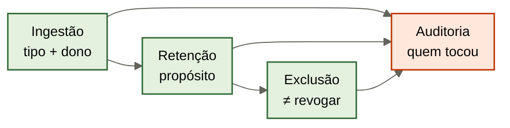

# Ciclo de vida: ingestão, retenção, exclusão e auditoria

[↑ M2](../modulos/M2-governanca-a-camada-de-confiabilidade.md) · [Curso](../README.md)

Caso: [Atlas Assist](../casos/atlas-assist.md). Conflito da [aula 11](11-conflito-e-proveniencia.md). Fonte: [01](../sources/01-tese-company-brain.md). Termos: [Glossário](../Glossario.md).

O que entra sem aprovação amanhece política. O que some sem trilha amanhece amnésia. Os dois quebram o outcome.

> Analogia: a **alfândega da biblioteca**. T-8841 declara “episódio”. Sem declaração, não entra. Sem trilha, não some.

## Resultado

Você sai com o **contrato de governança** do case: as três fichas anteriores mais ingestão, retenção, exclusão e auditoria — T-8841 entra como episódio, não como SOP.

```text
acl: {antes_do_retrieve, margem: false}
validade: {revoga_sem_apagar, slack_supersede: false}
conflito: {ledger_aberto, modelo_escolhe: false}
ciclo: {ingestao_aprovada, retencao, exclusao, auditoria}
efeito: {brain_executa: false}
```

Se a frase final for “indexamos tudo e o jurídico apaga depois se precisar”, a aula falhou. Depois é o crime da terça com calendário. Ciclo de vida é gate na entrada, regra na estadia, rastro na saída.

## Mapa visual

Decisão-chave — O ciclo tem porta, estadia, saída e rastro?



> Leia o diagrama antes do texto longo. Depois volte e confira.

> Governança sem ciclo é carimbo em arquivo solto. Ciclo sem as aulas 09–11 é pasta com cron.

**Objetivos**

- Recusar ingestão de T-8841 como SOP e aceitá-la só como episódio classificado. _(evaluate)_
- Escrever retenção que não trata POL-REEMB-2023 revogada como lixo. _(apply)_
- Distinguir exclusão (direito de apagar) de revogação (aula 10). _(analyze)_
- Fechar o contrato ACL + validade + conflito + ciclo, sem autoridade de efeito. _(apply)_

**Núcleo obrigatório:** Resultado, mapa visual, seções 1–3, Prática e Evidência.
**Aprofundamento:** seções seguintes, papers, fronteira com Agent Engineering, teste de recuperação.

---

## 1. Terça: o transcript entrou — o ciclo já tinha falhado

Alguém cola T-8841 no IDX-ALL. Não houve tipo. Não houve dono. Não houve célula de escrita (aula 09). No dia seguinte a triagem trata o erro como política. A aula 06 recusou o SOP. A aula 07 aceitou o episódio. Esta aula nomeia o **momento** em que a empresa deveria ter dito não: a ingestão.

As outras quatro falhas do mesmo dia são o mesmo ciclo em outras portas.

1. POL-REEMB-2023 vigente no retrieve — validade sem carimbo (aula 10), projeção sem leitura do carimbo (aula 08).
2. FT-ATLAS-2024 ainda diz 30 — ingestão paramétrica que este ciclo **não** governa; relógio de modelo, [aula 02](02-tres-relogios.md).
3. Quarenta mil chunks — ingestão sem teto e sem tipo; depósito, não brain ([aula 03](03-o-que-o-brain-entrega.md)).
4. Estagiário vê MARGEM-CLIENTE — ingestão do dado no mesmo índice que a política; ACL depois do fato (aula 09).
5. T-8841 vira “política” — ingestão sem aprovação; esta aula.

O contrato que você fecha hoje não implementa store. Especifica as quatro perguntas que o dump nunca fez: o que pode entrar, quanto tempo fica, o que pode sair, quem vê o rastro. Sem elas, as aulas 09–11 são parecer. Com elas, o M2 tem um artefato só.

Não há benchmark público de retenção, exclusão ou auditoria de company brain. A [fonte 01](../sources/01-tese-company-brain.md) declara a lacuna. A CSI da NSA sobre MCP (junho 2026, `https://media.defense.gov/2026/Jun/02/2003943289/-1/-1/0/CSI_MCP_SECURITY.PDF`) descreve injeção, envenenamento de tool e exfiltração em outro objeto — o protocolo de tools. Aplique, não copie: ingestão aberta é o irmão do tool poisoning; retenção de margem no mesmo índice é o irmão da exfiltração; query injetada na triagem é o irmão da injeção. O curso ensina o contrato da Atlas, não um score do PDF.

---

## 2. Ingestão aprovada — T-8841 não entra como SOP

Aprovar ingestão não é “um humano clicou em upload”. É um ato com quatro campos, iguais em espírito ao catálogo da aula 06:

```text
o_que_e:     tipo da anatomia (fonte, claim, procedural, episodio, projecao)
quem_dona:   ator com célula escrever naquele módulo (aula 09)
para_quem:   ACL de leitura já carimbada; MARGEM-CLIENTE nao herda wiki
nao_e:       a recusa explícita (SOP, fato, vigente, sucessor…)
```

T-8841, se entrar, entra **assim**:

```text
id: T-8841
entra_como: episodio
nao_entra_como: sop | claim_de_politica | exemplo_aprovado
dono_da_ingestao: humano com célula escrever em episodica
acl_de_leitura: quem a aula 07 isolou; nao o estagiario da proposta
```

Se qualquer campo faltar, a ingestão recusa. Recusar é o produto. Colar “para o agent aprender” é a aula 15 tentada cedo demais. Sem classificação, aprendizado de volta é IDX-ALL.

Três outros IDs, três portas.

**SOP-EXC-SLA.** Três versões, zero aprovação. Ingestão como `procedural usável` = recusa. Ingestão como *candidato* catalogado, `aprovado: false`, é o máximo que a aula 06 permitiu. Três arquivos no mesmo índice, sem sucessor, é conflito informal que a aula 11 **não** desempatou — e este ciclo não desempata na entrada.

**SLK-ANA-2026-03-12.** Ingestão como fonte de política = recusa. Ingestão como episódio de decisão = aceitável, com os campos da aula 07. Ingestão como sucessor = a aula 10 já recusou. A porta não republica a Ana.

**MARGEM-CLIENTE.** Ingestão no mesmo store que política pública = recusa. Se um dia existir projeção própria, a célula de leitura continua vazia para os três agents e para o estagiário. Ingerir “para depois filtrar” é a exfiltração da terça com atraso. A CSI da NSA, aplicada: dado restrito que entra num contexto compartilhado já saiu da cerca.

**POL-REEMB-2023.** Já está no wiki. Ingestão aqui é *classificar o que já existe*: fonte, documento, vigente `nao` ou omissão declarada. Não é um segundo upload. Reingerir a página como se fosse texto novo, sem carimbo, reabre a terça.

IDX-ALL, como objeto, **não é destino aprovado**. É o anti-padrão que o ciclo existe para recusar. Se o seu case real só tiver um Markdown vigente, a ingestão aprovada pode ser “este arquivo, este dono, esta data”. Vitória da aula 16 começando cedo. Não invente um pipeline para parecer completo.

---

## 3. Retenção — revogado não é lixo; episódio não é eterno por omissão

Retenção responde *quanto tempo isto fica* e *para qual propósito*. Não é o TTL da aula 10. TTL (quando aparece) mata **vigência** ou cache. Retenção guarda **registro**. POL-REEMB-2023 revogada fica *porque* é prova. T-8841 classificado fica *enquanto* o propósito de auditoria do desfecho existir — e pode ter prazo mais curto que uma política.

Três propósitos que a Atlas já tem, sem inventar lei:

| Objeto | Propósito de ficar | Recusa de “limpar” |
|--------|--------------------|---------------------|
| POL-REEMB-2023 | auditar 2024; rastro da supersessão | apagar para o retrieve “ficar limpo” |
| Ledger do conflito 30 vs 14 | compliance citar o buraco | esconder quando o comercial achar feio |
| T-8841 como episódio | provar o desfecho daquele ticket | promover a SOP *ou* apagar para “não dar ideia” |
| MARGEM-CLIENTE | dado de competência, se um ator autorizado existir | reter no IDX-ALL “por se acaso” |
| FT-ATLAS-2024 | nenhum, no brain | reter como se fosse arquivo da empresa |

Regra que você deve recitar: **`vigente: nao` não autoriza delete; retenção de política histórica é dever, não nostalgia.** A aula 10 carimbou. Esta aula impede o time de “higienizar” o carimbo no mês seguinte.

Retenção de margem no índice compartilhado é superfície. Mesmo com ACL na aula 09, o chunk retido é o que uma injeção futura tenta puxar. Menos superfície: não reter MARGEM-CLIENTE onde a triagem busca. Ausência continua sendo projeção (aula 08).

Não cite prazo mágico (“7 anos”) sem o propósito do *seu* case. Sem benchmark público, um número copiado de outro setor é teatro. Escreva propósito + dono da revisão. Se não souber o prazo, declare `retencao: revisao_pelo_dono`, não invente cron.

---

## 4. Exclusão — direito de apagar não é revogar

Exclusão é o ato de **tirar o registro** — ou o identificador pessoal dentro dele — quando um propósito vence outro. Revogação (aula 10) deixa o registro e mata a vigência. Confundir os dois é a amnésia que a aula 04 nomeou.

Três exclusões que esta aula aceita discutir, e uma que recusa.

**Pessoa no episódio.** T-8841 pode carregar nome de cliente, trecho de conversa, dado que um direito de apagar alcance. O ciclo honesto: apagar ou reduzir o PII **e** manter o esqueleto institucional que a aula 07 precisa (tipo, quando, outcome, isolamento) *se* o propósito de auditoria ainda existir. Apagar o episódio inteiro para “ficar em conformidade” e depois não conseguir explicar a terça é trocar um risco por outro. Escreva os dois propósitos na ficha; não finja que um some.

**Dado restrito no lugar errado.** MARGEM-CLIENTE no IDX-ALL: a exclusão *da cópia no índice* é higiene, não perda da planilha-origem. A fonte (aula 04) continua na planilha, com ACL. Excluir a cópia órfã é o contrário de apagar POL-REEMB-2023.

**Candidato podre.** Uma das três versões de SOP-EXC-SLA, se ninguém for usá-la nem como histórico informal, pode sair do retrieve. O catálogo ainda registra que existiram três e nenhuma foi aprovada. Excluir o PDF sem linha de catálogo recria o “achamos que nunca teve procedimento”.

**Recusa: excluir POL-REEMB-2023 porque 14 “já valem”.** Isso não é direito de apagar. É destruir prova para fingir supersessão. A aula 10 já vetou. O contrato desta aula repete o veto no campo `exclusao`.

Quem exclui. A célula não estava na matriz da aula 09 como operação nomeada; trate exclusão como irmã de `escrever` + dono do propósito. Agent não exclui. Estagiário não exclui. Triagem não “limpa o índice”. Ana não exclui margem que ela **não lê**. Declare o ator no seu case; na Atlas didática, exclusão de política histórica está **fechada**.

---

## 5. Auditoria — quatro rastros, um outcome

O outcome da Atlas pede ticket com política vigente, proposta sem dado que o autor não pode ver, exceção com fonte citável. Depois do fato, alguém pergunta *quem viu o quê*. Sem trilha, você tem opinião.

Quatro rastros mínimos — os campos da ficha:

| Rastro | Pergunta | Falha da terça se faltar |
|--------|----------|---------------------------|
| Quem ingestou | quem colou T-8841 no IDX-ALL? | “foi o crawl” / ninguém |
| Quem leu | o estagiário retrieveou MARGEM-CLIENTE? | “o modelo não deveria citar” |
| Quem escreveu | quem promoveu 14 a fato? | compliance “já gravou no cérebro” |
| Quem revogou | Ana carimbou POL-REEMB-2023 ou só o wiki ainda diz 30? | retrieve “revogou sozinho” |

Trilha não é dashboard. É linha que um humano aponta: ator, módulo, operação, ID, tempo. A aula 07 já exigiu identidade e tempo no episódio. Esta aula exige o mesmo na **governança do módulo**. SLK-ANA-2026-03-12 pode ser o rastro de uma decisão. Não é o rastro de uma ingestão aprovada de política.

Anthropic, *Decoupling the brain from the hands* (`https://www.anthropic.com/engineering/managed-agents`), deixa o efeito no ambiente. Auditoria de efeito (reembolso pago, ticket fechado) é harness — e, neste acervo, runtime em `cursos/AIOX-Agent-Engineering/`. Auditoria **deste** contrato é outra: quem tocou o conhecimento. Se o brain “já pagou” e só resta log de tool, você misturou as trilhas da aula 02. O contrato marca `brain_executa: false` de novo, não por repetição vã: ciclo de vida sem essa frase vira pipeline de execução disfarçado.

Injeção, na CSI da NSA aplicada: a trilha de *leitura* mostra se o ticket injetado conseguiu puxar margem. Se a ACL da aula 09 funcionou, a trilha registra recusa, não chunk. Se não houver trilha, você não distingue recusa de sorte.

---

## 6. O contrato fecha as quatro peças — e recusa a quinta

Junte, num artefato só, o que as aulas 09–12 produziram. Sem as fichas anteriores, este YAML é capa.

**ACL.** Antes do retrieve. Estagiário e agents sem MARGEM-CLIENTE. Agent não escreve fato. Ana revoga. Brain não dispara efeito.

**Validade.** Evento = publicação jurídica. POL-REEMB-2023 revogada sem apagar. Slack não supersede. TTL não é funeral da política.

**Conflito.** Wiki 30 vs Ana 14 vs FT 30. Resolver policy explícita. Ledger aberto. Modelo não escolhe.

**Ciclo.** Ingestão com tipo. T-8841 = episódio. Retenção com propósito. Exclusão ≠ revogação. Quatro rastros.

A quinta peça, que o time vai pedir: **implementação**. Vendor, cron, bucket, IdP, MCP em produção. Fora deste curso. A [fonte 01](../sources/01-tese-company-brain.md) já recusou ranking de produtos. O M3 — [aula 13](13-politica-de-contexto.md) — herda este contrato para montar o pacote da execução. Não herda um cluster.

Se uma das quatro peças faltar, o contrato não fecha. ACL sem ciclo deixa o estagiário “só por hoje” no índice. Validade sem auditoria deixa o carimbo sem dono. Conflito sem ingestão deixa T-8841 entrar como quarto candidato. Ciclo sem as três primeiras é pasta.

Declare de novo a lacuna, no campo da ficha: não há benchmark público de governança de company brain. Você passou o M2 com um contrato, não com uma prova empírica de que este contrato vence outro.

---

## 7. Fronteira: ciclo não é aprendizado nem hands

Não antecipe a aula 15 nem o contrato da aula 14 além da frase de efeito.

| Ainda não é esta aula | Path | O que o ciclo já trava |
|----------------------|------|-------------------------|
| Classificar run e devolver memória | [aula 15](15-aprendizado-de-volta.md) | T-8841 não entra como SOP *agora* |
| Pacote no prompt | [aula 13](13-politica-de-contexto.md) | esteira só lê o que o ciclo deixou existir |
| Hands, tools, prova de efeito | [aula 14](14-contrato-brain-harness.md) e `cursos/AIOX-Agent-Engineering/` | `brain_executa: false` já no contrato |

Se o pedido for “o agent aprendeu com o ticket ruim”, recuse a ingestão e aponte a 15. Se for “então já aplica o reembolso”, recuse o efeito e aponte harness. Esta aula não executa, não aprende, não escolhe vendor.

---

## Quando usar — e quando não usar

**Use quando** as fichas 09–11 existem e você precisa de um artefato único que um humano assine: o que o brain *faz* com o tempo.

**Não use quando** estiver dimensionando backup, LGPD de consultoria genérica, ou “vamos indexar o Slack e o jurídico revisa o trimestre”. Revisão tardia é a terça. Backup de IDX-ALL não é retenção de fonte.

Limite: um arquivo, um dono, zero ingestão automática — o ciclo cabe em “nada entra sem este humano; nada some sem linha”. A Atlas de terça passou desse limite no minuto em que o transcript foi colado. O seu case pode não ter passado. Não invente T-8841 para ter o que recusar.

---

## Teste de recuperação

Para cada item, diga: entra / fica / some / audita — e a peça do contrato que autoriza.

1. T-8841 colado no IDX-ALL sem tipo, para a triagem “aprender”.
2. POL-REEMB-2023 revogada; time quer deletar a página.
3. Cliente pede exclusão do nome que aparece em T-8841.
4. Cópia de MARGEM-CLIENTE no índice compartilhado.
5. Ninguém sabe quem ingestou o transcript da terça.
6. Brain dispara o reembolso de 14 dias “já alinhado ao jurídico”.

<details>
<summary>Gabarito comentado</summary>

1. **Não entra como SOP.** Pode entrar como episódio, com os quatro campos. Sem eles, recusa. Crime da aula 07 + desta porta.
2. **Fica.** Revogar ≠ excluir. Prova do que foi verdade. Aula 10 + retenção desta aula.
3. **Exclusão de PII possível;** esqueleto do episódio pode ficar se o propósito de auditoria restar. Não apague POL-REEMB-2023 no mesmo ato.
4. **Some a cópia do índice.** A planilha-origem fica, com ACL. Ingestão naquele store era recusa.
5. **Falha de auditoria.** Sem rastro de ingestão o contrato não fecha. “Foi o crawl” não é ator.
6. **Efeito.** Harness. Contrato marca `brain_executa: false`. Slack não autorizou pagamento.

</details>

---

## Prática

Junte as três fichas anteriores e preencha o [contrato de governança](../templates/contrato-de-governanca.md). Na Atlas, `recusados_de_ingestao` inclui T-8841 como episódio, não SOP.

**Funcionou se:**

- as quatro peças (ACL, validade, conflito, ciclo) apontam as fichas e não se contradizem;
- T-8841 não entra como SOP;
- POL-REEMB-2023 não aparece em `exclusao` como “limpar wiki”;
- os quatro rastros de auditoria têm pergunta em linguagem própria;
- `brain_executa` é `false` e a lacuna de benchmark está escrita.

## Pergunte ao seu agente

```text
Contexto: Atlas (ou meu case) + matriz, validade e resolver policy preenchidas.
Pedido: feche o contrato de governança. Ingestão aprovada; T-8841 só como episódio. Retenção com propósito. Exclusão ≠ revogação. Quatro rastros. Brain não executa. Declare que não há benchmark público de governança de company brain. Não implemente store nem cite vendor.
Evidência que espero: YAML do contrato + uma frase sobre a porta que a terça deveria ter fechado.
```

## Evidência de conclusão

Você passou o M2 quando consegue:

1. recusar a ingestão que transformou T-8841 em política;
2. reter POL-REEMB-2023 como prova e ainda assim não usá-la como vigente;
3. auditar quem leu margem e quem não deveria ter lido;
4. assinar um contrato que junta ACL, validade, conflito e ciclo — sem mãos no brain.

A [aula 13](13-politica-de-contexto.md) pega este contrato e pergunta o que, **desta execução**, entra no prompt.

## Navegação

[← Anterior](11-conflito-e-proveniencia.md) · [↑ M2](../modulos/M2-governanca-a-camada-de-confiabilidade.md) · [↑ Curso](../README.md) · [Próxima →](13-politica-de-contexto.md)
