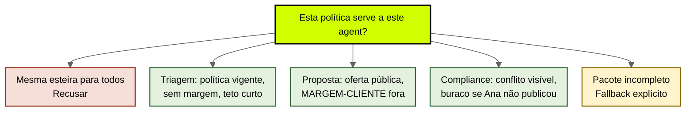
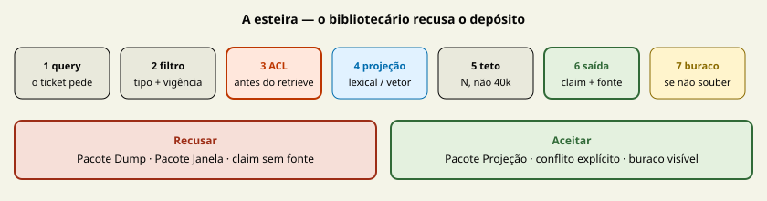

# Política de contexto: do brain ao prompt

[↑ M3](../modulos/M3-interface-o-brain-alimentando-agents.md) · [Curso](../README.md)

Caso: [Atlas Assist](../casos/atlas-assist.md). Promessa da [aula 03](03-o-que-o-brain-entrega.md). Fonte: [01](../sources/01-tese-company-brain.md). Termos: [Glossário](../Glossario.md).

A esteira já existia. Sem nome, sem dono de workload, ela vira o dump com um checklist.

> Analogia: **três listas de leitura**, não uma biblioteca jogada na mesa. Triagem, proposta e compliance não pedem o mesmo volume.

## Resultado

Você escreve **uma política de contexto nomeada por workload**: a esteira query → filtro → ACL → projeção → teto da [aula 03](03-o-que-o-brain-entrega.md) deixa de ser um pipeline genérico e passa a diferir **por agent**. Inclui o fallback quando o pacote não fecha.

```text
politica:
  nome:
  workload: {triagem | proposta | compliance}
  query / filtro / acl / projecao / teto / saida
  fallback_insuficiente:
diferenca_vs_outro_agent:
```

Se a frase final for “os três agents usam a mesma recuperação”, a aula falhou. A [aula 03](03-o-que-o-brain-entrega.md) ensinou o que o brain entrega. Esta aula ensina que **entrega sem nome de workload é depósito com protocolo**.

## Mapa visual

Decisão-chave — Esta política serve a este agent?



> Leia o diagrama antes do texto longo. Depois volte e confira.

> Política de contexto é a esteira com dono. Sem dono, IDX-ALL continua sendo o cérebro.



**Objetivos**

- Nomear a esteira do M0 como política de um workload, não da empresa. _(understand)_
- Escrever três políticas distintas para triagem, proposta e compliance. _(apply)_
- Declarar o fallback quando a fonte vigente falta ou o teto corta o trecho. _(analyze)_
- Recusar uma política única “do brain” compartilhada pelos três agents. _(evaluate)_

**Núcleo obrigatório:** Resultado, mapa visual, seções 1–3, Prática e Evidência.
**Aprofundamento:** seções seguintes, papers, fronteira com Agent Engineering, teste de recuperação.

---

## 1. A esteira já era conhecida — o que esta aula acrescenta

A [aula 03](03-o-que-o-brain-entrega.md) montou query → filtro → ACL → projeção → teto → saída → buraco. Não remonte essa esteira como se fosse novidade. O M0 travou a **promessa**. O M3 trava o **nome**.

Promessa: pequena + atual + autorizada + citável. Política: *qual* query, *qual* ACL, *qual* teto, *qual* fallback — **deste agent, nesta execução**.

Três erros de quem trata a aula 03 como suficiente:

**Erro 1 — uma esteira, três chamadores.** A Atlas cola IDX-ALL em triagem, proposta e compliance. A esteira “existe” no slide. No retrieve, não há nome. Sem nome, o estagiário e o agent de triagem compartilham o mesmo ranking.

**Erro 2 — recortar o dump e chamar de política.** “Mandamos só 20 chunks.” Teto sem filtro de tipo e sem ACL ainda é dump. Lost in the Middle (Liu et al., 2023, arXiv [2307.03172](https://arxiv.org/abs/2307.03172)) mede posição, não governança. Cortar o meio sem classificar POL-REEMB-2023, T-8841 e MARGEM-CLIENTE só encurta o veneno.

**Erro 3 — buraco só no papel.** A aula 03 exigiu `se_nao_souber`. A política exige o **comportamento do agent** quando o pacote não fecha: a triagem não completa com FT-ATLAS-2024; a proposta não inventa margem; o compliance não escolhe entre wiki e Slack.

A [fonte 01](../sources/01-tese-company-brain.md) já avisou: mais tokens não resolvem ACL, staleness nem conflito. Esta aula operacionaliza o aviso **por chamador**.

---

## 2. Três workloads, três políticas — o mesmo ticket

Cliente pede reembolso. Três agents tocam o mesmo fato institucional. Se a política for uma, o outcome observável da Atlas quebra de três jeitos diferentes.

### 2.1 Triagem — `politica-triagem-reembolso`

```text
query:     política de reembolso vigente para este produto, este canal, esta data
filtro:    tipo=politica; vigente=sim; produto; não-revogado
acl:       agent de triagem — lê política pública; não lê MARGEM-CLIENTE
projecao:  lexical no ID + vetorial no corpus já filtrado
teto:      2 páginas ou N tokens, o que for menor; POL-REEMB-2023 só entra se vigente
saida:     claim + trecho + fonte + data
fallback:  “não há fonte vigente publicada”; não completar com FT-ATLAS-2024
```

A triagem **não** precisa de SOP-EXC-SLA. **Não** precisa do transcript T-8841. **Não** precisa da thread SLK-ANA como se fosse política. Se o único documento for POL-REEMB-2023 (`vigente: nao`), o filtro corta. O fallback dispara. Completar com o snapshot é devolver a empresa aos pesos.

### 2.2 Proposta — `politica-proposta-oferta`

```text
query:     condições comerciais públicas deste produto que o autor pode citar
filtro:    tipo=oferta|politica_publica; vigente=sim; sem dado restrito
acl:       agent de proposta e estagiário — leem o que o cliente pode ouvir; MARGEM-CLIENTE fora ANTES do retrieve
projecao:  lexical em código de produto + arquivo fiel da oferta
teto:      oferta + cláusula pública; zero célula de margem
saida:     claim citável sem número que o locator proíbe
fallback:  omitir o número; não interpolar 18% a partir de FT-ATLAS-2024
```

A proposta não é “a triagem com tom de venda”. O teto é outro. A ACL é outra. O fallback é outro: silêncio sobre margem, não “o modelo calcula”.

### 2.3 Compliance — `politica-compliance-excecao`

```text
query:     procedimento aprovado de exceção de SLA + conflito de prazo de reembolso, se houver
filtro:    tipo=procedimento|politica; aprovado=sim; conflito explícito permitido
acl:       agent de compliance — lê política pública; escreve candidato, não fato
projecao:  lexical em SOP-EXC-SLA + ledger de conflito (aula 11)
teto:      o pacote do conflito, não o índice
saida:     claim ou conflito|buraco; nunca escolha silenciosa entre 30 e 14
fallback:  “SOP-EXC-SLA sem versão aprovada; SLK-ANA não é fonte”; escalar à Ana
```

O compliance é o único workload que **deve** ver o conflito. Esconder POL-REEMB-2023 e fingir que só existem 14 dias é apagar prova. Tratar SLK-ANA como vigente é inventar fonte. A política nomeia os dois estados.

---

## 3. Diferenças por agent — não por “o cérebro”

A tabela de atores do [caso](../casos/atlas-assist.md) já diz quem lê o quê. A política transforma essa tabela em recorte de prompt.

| Campo | Triagem | Proposta | Compliance |
|-------|---------|----------|------------|
| Query | política vigente | oferta pública | exceção + conflito |
| Filtro que os outros não têm | `tipo=politica`, sem episódio | sem `dado restrito` | `aprovado=sim` **ou** conflito aberto |
| ACL que os outros não têm | não escala exceção | MARGEM-CLIENTE jamais | candidato, não fato |
| Teto | curto, um claim | oferta, sem planilha | pacote do conflito |
| Fallback | buraco; não usar FT-ATLAS-2024 | omitir número | escalar à Ana |
| O que nunca entra | T-8841, margem, Slack como política | margem, ticket bruto | escolha silenciosa 30 vs 14 |

Copiar a política da triagem para a proposta é o vazamento da terça com papel timbrado. Copiar a da proposta para o compliance apaga o conflito. Copiar a do compliance para a triagem joga Slack e PDF informal no L1.

`cursos/AIOX-Agent-Engineering/aulas/21b-modelos-substituiveis-harness-fino-cerebro-modular.md` já desenhou: o brain **seleciona** contexto autorizado; o harness governa execução. Esta aula nomeia a seleção. O harness fino não substitui as três fichas. Se a regra de “não mostrar margem” viver num `if` do runner, você comprou harness-brain — aula 17.

---

## 4. Fallback quando o contexto é insuficiente

A aula 03 disse: não achou, entrega o buraco. A política especifica **qual** buraco e **o que o agent faz em seguida**. Três insuficiências distintas.

**Fonte inexistente.** Não há documento aprovado de 14 dias. A triagem devolve: “não há fonte vigente para este produto nesta data.” Não cita POL-REEMB-2023 como se valesse. Não cita FT-ATLAS-2024. O modelo não “completa o razoável”.

**Fonte existe e o chamador não pode ver.** MARGEM-CLIENTE é fonte de dado. A proposta não a recebe. O fallback não é “resume sem o número”. Resumo com o número no contexto já atravessou a fronteira. O dado **não entra**. A saída declara omissão autorizada, não um 18% redondo.

**Fonte existe, entra no filtro e o teto corta.** Dois parágrafos vigentes, teto de uma página. A política diz o que cai: o de menor prioridade (exceção depois da regra; anexo depois do locator). Long Context RAG (arXiv [2411.03538](https://arxiv.org/abs/2411.03538)) autoriza recusar “cabe na janela, então entra”. Não autoriza um N mágico. O teto é do workload, medido no outcome — ticket classificado com política vigente, não com 40 mil chunks.

**Conflito é insuficiente para decidir, não para informar.** Duas fontes vigentes que divergem não são buraco. São saída `conflito`. O fallback de “escolher a melhor” é recusado. O compliance recebe o par. A triagem, se não for o dono da resolução, recebe o buraco *de decisão*: “há conflito; não classificar prazo até o jurídico publicar.”

Insuficiente ≠ vazio. IDX-ALL nunca está vazio. Está *demais*. Política que trata “tem hit” como “tem contexto” é vector-oracle.

---

## 5. O que os papers autorizam nesta aula

A aula 03 já usou os dois resultados no tamanho certo. Aqui eles justificam **políticas diferentes**, não um slogan único de “seja pequeno”.

**Lost in the Middle.** A evidência no meio da janela é usada pior. Se a triagem empilha wiki + Slack + T-8841 + margem, o trecho vigente — se existir — some no meio. Isso autoriza teto curto **e** ordenação (locator primeiro). Não autoriza a mesma ordenação na proposta: o que a proposta não pode ver nem deve competir por posição.

**Long Context RAG.** Capacidade nominal ≠ uso confiável. “O modelo da proposta tem janela maior, então a política pode ser a mesma da triagem com mais texto” é má leitura. Janela maior não cria ACL. Não cria vigência. Não cria três nomes.

Nenhum dos dois cobre: ACL por actor, fallback por workload, gate de escrita. Declare a lacuna. A política preenche o que o paper não mede.

---

## 6. O que a política ainda não é

A política de contexto **não**:

- substitui o contrato da [aula 14](14-contrato-brain-harness.md) — entrada/saída/latência;
- aprova T-8841 como SOP — [aula 15](15-aprendizado-de-volta.md);
- escolhe vendor, chunk ou reranker — implementação da projeção, [aula 08](08-projecoes-recuperaveis.md);
- autoriza efeito no mundo — harness; a 21b guarda as mãos.

Se o time pedir “a política do brain”, pergunte *de qual agent*. Se não souberem responder, ainda não saíram do M0.

---

## Quando usar — e quando não usar

**Use quando** dois agents do mesmo case recuperam o mesmo store, ou quando o mesmo ticket atravessa triagem e compliance. Nomeie uma ficha por chamador.

**Não use quando** estiver reescrevendo os quatro adjetivos da aula 03 sem mudar query, ACL ou fallback. Isso é revisão, não política. Também não use para dimensionar janela do provider.

Limite: um único Markdown versionado, entregue inteiro a **um** agent, já é uma política (teto = o arquivo). Três agents no mesmo arquivo sem ACL — a Atlas — exigem três fichas.

---

## Teste de recuperação

1. A proposta reusa a query da triagem e o estagiário vê MARGEM-CLIENTE. Qual campo da política falhou?
2. A triagem não acha documento de 14 dias e cita FT-ATLAS-2024. Qual recusa faltou?
3. O compliance esconde POL-REEMB-2023 para “não confundir”. Isso é fallback saudável?
4. O time aumenta a janela da proposta e declara uma política só. O que Long Context RAG não autoriza?
5. T-8841 entra no pacote da triagem porque “é parecido”. Qual filtro faltou?

<details>
<summary>Gabarito comentado</summary>

1. **ACL (e filtro de tipo).** Autorizada falha antes do retrieve. Não é “o modelo não deveria citar”.
2. **Fallback de fonte inexistente.** Completar com pesos é o habitat da aula 01.
3. **Não.** É apagar prova. Conflito é saída, não buraco. Buraco é ausência de fonte publicada de 14 dias.
4. **Uma política para todos os agents.** Janela maior não unifica ACL nem query.
5. **Filtro de tipo.** Episódio não entra na política de L1. Similaridade não é classificação.

</details>

---

## Prática

No case real — ou na Atlas, se for treino — preencha a [política de contexto](../templates/politica-de-contexto.md) **três vezes**: triagem, proposta, compliance. Não copie a esteira da [promessa](../templates/promessa-do-brain.md) sem alterar query, ACL, teto e fallback.

**Funcionou se:**

- cada ficha tem um `nome` distinto;
- MARGEM-CLIENTE aparece em `nao_pode_ler` da proposta e da triagem;
- o fallback da triagem recusa FT-ATLAS-2024 e POL-REEMB-2023 revogada como resposta;
- o compliance declara conflito ou buraco, nunca escolha silenciosa;
- `diferenca_vs_outro_agent` está em frase própria, não “é parecido mas menor”.

## Pergunte ao seu agente

```text
Contexto: Atlas Assist (ou case real) + promessa da aula 03 já preenchida.
Pedido: escreva três políticas nomeadas (triagem, proposta, compliance). Não repita a esteira genérica. Aponte, por campo, o que muda entre agents. Declare fallback quando POL-REEMB-2023 está revogada, quando MARGEM-CLIENTE existiria e quando SOP-EXC-SLA não tem versão aprovada.
Evidência que espero: três YAMLs do template. Sem vendor, sem chunk size.
```

## Evidência de conclusão

Você passou quando consegue:

1. dizer por que a esteira do M0 sem nome de workload ainda é depósito;
2. escrever três fallbacks que não se copiam;
3. recusar IDX-ALL como “a política do brain”;
4. separar o que esta aula nomeia do contrato da aula 14.

Feche o módulo no [Quiz M3](../avaliacoes/Quiz-M3.md) depois das aulas 14 e 15. Não avance sem as três fichas do módulo preenchidas.

## Navegação

[← Anterior](12-ciclo-de-vida.md) · [↑ M3](../modulos/M3-interface-o-brain-alimentando-agents.md) · [↑ Curso](../README.md) · [Próxima →](14-contrato-brain-harness.md)
