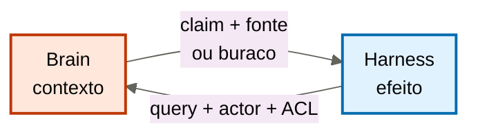

# O contrato brain↔harness

[↑ M3](../modulos/M3-interface-o-brain-alimentando-agents.md) · [Curso](../README.md)

Caso: [Atlas Assist](../casos/atlas-assist.md). Política da [aula 13](13-politica-de-contexto.md). Fonte: [01](../sources/01-tese-company-brain.md). Termos: [Glossário](../Glossario.md).

A política diz o que entra no prompt. O contrato diz como o harness pede e o que é obrigado a aceitar de volta. Sem contrato, a política é um wish no README.

> Analogia: a **tomada entre o bibliotecário e as mãos**. O cérebro entrega o volume. As mãos pagam, fecham ticket, mandam e-mail. MCP é o formato da ficha — não a biblioteca.

## Resultado

Você rascunha o **contrato de interface** de um workload: entrada (query + ACL + actor), saída (claim + fonte + citação + conflito|buraco), latência como **intenção** — não SLA de produto —, fallback e citação obrigatória.

```text
entrada: {query, acl, actor}
saida:   {claim, fonte, citacao, conflito|buraco}
citacao_obrigatoria: true
latencia_alvo: {intencao, nao_e_sla_de_produto}
fallback:
brain_sem_maos:
```

Se a frase final for “o harness chama o índice”, a aula falhou. Índice não é parte. MCP não é memória. O brain não tem mãos.

## Mapa visual

Decisão-chave — Quem pede, quem entrega, quem tem mãos?



> Leia o diagrama antes do texto longo. Depois volte e confira.

> Interface estável. Modelo troca. Tool muda de nome. O locator do claim não viaja com nenhum dos dois.


**Objetivos**

- Declarar entrada e saída sem nomear modelo nem vendor. _(understand)_
- Distinguir latência-alvo (intenção de recorte) de SLA de produto. _(analyze)_
- Dizer o que a spec MCP de tools padroniza — e o que ela **não** padroniza. _(evaluate)_
- Escrever o fallback e a citação obrigatória para um agent da Atlas. _(apply)_

**Núcleo obrigatório:** Resultado, mapa visual, seções 1–3, Prática e Evidência.
**Aprofundamento:** seções seguintes, papers, fronteira com Agent Engineering, teste de recuperação.

---

## 1. Duas portas, nenhum depósito

A [aula 13](13-politica-de-contexto.md) nomeou o recorte. Esta aula nomeia o **pedido** e a **resposta**. [Anthropic — Decoupling the brain from the hands](https://www.anthropic.com/engineering/managed-agents) separa raciocínio, ambiente e sessão. A [fonte 01](../sources/01-tese-company-brain.md) importa a tese: o brain não herda autoridade de execução.

Tradução operacional:

| Porta | Quem fala | O que viaja | O que não viaja |
|-------|-----------|-------------|-----------------|
| Entrada | harness → brain | query de negócio, actor, ACL do chamador | o dump, a tool, o modelo |
| Saída | brain → harness | claim + locator + trecho + data, ou conflito, ou buraco | efeito no mundo, escolha silenciosa, “o modelo já sabia” |

O harness monta o prompt **depois**. Se ele montar *antes* e só “consultar o brain se der tempo”, o contrato é teatro. Na terça da Atlas, não havia porta. Havia IDX-ALL aberto.

`cursos/AIOX-Agent-Engineering/aulas/21b-modelos-substituiveis-harness-fino-cerebro-modular.md` já desenhou o fluxo: brain seleciona → harness governa → adapter traduz → modelo raciocina. O contrato desta aula é a **junta** entre o primeiro e o segundo passo. Sem ela, a 21b vira slide.

---

## 2. Entrada: query + ACL + actor

Três campos. Falte um, o retrieve da Atlas se repete.

**Query.** Em termos de negócio, não em embedding. “Política de reembolso vigente para o produto X nesta data” é query. “chunks similares a este ticket” é abdicação. A query da entrada **é** a query da política da aula 13 — o contrato a torna obrigatória no pedido.

**Actor.** Quem chama. Não o modelo. Não o “usuário”. O agent de triagem, o agent de proposta, o estagiário comercial, a Ana, o agent de compliance. A [tabela de atores](../casos/atlas-assist.md) é o enum. Se o harness não manda actor, o brain não pode aplicar ACL. Default-allow é autoridade global — aula 17.

**ACL.** O que este actor pode ler nesta execução. Não é um parágrafo educado no system prompt. É dado de entrada que o brain **usa antes** da projeção. A proposta manda `pode_ler: [politica_publica, oferta]; nao_pode_ler: [MARGEM-CLIENTE]`. Se MARGEM-CLIENTE estiver no mesmo índice e o actor for o estagiário, o contrato recusa o hit *antes* do ranking.

A ACL do contrato não substitui a matriz da [aula 09](09-acl-e-autoridade.md). Ela **aplica** a matriz a uma chamada. A matriz é governança. A chamada é interface.

---

## 3. Saída: claim + fonte + citação + conflito|buraco

Quatro formas honestas. Uma forma proibida.

**Claim + fonte + citação.** Afirmação, locator, trecho, data. A citação é o trecho que um humano abre e confere. “Está no índice” não é citação. “A Ana disse” sem ID de episódio aprovado não é citação. Sem essa cadeia, o compliance da Atlas não consegue auditar.

**Conflito.** Duas fontes vigentes, autorizadas, que divergem. POL-REEMB-2023 (revogada, mas ainda no wiki) versus a prática de 14 dias *ainda sem documento*. SOP-EXC-SLA, com três versões e zero aprovação, **não** desempata: é candidato, não terceira fonte. O contrato da triagem, neste estado, devolve buraco de decisão *ou* o compliance devolve o par. O modelo **não** desempata. Escolha sem regra publicada devolve a Ana ao prompt.

**Buraco.** Não há fonte vigente autorizada. Texto canônico: o que falta, o que foi recusado (FT-ATLAS-2024, SLK-ANA como política), o que o harness **não** deve fazer (completar, disparar estorno).

**Proibido: texto fluido sem cadeia.** O brain que “responde a pergunta” virou modelo. O harness que aceita parágrafo sem locator quebrou o contrato. Citação obrigatória significa: **sem cadeia, a saída é inválida**, mesmo que o prazo “pareça certo”.

```text
saida_ok:
  claim: "Não há política vigente publicada de reembolso em 14 dias para o produto X."
  fonte: null
  citacao: null
  conflito_ou_buraco: buraco
  recusados: [POL-REEMB-2023 vigente=nao, SLK-ANA resolucao_privada, FT-ATLAS-2024 pesos]
```

Isso é saída. “Reembolso em 14 dias, confiamos na Ana” não é.

---

## 4. Latência alvo é intenção — não SLA de produto

O outline pede “SLA de latência”. Este curso **não** ensina SLO de produção. Isso é anti-escopo: `cursos/AIOX-Enterprise/`. Aqui a latência é **intenção de desenho**: o recorte tem de caber no tempo em que o harness ainda espera um pacote citável. Se não couber, dispara fallback — não o dump.

Três leituras erradas:

**“O brain tem de responder em 200 ms.”** Número de produto sem medição, sem ambiente, sem dono. Inventar SLA aqui é teatro. Escreva a intenção: “a triagem L1 não espera rebuild de índice; se a projeção lexical do ID não voltar, usa fallback de buraco, não IDX-ALL.”

**“Se atrasar, manda o store.”** Isso transforma latência em autorização para dump. Lost in the Middle (arXiv [2307.03172](https://arxiv.org/abs/2307.03172)) e Long Context RAG (arXiv [2411.03538](https://arxiv.org/abs/2411.03538)) já recusaram o pacote janela. Atraso não reautoriza 40 mil chunks.

**“Modelo mais rápido = contrato cumprido.”** Relógio errado. A [aula 02](02-tres-relogios.md) pôs o modelo no relógio curto. O contrato sobrevive à troca. A 21b governa a substituição. A latência-alvo desta ficha não cita provider.

Campo honesto:

```text
latencia_alvo:
  intencao: "pacote da triagem cabe em uma ida ao brain; sem fan-out para IDX-ALL"
  nao_e_sla_de_produto: "sem p95, sem uptime, sem página de status"
```

---

## 5. Fallback do contrato — distinto do fallback da política

A política (aula 13) diz o que o **pacote** faz quando a fonte falta. O contrato diz o que o **harness** faz quando a interface falha.

| Falha | Fallback do contrato | Recusa |
|-------|----------------------|--------|
| Brain devolve buraco | harness não completa com o modelo; escala ou recusa o ticket | FT-ATLAS-2024 como oráculo |
| Brain devolve conflito | harness roteia ao compliance ou à Ana; não pede ao modelo para votar | “escolhe a mais recente” |
| Brain não responde no tempo da intenção | harness usa o último pacote **citável** em cache de política, ou para | IDX-ALL “só desta vez” |
| Citação ausente | harness trata a saída como inválida | aceitar parágrafo plausível |

O fallback **nunca** é “chama a tool mesmo assim”. Isso são mãos sem cérebro.

---

## 6. MCP padroniza tools — não memória

A spec [MCP Tools (2026-07-28)](https://modelcontextprotocol.io/specification/2026-07-28/server/tools) é o documento que o time vai brandir para dizer “já temos cérebro: é o servidor MCP”. Use-a no tamanho certo.

**O que ela padroniza.** Descoberta (`tools/list`), invocação (`tools/call`), schema de entrada, nome único da tool, capability `tools`, notificação de lista alterada. Autorização **pode** variar pelas credenciais do *pedido da tool* — escopos do chamador da tool, não ACL de claim institucional. Human-in-the-loop é recomendação de produto, não módulo de proveniência.

**O que ela não padroniza — declare em voz alta:**

- memória da empresa, ledger, supersessão, conflito de fontes;
- política de contexto (query → filtro → ACL de **conhecimento** → teto);
- citação claim → trecho → fonte → data;
- gate de escrita / aprendizado de volta;
- quem é a Ana, o que POL-REEMB-2023 prova, o que T-8841 não vira.

Quiz M3, questão 4: descoberta e invocação por schema — e não o resto. Cola MCP ≠ company brain. Um servidor que “busca no Drive” é tool. Sem as portas desta aula, é IDX-ALL com JSON-RPC.

A NSA (considerações de segurança em MCP) já apareceu na aula 03 como superfície: dado a mais no contexto é exfiltração. Aqui o ponto é de **contrato**: expor uma tool `search_wiki` sem actor/ACL/citação **não** cumpre a interface. Cumpre o protocolo.

---

## 7. Brain sem mãos

O brain não:

- fecha T-8841, envia e-mail, dispara estorno, aprova exceção de SLA;
- escolhe o modelo da rota — routing, 21b;
- “conserta” o prazo no wiki — escrita é aula 15, com Ana;
- inventa POL-REEMB vigente.

O harness não:

- guarda a política da empresa no `if (ticket.contains("reembolso")) return 30`;
- trata o retorno do modelo como locator;
- chama tool com claim sem citação válida.

Na Atlas, o crime clássico de mãos é o runner que, ao receber um parágrafo do GPT interno, chama a API de reembolso. Citação boa da aula 03 não autoriza efeito. Contrato bom desta aula **proíbe** o efeito sem gate do harness. As duas recusas se complementam. Nenhuma substitui a outra.

---

## Quando usar — e quando não usar

**Use quando** for a primeira vez que o case precisa escrever, em YAML, o que o harness pode perguntar e o que é obrigado a aceitar. Antes de implementar retrieve. Antes de “subir um MCP”.

**Não use quando** estiver escolhendo framework de agents, nome de tool ou p95. Também não use para redesenhar a política da aula 13 — se a query mudou, volte à ficha do workload.

Limite: um arquivo Markdown lido inteiro por um agent, com actor único, já é um contrato mínimo (entrada = “leia este arquivo”; saída = o texto + locator do arquivo). Três agents, uma política compartilhada — a Atlas — exigem as três portas explícitas.

---

## Teste de recuperação

1. O harness manda só o texto do ticket, sem actor. O que o contrato recusa?
2. O brain devolve “14 dias” sem locator. A saída é válida?
3. O time escreve `p95 < 200ms` no YAML e chama isso de governança. Qual campo foi distorcido?
4. Um servidor MCP lista `search_all`. Isso substitui o contrato?
5. O brain dispara a tool de estorno porque o claim estava citado. Qual recusa?

<details>
<summary>Gabarito comentado</summary>

1. **Entrada incompleta.** Sem actor não há ACL. Default-allow é autoridade global.
2. **Não.** Citação obrigatória. Parágrafo sem cadeia é inválido — mesmo “certo”.
3. **Latência alvo.** Intenção de recorte, não SLA de produto. Enterprise não entra aqui.
4. **Não.** MCP padroniza list/call/schema. Não padroniza memória, proveniência nem política.
5. **Brain sem mãos.** Citação autoriza contexto. Efeito é harness.

</details>

---

## Prática

Preencha o [contrato brain↔harness](../templates/contrato-brain-harness.md) para **um** workload da Atlas (comece pela triagem). A entrada tem de nomear actor da tabela. A saída tem de prever conflito **e** buraco. A latência é intenção.

**Funcionou se:**

- `actor` é um papel do [caso](../casos/atlas-assist.md), não “o usuário”;
- `citacao_obrigatoria` é `true` e há um exemplo de saída inválida;
- `latencia_alvo.nao_e_sla_de_produto` está preenchido em frase própria;
- `o_que_mcp_nao_padroniza` lista memória e pelo menos mais um item;
- `brain_sem_maos` recusa um efeito concreto (fechar ticket, estorno, e-mail).

## Pergunte ao seu agente

```text
Contexto: política da aula 13 + tabela de atores da Atlas.
Pedido: rascunhe o contrato YAML (entrada, saída, citação obrigatória, latência como intenção, fallback, brain sem mãos). Diga o que a spec MCP 2026-07-28/server/tools padroniza e o que não padroniza. Não proponha implementação de servidor.
Evidência que espero: template preenchido + cinco linhas sobre MCP.
```

## Evidência de conclusão

Você passou quando consegue:

1. desenhar as duas portas sem mencionar vendor;
2. invalidar uma resposta “certa” sem citação;
3. recusar MCP como company brain em uma frase que o quiz reconheceria;
4. apontar um efeito que o brain da Atlas nunca dispara.

A [aula 15](15-aprendizado-de-volta.md) fecha o M3 pelo caminho perigoso: a escrita.

## Navegação

[← Anterior](13-politica-de-contexto.md) · [↑ M3](../modulos/M3-interface-o-brain-alimentando-agents.md) · [↑ Curso](../README.md) · [Próxima →](15-aprendizado-de-volta.md)
