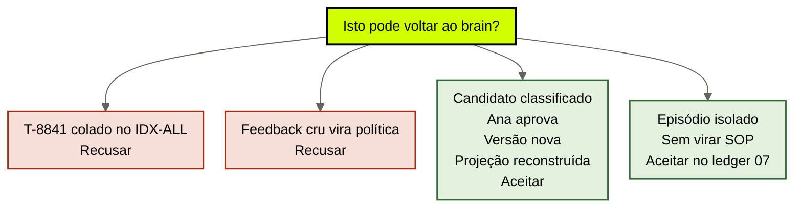
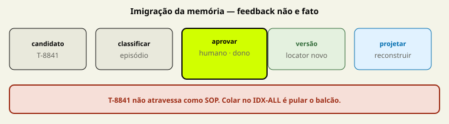

# Aprendizado de volta ao brain

[↑ M3](../modulos/M3-interface-o-brain-alimentando-agents.md) · [Curso](../README.md)

Caso: [Atlas Assist](../casos/atlas-assist.md). Contrato da [aula 14](14-contrato-brain-harness.md). Fonte: [01](../sources/01-tese-company-brain.md). Termos: [Glossário](../Glossario.md).

T-8841 não vira fato. Run gera candidato. Governança decide memória. Escrita é mais perigosa que leitura.

> Analogia: a **imigração da memória**. O ticket chega como candidato. Sem classificação e sem carimbo de Ana, não entra como SOP.

## Resultado

Você especifica o **gate de aprendizado** do case: o caminho candidato → classificação → aprovação (Ana) → versão → projeção reconstruída. Feedback não atravessa o gate como fato.

```text
candidato: {id, origem, nao_e: fato}
classificacao: episodio | feedback | candidato_sop | recusado
aprovacao: {quem, criterio, status}
versao:
projecao_reconstruida:
feedback_vs_fato:
```

Se a frase final for “o agent aprendeu com o ticket”, a aula falhou. Aprender sem gate é o crime da terça com um verbo mais simpático.

## Mapa visual

Decisão-chave — Isto pode voltar ao brain?



> Leia o diagrama antes do texto longo. Depois volte e confira.

> O default seguro: runs geram candidatos; ninguém escreve fato no calor do outcome.



**Objetivos**

- Percorrer T-8841 pelo gate sem promovê-lo a política. _(apply)_
- Separar feedback, episódio, candidato a SOP e fato. _(analyze)_
- Nomear Ana como aprovadora de claim — e o que o compliance *não* pode sozinho. _(understand)_
- Explicar por que a escrita envenena mais que um retrieve ruim. _(evaluate)_

**Núcleo obrigatório:** Resultado, mapa visual, seções 1–3, Prática e Evidência.
**Aprofundamento:** seções seguintes, papers, fronteira com Agent Engineering, teste de recuperação.

---

## 1. A terça pelo caminho de volta

Alguém cola T-8841 no IDX-ALL. No dia seguinte a triagem trata o transcript como SOP. A [aula 07](07-memoria-episodica.md) já classificou o ID: episódio. A [aula 06](06-memoria-procedural.md) já recusou o status de procedimento. Esta aula fecha o **processo** que deveria ter acontecido — e não aconteceu.

A [fonte 01](../sources/01-tese-company-brain.md): *escrita é mais perigosa que leitura*. Leitura ruim cita POL-REEMB-2023 revogada. Escrita ruim **multiplica** o erro: cada retrieve futuro nasce envenenado. Lost in the Middle (arXiv [2307.03172](https://arxiv.org/abs/2307.03172)) piora o uso de evidência no meio; escrita sem gate põe o veneno no extremo — o retrieve *quer* o ticket parecido.

`cursos/AIOX-Agent-Engineering/aulas/21b-modelos-substituiveis-harness-fino-cerebro-modular.md` já desenhou o caminho de escrita:

```text
observação + trace + outcome
→ quarentena
→ classificação: fonte, fato, procedimento ou episódio
→ validação/aprovação
→ escrita versionada
→ reconstrução das projeções
```

O default da 21b: *runs geram candidatos a memória; governança decide o que vira memória*. Falha bruta não vira verdade. Esta aula é esse parágrafo no tamanho da Atlas.

---

## 2. T-8841 pelo gate — cinco estações

### 2.1 Candidato

O transcript existe. Outcome ruim. Cliente pediu exceção de SLA; o agent improvisou. Isso é **observação**. Ainda não é memória institucional. Quarentena: o arquivo não entra em projeção de política, não entra em IDX-ALL, não entra no pacote da aula 13.

Campo obrigatório: `nao_e: fato`. Se você não conseguir escrever essa linha, já promoveu.

### 2.2 Classificação

Um humano — ou um fluxo que um humano assina — escolhe o tipo. Não o modelo. Não a similaridade.

| Tipo | T-8841 vira? | O que prova depois |
|------|----------------|-------------------|
| Episódio | **sim**, se tiver quem, quando, decisão, outcome, isolamento | aquele desfecho, aquele dia |
| Feedback | sim, como *sinal* (“o fechamento falhou”) | que o harness ou o SOP falhou — não *como* deve ser o SOP |
| Candidato a SOP | só se alguém extrair uma instrução e pedir aprovação | ainda não prova procedimento |
| Fato / política | **nunca** neste estado | — |
| Recusado | se for lixo, duplicata ou injeção | nada; retenção mínima de auditoria, aula 12 |

Classificar “é episódio” **e** “é SOP” ao mesmo tempo é o crime. Os IDs não se fundem. T-8841 não vira SOP-EXC-SLA. SOP-EXC-SLA, se um dia for aprovado, é **outro** locator. MARGEM-CLIENTE também não “aprende” com o ticket: dado restrito não se reescreve com feedback de L1.

### 2.3 Aprovação — Ana

A [tabela de atores](../casos/atlas-assist.md):

- agent de compliance: escreve **candidato**, não fato;
- Ana (jurídico): escreve claim **com aprovação**; revoga.

Para T-8841 virar *qualquer* coisa além de episódio isolado, Ana (ou o dono equivalente do seu case) assina. Critério observável, não “parece útil”:

```text
aprovacao:
  quem: Ana
  criterio: "o texto ensina um como vigente, sem contradizer política publicada, com locator novo"
  status: recusado  # neste ticket: outcome ruim não é exemplo aprovado
```

Se Ana recusa a promoção a SOP, T-8841 **pode** permanecer no ledger episódico com `nao_virar: procedimento`. Recusar promoção não é apagar o episódio. Apagar o episódio é amnésia — a aula 04 já recusou apagar POL-REEMB-2023.

O que Ana *não* faz neste ticket: republicar 14 dias *a partir* do transcript. 14 dias, se existirem, saem de um **documento** que ela publica. SLK-ANA continua resolução privada até esse locator existir. T-8841 não atalha a publicação.

### 2.4 Versão

Tudo que atravessa o gate ganha versão. Episódio ganha `v1` no ledger 07. Se um dia um SOP nascer *inspirado* no fracasso, é **outro ID**, outra versão, outro aprovador. Não se “atualiza T-8841 para SOP v2”. Isso é fundir tipos.

POL-REEMB-2023, quando o jurídico publicar 14 dias, não se edita no lugar. Supersessão (aula 10): claim novo, claim antigo carimbado `vigente: nao`. O gate de aprendizado **não** é um `git commit` no wiki feito pelo agent.

### 2.5 Projeção reconstruída

Só depois da versão. A [aula 08](08-projecoes-recuperaveis.md) exigiu reconstrução a partir das fontes. Se T-8841 ficou episódio, a projeção de *política* **não** o inclui. A projeção episódica, se existir, aponta o ledger — com tipo. IDX-ALL sem tipo não se “reconstrói”: se o índice queimar e a única cópia for o embed, você não tinha brain.

Na Atlas, o passo que faltou na terça foi este: ninguém reconstruiu nada porque ninguém classificou. Colar *é* a projeção. Por isso o dia seguinte já estava perdido.

---

## 3. Feedback não é fato

O time adora a frase “o cliente não gostou, então a política está errada”. Três coisas distintas:

**Feedback.** Sinal de outcome: ticket reaberto, NPS, “o agent inventou 30 dias”. Entra no episódio. Não altera POL-REEMB-2023. Não cria 14 dias.

**Fato (claim).** Afirmação com fonte, data, uso. “A empresa publicou 30 dias em 2023” — fonte POL-REEMB-2023. “A empresa opera 14 dias” — **gap** até Ana publicar.

**Aprendizado aprovado.** Mudança versionada num módulo (fato, SOP, ou regra de supersessão) depois do gate. A 21b chama isso de seta *evals → brain*. Sem a seta formal, o eval é opinião.

Misturar os três é o vetor de injeção institucional: o modelo (ou o cliente, ou um ticket forjado) escreve o corpus. A NSA, no recorte de MCP que a aula 03 já usou, fala em envenenamento de tool. O irmão desta aula é envenenamento de **memória**. O harness verifica efeito no mundo. O gate verifica o que o mundo **não** tem o direito de gravar sozinho.

---

## 4. Por que a escrita é o caminho perigoso

Leitura falha: um ticket errado. Escrita falha: *todos* os tickets seguintes.

Na Atlas, cinco falhas do mesmo dia. A quinta — T-8841 no índice — é a única que **se reproduz sozinha**. As outras (wiki revogado, fine-tune, dump, margem) já estavam lá. Esta se instala.

Três recusas de escrita que o YAML tem de listar em `o_que_nao_volta`:

1. output cru do agent (“concluído”, “a política é 14”);
2. transcript sem classificação (T-8841 → IDX-ALL);
3. fine-tune de FT-ATLAS-2024 com o ticket “para o modelo aprender”.

A terceira devolve a empresa aos pesos *e* queima o snapshot que o provider já vai aposentar. Duas camadas envenenadas, um relógio.

O agent de compliance pode **propor** um candidato. Não fecha o gate. Ana fecha. Se o seu case não tem Ana, o campo `quem` não pode ficar “o squad”. Nomeie o papel que revoga. Sem papel, não há company brain — há um wiki com CI.

---

## 5. O que o gate ainda não é

O gate **não**:

- substitui o contrato da aula 14 — a leitura continua citável mesmo se a escrita estiver fechada;
- implementa fila, ticket de jurídico ou workflow de produto;
- autoriza o modelo a “resumir o aprendizado da semana” para o índice;
- é o menor brain (aula 16). Um arquivo versionado com dono já *é* um gate: ninguém cola T-8841 sem o dono aceitar o parágrafo.

Se o time pedir “memória automática”, pergunte qual das cinco estações eles querem pular. Quase sempre a 2.3.

---

## Quando usar — e quando não usar

**Use quando** qualquer run (ticket, proposta, exceção) puder escrever num store que o próximo agent lê. Se a resposta for “o índice aceita paste”, o gate é obrigatório antes do próximo retrieve.

**Não use quando** estiver desenhando eval de modelo ou fine-tune. A 21b governa promoção de *modelo*. Esta aula governa promoção de *claim*. Também não use para apagar episódio ruim: isole, não delete.

Limite: zero escrita automática + um humano dono do único Markdown já é um gate. A Atlas passou desse limite no instante em que IDX-ALL aceitou T-8841.

---

## Teste de recuperação

1. T-8841 no IDX-ALL na terça. Qual estação foi pulada primeiro?
2. O compliance escreve “vamos operar 14 dias” no ledger. Isso é fato?
3. Ana recusa promover T-8841 a SOP. O episódio some?
4. O time fine-tuna FT-ATLAS-2024 com tickets mal fechados “para aprender”. O que o gate recusa?
5. Feedback “cliente irritado” altera POL-REEMB-2023?

<details>
<summary>Gabarito comentado</summary>

1. **Classificação** (e quarentena). Colar é pular tipo, aprovação, versão e reconstrução.
2. **Não.** Candidato. Fato exige documento aprovado por Ana, com locator.
3. **Não.** Permanece episódio com `nao_virar`. Recusar promoção ≠ apagar prova.
4. **Output cru / falha bruta como verdade.** Pesos não são módulo de aprendizado institucional.
5. **Não.** Feedback é sinal. Supersessão é aula 10, com publicação — não com humor do cliente.

</details>

---

## Prática

Preencha o [gate de aprendizado](../templates/gate-de-aprendizado.md) com T-8841 (treino) ou com um run real do seu case que quase virou “política”. Percorra as cinco estações. Nomeie quem aprova.

**Funcionou se:**

- `nao_e: fato` está explícito;
- a classificação é *uma* (não “episódio e SOP”);
- `aprovacao.quem` é Ana ou o equivalente do case — não o agent;
- há versão **ou** recusa explícita de promoção;
- `projecao_reconstruida` diz o que **não** entra na projeção de política;
- `o_que_nao_volta` lista output cru e colar no índice.

## Pergunte ao seu agente

```text
Contexto: T-8841 + tabela de atores + caminho de escrita da 21b.
Pedido: percorra candidato → classificação → aprovação → versão → projeção reconstruída. Recuse T-8841 como fato. Separe feedback de claim. Não proponha fine-tune nem “indexar o aprendizado”.
Evidência que espero: YAML do gate + uma frase de por que escrita é mais perigosa que leitura.
```

## Evidência de conclusão

Você passou quando consegue:

1. narrar T-8841 nas cinco estações sem promovê-lo;
2. dizer a diferença entre feedback e fato sem sinônimo;
3. apontar Ana (ou o dono do case) como único fechamento de claim;
4. recusar IDX-ALL e FT-ATLAS-2024 como destinos de aprendizado.

Feche o [Quiz M3](../avaliacoes/Quiz-M3.md). O M4 pergunta se a empresa **precisa** desse aparato — ou se um arquivo bastava.

## Navegação

[← Anterior](14-contrato-brain-harness.md) · [↑ M3](../modulos/M3-interface-o-brain-alimentando-agents.md) · [↑ Curso](../README.md) · [Próxima →](16-menor-brain-suficiente.md)
