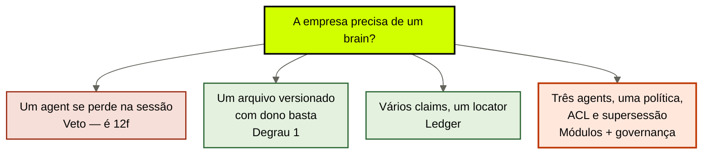
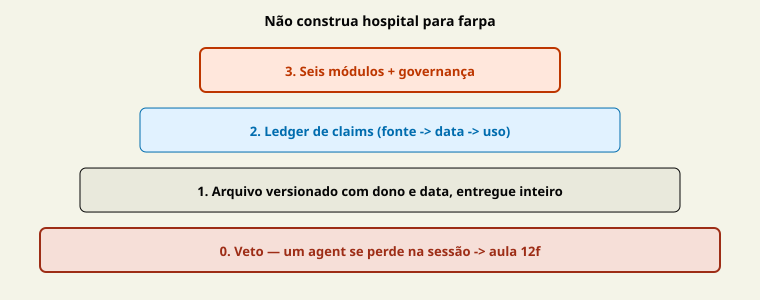

# O menor brain suficiente

[↑ M4](../modulos/M4-menor-brain-e-anti-padroes.md) · [Curso](../README.md)

Caso: [Atlas Assist](../casos/atlas-assist.md). Gate da [aula 15](15-aprendizado-de-volta.md). Fonte: [01](../sources/01-tese-company-brain.md). Termos: [Glossário](../Glossario.md).

A empresa sobe degrau quando o sintoma é institucional. A capacidade sobe degrau quando o PRD esquece a story. As duas escadas não se emprestam.

> Analogia: **não construa hospital para farpa**. Compactação de wave é 12f. Três agents citando prazos diferentes é este curso.

## Resultado

Você aplica a **escada da empresa** ao case: um arquivo versionado com dono → ledger de claims → módulos + governança. A Atlas **precisa** de brain (três agents, uma política). Cases sem sintoma institucional saem com veto e condição de reabertura — não com store.

```text
degrau: {arquivo_versionado | ledger_de_claims | modulos_e_governanca}
decisao: {construir | veto}
fronteira_12f:
condicao_de_reabertura:
```

Se a frase final for “vamos instalar o cérebro”, a aula falhou. Se for “a 12f já cobriu a Atlas”, também.

## Mapa visual

Decisão-chave — A empresa precisa de um brain?



> Leia o diagrama antes do texto longo. Depois volte e confira.

> Menor mecanismo da empresa não é menor cérebro da capacidade com outro nome.



**Objetivos**

- Distinguir esta escada da aula 12f em `cursos/AIOX-Agent-Engineering/aulas/12f-menor-cerebro-suficiente.md`. _(understand)_
- Justificar por que a Atlas não cabe num arquivo só. _(analyze)_
- Escolher o menor degrau — ou escrever veto com reabertura observável. _(evaluate)_
- Preencher o template sem propor vendor. _(apply)_

**Núcleo obrigatório:** Resultado, mapa visual, seções 1–3, Prática e Evidência.
**Aprofundamento:** seções seguintes, papers, fronteira com Agent Engineering, teste de recuperação.

---

## 1. Duas escadas, dois donos

`cursos/AIOX-Agent-Engineering/aulas/12f-menor-cerebro-suficiente.md` fecha o M1b: o que já basta **neste PRD** antes de um store novo. Degraus: sessão → mapa de trabalho → resíduo `data/` → arquivo fiel → síntese → nervoso. Sintoma típico: o agent esquece o fan-in, perde o tom, não sabe quem é o cliente *desta* story.

Esta aula fecha outra pergunta: o que já basta **à empresa** antes de um company brain modular. Sintoma típico: dois ou mais agents (ou um agent e um humano de outro time) precisam apontar o **mesmo locator**, com vigência e ACL, depois que o modelo for aposentado.

| | 12f (capacidade) | Esta aula (empresa) |
|--|------------------|---------------------|
| Unidade | um PRD / um squad | a instituição |
| Teste | o que cobre o esquecimento da story | quantos agents apontam o mesmo locator |
| Degrau alto | nervoso / control plane da capacidade | seis módulos + governança |
| Veto | “não subimos para córtex até evidência” | “não construímos brain até sintoma institucional” |
| Atlas | um agent de triagem *sozinho* poderia viver com arquivo fiel | **três** agents, **uma** política de reembolso → brain |

Copiar o YAML da 12f para esta ficha é o erro de fronteira que a aula 04 já recusou: não chame POL-REEMB-2023 de “córtex”. A 12f **não** cobre ACL corporativa, supersessão entre wiki e jurídico, nem MARGEM-CLIENTE no mesmo índice. O quiz M4, questão 3, é essa linha.

A 21b em `cursos/AIOX-Agent-Engineering/aulas/21b-modelos-substituiveis-harness-fino-cerebro-modular.md` cita o company brain como camada. Não autoriza construir a camada em todo repositório. Esta aula é o freio.

---

## 2. Três degraus — empresa, menor primeiro

Não invente um quarto. Não importe os seis da 12f.

### Degrau 1 — um arquivo versionado com dono

Markdown (ou PDF) com locator, dono, data. Entregue **inteiro** a um agent. A [aula 03](03-o-que-o-brain-entrega.md) já disse: isso pode ser pequena + atual + autorizada + citável. A [aula 04](04-fontes-canonicas.md) já disse: um locator só pode ser vitória, não atraso.

Chega quando: um workload, um leitor, uma fonte, nenhuma margem no mesmo envelope, nenhuma escrita automática.

Não chega quando: o estagiário e a triagem leem o mesmo blob que contém MARGEM-CLIENTE; ou quando POL-REEMB-2023 e a prática da Ana divergem e o arquivo único finge consenso; ou quando SOP-EXC-SLA (três versões, nenhuma aprovada) mora no mesmo Markdown que a política vigente.

### Degrau 2 — ledger de claims

Três a cinco linhas claim → fonte → data → uso, como a [aula 05](05-fatos-e-sinteses.md). Ainda pode viver em um repositório magro. Ainda não exige vector store.

Chega quando: as afirmações divergem das páginas, mas os chamadores são poucos e a ACL é “todo mundo que lê o ledger pode ler tudo que está nele”.

Não chega quando: um claim de margem não pode estar no mesmo arquivo que o claim de prazo — ou você reintroduz o vazamento com um YAML educado.

### Degrau 3 — módulos + governança

Os seis jobs da [fonte 01](../sources/01-tese-company-brain.md): fontes, fatos, procedural, episódico, projeções, governança. Políticas de contexto por agent (aula 13), contrato (aula 14), gate (aula 15).

Chega quando o sintoma é o da Atlas. Não chega “porque o curso tem dezoito aulas”. Se o case real ainda está no degrau 1, o capstone é um **veto**, não um teatro de seis módulos vazios.

Subir um degrau exige prova de que o atual falhou. Pular do zero ao três porque “RAG é o padrão” é IDX-ALL com orçamento.

---

## 3. A Atlas precisa de brain — o argumento

Não é gosto. É aritmética de locator.

**Três agents.** Triagem, proposta, compliance. Outcome observável: ticket com política vigente, proposta sem dado que o autor não pode ver, exceção com fonte citável. Um arquivo único entregue aos três **falha ACL**: MARGEM-CLIENTE e POL-REEMB-2023 não compartilham envelope.

**Uma política compartilhada.** Reembolso. POL-REEMB-2023 (revogada), SLK-ANA (não fonte), FT-ATLAS-2024 (pesos). Três habitats, um fato institucional. A 12f resolve memória de *um* workload. Não resolve o conflito entre três relógios sobre o mesmo prazo.

**Escrita que se reproduz.** T-8841 no IDX-ALL. Sem gate, o degrau 1 morre no dia seguinte: o arquivo “oficial” compete com o transcript no retrieve. Sem módulo episódico + gate, você não tem menor brain. Tem menor *intenção*.

**Deprecação.** FT-ATLAS-2024 some em 90 dias. Se o “jeito Atlas” mora só nos pesos, o degrau 1 nem existe — a empresa vive no habitat 1 da aula 01. Brain, aqui, é a condição de sobreviver à 21b.

Portanto: `decisao: construir`, degrau `modulos_e_governanca`, não porque módulos impressionam, mas porque o degrau 1 viola ACL e o degrau 2 não isola margem nem classifica T-8841.

```text
atlas_precisa:
  agents: 3
  politica_compartilhada: reembolso
  por_que_arquivo_unico_falha: "estagiário e triagem no mesmo blob; margem + prazo"
  por_que_12f_nao_basta: "não é esquecimento de story; é locator institucional compartilhado"
```

---

## 4. Veto com condição de reabertura

O case sem sintoma institucional **deve** vetar. O quiz M4, questão 1: agent que se perde na sessão → não construir company brain; resolver memória de capacidade.

Veto sem reabertura é capricho (questão 4). Reabertura sem observação é “vamos decidir depois”.

```text
veto:
  motivo: "um agent, um humano, um Markdown; nenhum segundo chamador do mesmo locator"
  condicao_de_reabertura: "quando um segundo agent ou time precisar citar o mesmo locator com ACL distinta, ou quando um run escrever num store que o próximo agent lê"
```

Três vetos honestos — e três desonestos.

**Honestos.** (1) Só há sessão perdida → 12f. (2) Só há um arquivo e um reader → degrau 1, sem módulos. (3) O “brain” pedido é vault de estudo → `cursos/Obsidian-IA/`.

**Desonestos.** (1) “Não gostamos de documentação.” (2) “O vendor resolve.” (3) “A janela do modelo novo cabe tudo” — Long Context RAG (arXiv [2411.03538](https://arxiv.org/abs/2411.03538)) não autoriza o veto *nem* a construção; autoriza recusar janela-como-prova.

A Atlas **não** veta. Se o seu case parecer Atlas e você vetar, escreva qual dos três agents você fingiu que não existe.

---

## 5. O que esta aula não autoriza

- Implementar RAG “mínimo” como primeiro degrau. Degrau 1 é arquivo, não índice.
- Usar o veto para pular o capstone: veto preenchido **é** evidência do M4 e entra na seção 1 da [aula 18](18-projeto-integrador.md).
- Importar Pinecone, Notion AI ou “o Drive da empresa” como fundação do degrau 3. Vendor é opção futura, não escada.

---

## Quando usar — e quando não usar

**Use quando** o case pedir “cérebro” e você ainda não sabe se o sintoma é institucional ou de capacidade. Aplique as duas escadas. Fique com uma.

**Não use quando** estiver escolhendo embedding ou justificando o módulo 5 porque o 4 “já está no outline”. Também não use para recusar a Atlas: ela já falhou o teste do arquivo único.

Limite: o menor brain suficiente pode ser um parágrafo com dono. O maior erro é ter vergonha disso. O segundo maior é a Atlas fingir que é só um parágrafo.

---

## Teste de recuperação

1. Um intern e um agent, um `politica.md` versionado, sem segundo reader. Degrau?
2. A Atlas. Por que a 12f não fecha o case?
3. Veto: “não gostamos de documentação.” Passa?
4. Segundo agent passa a citar o mesmo prazo com ACL diferente. O que acontece com o veto anterior?
5. Time sobe vector store porque “memória”. Qual recusa?

<details>
<summary>Gabarito comentado</summary>

1. **Arquivo versionado** (ou veto de módulos). Não é company brain modular.
2. **Três agents, um locator, ACL e conflito.** A 12f cobre a story de um squad, não a instituição.
3. **Não.** Capricho. Falta condição observável.
4. **Reabre.** A condição disparou. Sobe o degrau que a ACL exigir — provavelmente 3 na Atlas.
5. **Pular degrau.** Store não é degrau 1. Vector-oracle é aula 17.

</details>

---

## Prática

Preencha o [veto ou menor brain](../templates/veto-menor-brain.md). Se for Atlas (treino), a decisão é construir e a justificativa cita três agents e uma política. Se o case real não tiver sintoma, vete com reabertura.

**Funcionou se:**

- `fronteira_12f` está em frase que um revisor da 12f aceitaria;
- Atlas (treino) não sai com veto;
- veto real tem `condicao_de_reabertura` observável;
- nenhum vendor aparece como degrau.

## Pergunte ao seu agente

```text
Contexto: case real ou Atlas + linha da 12f se existir.
Pedido: aplique a escada da EMPRESA (arquivo → ledger → módulos). Não recicle os degraus 0–5 da 12f. Se não houver sintoma institucional, escreva veto com condição de reabertura. Se for Atlas, justifique por que três agents e uma política exigem brain.
Evidência que espero: YAML do template. Sem store, sem vendor.
```

## Evidência de conclusão

Você passou quando consegue:

1. desenhar as duas escadas sem misturar degraus;
2. defender a Atlas no degrau 3 com aritmética de locator, não com entusiasmo;
3. escrever um veto que o quiz M4 reconheceria;
4. recusar “instalar o cérebro” como próximo passo automático.

A [aula 17](17-antipadroes-do-company-brain.md) cataloga o que o degrau 3 ainda pode comprar de errado.

## Navegação

[← Anterior](15-aprendizado-de-volta.md) · [↑ M4](../modulos/M4-menor-brain-e-anti-padroes.md) · [↑ Curso](../README.md) · [Próxima →](17-antipadroes-do-company-brain.md)
