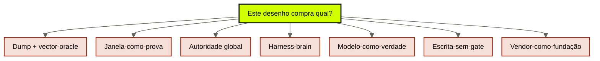
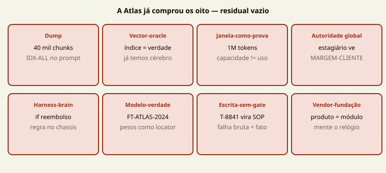

# Anti-padrões do company brain

[↑ M4](../modulos/M4-menor-brain-e-anti-padroes.md) · [Curso](../README.md)

Caso: [Atlas Assist](../casos/atlas-assist.md). Escada da [aula 16](16-menor-brain-suficiente.md). Fonte: [01](../sources/01-tese-company-brain.md). Termos: [Glossário](../Glossario.md).

A Atlas não tem um vício. Tem os oito. O capstone recusa residual sem justificativa.

> Analogia: **oito cirurgias erradas** para o mesmo paciente. “Vamos evitar RAG ruim” cura uma e deixa sete.

## Resultado

Você aplica a **rubrica de anti-padrões** ao case: dump, vector-oracle, janela-como-prova, autoridade global, harness-brain, modelo-como-verdade, escrita-sem-gate, vendor-como-fundação. Na Atlas, todos aparecem. No seu case, cada recusa ganha frase própria.

```text
antipadroes: {oito × {aparece, evidencia, recusa}}
residual_sem_justificativa: []
```

Se a frase final for “vamos evitar RAG ruim”, a aula falhou. RAG ruim é um dos oito, com outro chapéu. Os outros sete continuam no desenho.

## Mapa visual

Decisão-chave — Este desenho compra qual anti-padrão?



> Leia o diagrama antes do texto longo. Depois volte e confira.



> Leia o diagrama antes do texto longo. Depois volte e confira.

> Anti-padrão sem ID do case é slogan. Slogan não passa na rubrica.

**Objetivos**

- Definir os oito sem sinônimo vago. _(understand)_
- Mapear cada um a um ID ou falha da Atlas. _(apply)_
- Distinguir harness-brain de política de contexto. _(analyze)_
- Deixar `residual_sem_justificativa` vazio. _(evaluate)_

**Núcleo obrigatório:** Resultado, mapa visual, seções 1–3, Prática e Evidência.
**Aprofundamento:** seções seguintes, papers, fronteira com Agent Engineering, teste de recuperação.

---

## 1. Catálogo — oito, não três

A 21b em `cursos/AIOX-Agent-Engineering/aulas/21b-modelos-substituiveis-harness-fino-cerebro-modular.md` recusa três atalhos (agnosticismo mágico, harness obeso, brain-dump). Esta aula completa o catálogo **do company brain** e aplica à Atlas. Não recicle só os três.

| Anti-padrão | Definição operacional | Mentira |
|-------------|----------------------|---------|
| **Dump** | o depósito entra no prompt | mais texto = mais empresa |
| **Vector-oracle** | o índice *é* a verdade | similaridade = vigência = fonte |
| **Janela-como-prova** | cabe = curado | datasheet substitui política |
| **Autoridade global** | um store, todos leem tudo | ACL no prompt chega |
| **Harness-brain** | regra de negócio no `if` / tool | o runner *é* o jurídico |
| **Modelo-como-verdade** | pesos como locator | FT-ATLAS-2024 prova prazo |
| **Escrita-sem-gate** | run grava memória | falha bruta = SOP |
| **Vendor-como-fundação** | produto = módulo mental | “o cérebro é o X” |

A [fonte 01](../sources/01-tese-company-brain.md) autoriza o vocabulário (paramétrico vs recuperável, janela ≠ curadoria, escrita perigosa). Não há benchmark público que rankeie os oito. A rubrica é contratual, não empírica. Declare a lacuna se o time pedir “qual paper prova que vendor-como-fundação falha”.

---

## 2. A Atlas nos oito — nenhum fica de fora

### 2.1 Dump — IDX-ALL, ~40 mil chunks

A triagem manda o store. Lost in the Middle (Liu et al., 2023, arXiv [2307.03172](https://arxiv.org/abs/2307.03172)): o meio da janela é usado pior. POL-REEMB-2023, T-8841 e um parágrafo útil competem. Recusa: política nomeada da [aula 13](13-politica-de-contexto.md), teto do workload. Evidência no case: falha 3 da terça.

### 2.2 Vector-oracle — IDX-ALL como “o cérebro”

O time não diz “dump”. Diz “o cérebro”. A [aula 04](04-fontes-canonicas.md) recusou o status de fonte. A [aula 08](08-projecoes-recuperaveis.md) nomeou as cinco mentiras do índice. Recusa: índice aponta; POL-REEMB-2023 prova. Se o índice queimar e as fontes existirem, reconstrói. Se as fontes *forem* o índice, não há brain.

### 2.3 Janela-como-prova — “1M resolve Lost in the Middle”

Paper velho, modelo novo. Long Context RAG (arXiv [2411.03538](https://arxiv.org/abs/2411.03538)): capacidade nominal ≠ uso confiável. Janela não cria ACL, não revoga POL-REEMB-2023, não classifica T-8841. Recusa: teto do workload, não datasheet. A aula 03 já matou o Pacote Janela; aqui ele entra na rubrica para o capstone não o reintroduzir como “infra”.

### 2.4 Autoridade global — MARGEM-CLIENTE no mesmo retrieve

Estagiário da proposta vê margem. A tabela de atores proíbe. ACL depois do ranking é teatro. Recusa: ACL **antes** da projeção, actor no contrato da [aula 14](14-contrato-brain-harness.md). Evidência: falha 4. Irmão no harness: least privilege da tool — não substitui este anti-padrão.

### 2.5 Harness-brain — a regra no `if`

`if (ticket.includes("reembolso")) prazo = 30`. Ou a tool de estorno que “já sabe” o prazo. A regra de negócio saiu do locator e entrou no runner. Quando Ana publicar 14 dias, o harness mente com confiança. Recusa: harness governa efeito; claim vive no brain. A 21b chama harness obeso; aqui o recorte é **política institucional no código de orquestração**.

Diferença fina: um `if` de *cap* (“acima de R$ 500 pede Ana”) é harness legítimo — autoridade de execução. Um `if` de *prazo de reembolso* é harness-brain. A Atlas mistura os dois no mesmo runner se ninguém nomear.

### 2.6 Modelo-como-verdade — FT-ATLAS-2024

Snapshot 2024, ainda diz 30, deprecação em 90 dias. Sem locator. Recusa: pesos nunca entram na coluna fonte (aula 04). A 21b já tratou o modelo como volátil. Evidência: falhas 1 e 2 da terça — o comercial entra em pânico porque “é lá que está o jeito”.

### 2.7 Escrita-sem-gate — T-8841

Transcript no índice, amanhã é política. Recusa: [aula 15](15-aprendizado-de-volta.md). Cinco estações. Ana. `nao_e: fato`. Evidência: falha 5.

### 2.8 Vendor-como-fundação — o store com nome comercial

“O cérebro é o vector store X / o GPT interno / o Slack da Ana.” Três vendors, um modelo mental. O capstone **falha crítico** se o YAML fundar módulos em marca. Recusa: jobs da fonte 01; implementação é opção posterior, não fundação. SLK-ANA, FT-ATLAS-2024 e IDX-ALL são os três disfarces da Atlas.

Os oito cabem **no mesmo dia**. Por isso o case de ensino existe. Seu case real pode ter quatro. Não force os outros — **justifique a ausência**. Residual sem frase é falha da rubrica.

Dois IDs atravessam mais de um vício — não os conte uma vez só.

**SOP-EXC-SLA.** Três versões, nenhuma aprovada. No dump, compete com política e ticket. No vector-oracle, “parece” procedimento. Na escrita-sem-gate, alguém cola a versão do Drive que o retrieve preferiu. Recusa: candidato (aula 06) até Ana/operação assinar; a política de compliance (aula 13) só o lê com `aprovado=sim`.

**SLK-ANA.** Resolução privada. Alimenta modelo-como-verdade quando o time fine-tuna “o que a Ana disse”. Alimenta harness-brain quando o runner passa a `prazo = 14` sem locator. Não é fonte (aula 04). Não é política de contexto. É episódio de decisão — e só vira documento se ela publicar.

---

## 3. Como eles se empilham

Dump sem vector-oracle é raro: quem despeja costuma tratar o índice como oráculo. Janela-como-prova é o álibi do dump (“cabe”). Autoridade global é o dump *com pessoas*. Harness-brain aparece quando o time desiste do locator e “congela” 30 dias no código para não depender do retrieve. Modelo-como-verdade é o álibi da deprecação. Escrita-sem-gate é o dump no sentido inverso (o run alimenta o oráculo). Vendor-como-fundação é o guarda-chuva que impede de ver os outros sete.

Ordem de desmonte na Atlas, se alguém perguntar “por onde começo”:

1. parar a escrita (T-8841) — senão todo recorte apodrece;
2. cortar autoridade global (MARGEM-CLIENTE) — senão a proposta é crime;
3. tirar FT-ATLAS-2024 da coluna fonte;
4. nomear políticas (aula 13) no lugar do dump;
5. só então discutir projeção. Vendor por último, se algum dia.

---

## 4. O que a rubrica não é

Não é code review. Não é lista de produtos proibidos. Um vector store *como projeção reconstruível* (aula 08) **não** é vector-oracle — se o locator continuar sendo POL-REEMB-2023. Um `if` de cap **não** é harness-brain. Fine-tune como *adapter* da 21b **não** é modelo-como-verdade — se ninguém citar o peso como prova.

A falha é o **status**. A rubrica pede o status. Justificativa do tipo “usamos vendor X na infra futura, o módulo mental é fonte/fato/projeção” é exemplar. “O cérebro é o X” é falha crítica da [aula 18](18-projeto-integrador.md).

---

## Quando usar — e quando não usar

**Use quando** o desenho do case (ou a Atlas) parecer “já está bom” e ninguém nomeou os oito. Antes do capstone. Depois de qualquer “só vamos indexar”.

**Não use quando** estiver rankeando vendors ou reescrevendo a aula 03. Também não use para vetar a Atlas: o veto da aula 16 é outra ficha. Aqui a Atlas **aparece** nos oito; a recusa é o desenho, não a existência do case.

---

## Teste de recuperação

Use os IDs. Nomeie o anti-padrão dominante — pode haver um segundo.

1. Triagem manda ~40 mil chunks de IDX-ALL.
2. Time: “o cérebro *é* o IDX-ALL.”
3. “Modelo novo tem 1M; Lost in the Middle morreu.”
4. Estagiário vê MARGEM-CLIENTE.
5. Runner: `prazo = 30` sem ler o brain.
6. Comercial cita FT-ATLAS-2024 como prova.
7. T-8841 colado; amanhã é SOP.
8. “Vamos adotar o produto Y como company brain.”

<details>
<summary>Gabarito comentado</summary>

1. **Dump** (e vector-oracle como fundo).
2. **Vector-oracle.**
3. **Janela-como-prova.**
4. **Autoridade global.**
5. **Harness-brain.**
6. **Modelo-como-verdade.**
7. **Escrita-sem-gate.**
8. **Vendor-como-fundação.**

</details>

---

## Prática

Preencha a [rubrica de anti-padrões](../templates/rubrica-antipadroes.md). Treino: a Atlas, os oito `aparece: true`, cada `evidencia` com ID. Case real: os que não aparecem levam justificativa, não silêncio.

**Funcionou se:**

- os oito campos existem;
- cada `evidencia` da Atlas cita POL-REEMB-2023, SLK-ANA, FT-ATLAS-2024, IDX-ALL, T-8841, SOP-EXC-SLA ou MARGEM-CLIENTE;
- `residual_sem_justificativa` é lista vazia;
- harness-brain e política da aula 13 não foram tratados como o mesmo vício.

## Pergunte ao seu agente

```text
Contexto: Atlas Assist + desenho atual do case.
Pedido: aplique os oito anti-padrões. Na Atlas, todos aparecem — não perdoe um. No case real, justifique ausência. Não proponha vendor como cura.
Evidência que espero: YAML da rubrica com residual vazio.
```

## Evidência de conclusão

Você passou quando consegue:

1. definir os oito sem “RAG ruim”;
2. apontar os oito na Atlas com IDs que não se repetem à toa;
3. separar harness-brain (regra no `if`) de cap no harness;
4. recusar vendor como nome de módulo.

O [Quiz M4](../avaliacoes/Quiz-M4.md) fecha o módulo. A [aula 18](18-projeto-integrador.md) junta as fichas numa especificação auditável.

## Navegação

[← Anterior](16-menor-brain-suficiente.md) · [↑ M4](../modulos/M4-menor-brain-e-anti-padroes.md) · [↑ Curso](../README.md) · [Próxima →](18-projeto-integrador.md)
