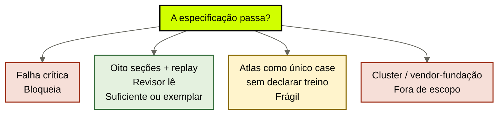
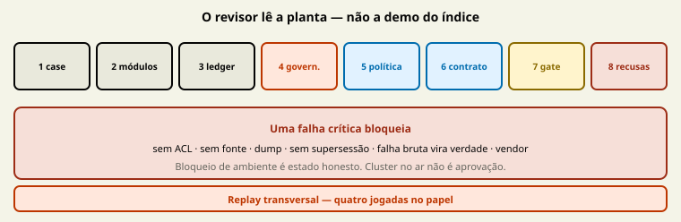

# Projeto Integrador: especificação do company brain

[↑ M5](../modulos/M5-projeto-integrador.md) · [Curso](../README.md)

Caso de treino: [Atlas Assist](../casos/atlas-assist.md). Preferido: o case real das aulas 01–17. Brief: [Projeto Integrador](../Projeto-Integrador.md). Nota: [Rubrica](../Rubrica.md). Fonte: [01](../sources/01-tese-company-brain.md). Termos: [Glossário](../Glossario.md).

Especificar. Não implementar. Um revisor externo tem de auditar o YAML sem cluster, sem vendor como fundação, sem “o modelo já sabe”.

> Analogia: o **inspetor lê a planta**, não a demo do índice. Oito estações. Uma falha crítica derruba o prédio no papel.

## Resultado

Você sai com a **especificação do company brain** nas oito seções da rubrica **mais o replay de mesa**, no [template](../templates/especificacao-capstone.md). Atlas vale como treino. [Norte Log](../casos/norte-log.md) vale como transferência. Case real é o artefato que o curso reconhece. Falha crítica bloqueia. Bloqueio de ambiente é estado honesto, não aprovação.

```text
especificacao: {case, modulos×6, claims≥3, governanca, politicas, contrato, gate, antipadroes}
revisor: {job, ACL, supersessao, residual}
```

Se a frase final for “subimos o índice e vimos que funciona”, o capstone falhou. Funcionar sem especificação auditável é IDX-ALL com demo.

## Mapa visual

Decisão-chave — A especificação passa na rubrica?



> Leia o diagrama antes do texto longo. Depois volte e confira.

> O revisor não precisa da sua máquina. Precisa do locator, da ACL e da recusa.



**Objetivos**

- Montar as oito seções a partir das fichas já preenchidas. _(apply)_
- Detectar as sete falhas críticas antes do revisor. _(evaluate)_
- Declarar Atlas como treino quando o case real faltar — e o que isso limita. _(analyze)_
- Recusar cluster, código no ar e vendor como módulo mental. _(understand)_

**Núcleo obrigatório:** Resultado, mapa visual, estações 0–8b (oito seções + replay), Prática e Evidência.
**Aprofundamento:** estações 9–13, script do revisor, papers citados, teste de recuperação.

---

## Protocolo do capstone

Siga as estações na ordem. Não “escreva um documento bonito” e depois force o YAML. O template **é** o artefato. Prosa só explica o que o YAML não cabe. Brief paralelo: [Projeto Integrador](../Projeto-Integrador.md). Critérios: [Rubrica](../Rubrica.md).

### Estação 0 — Pré-voo (antes das oito seções)

1. Abra o [template](../templates/especificacao-capstone.md). Não crie outro schema. Se faltar campo, o campo está vazio — isso é evidência, não licença para inventar chave.
2. Decida o case. **Preferido:** o mesmo case real das aulas 01–17. **Treino:** Atlas Assist. **Transferência:** [Norte Log](../casos/norte-log.md) — IDs inéditos, mesmo mecanismo. Se for Atlas, escreva `nome: Atlas Assist (treino)`. Se for Norte, `nome: Norte Log (transferencia)`. Entregar só Atlas sem a palavra `treino` é fingir instituição.
3. Reúna as fichas: diagnóstico, mapa de camadas, promessa, inventário, ledger, catálogo procedural, ledger episódico, escolha de projeção, políticas (×N), contrato, gate, veto/menor brain, rubrica de anti-padrões. O capstone **cola e reconcilia**. Não redesenha do zero. Contradição entre fichas (triagem pode ler margem na aula 13 e não pode na 09) é falha: escolha uma e justifique.
4. Confirme anti-escopo. Não entra: cluster, banco, código de retrieve, Pinecone/Notion AI/Confluence como cérebro, preço, SLO de produção, vault de estudo, memória de um único PRD (isso é 12f). Se o ambiente bloqueou implementação, escreva `bloqueio_de_ambiente: true` numa linha de prosa — **não** marque a rubrica como exemplar por isso.
5. Nomeie o revisor. Outro aluno ou um agente-professor que **não** escreveu o YAML. Sem revisor, o artefato existe e a aprovação não.

Saída da estação 0: uma pasta (ou um Markdown) com o template vazio + lista das fichas-fonte + a palavra `treino` se for Atlas.

Ordem de colagem — não comece pela seção 8:

| Seção do capstone | Ficha de origem | Se a ficha faltar |
|-------------------|-----------------|-------------------|
| 1 | diagnóstico + veto/menor brain | a aula 16 é o mínimo; sem sintoma, vete |
| 2 | mapa de camadas + inventário + catálogos 06–08 | não invente módulo “extra” para parecer completo |
| 3 | ledger da aula 05 | três claims; gap explícito vale mais que cinco órfãos |
| 4 | contrato de governança (aulas 09–12) | se M2 estiver magro, a tabela de atores da Atlas ainda obriga ACL |
| 5 | políticas da aula 13 (uma por agent) | uma esteira só = dump |
| 6 | contrato da aula 14 | latência é intenção |
| 7 | gate da aula 15 | T-8841 no treino |
| 8 | rubrica da aula 17 | to-be, não as-is da terça |
| Replay transversal | quatro jogadas ligando as seções 3–7 | sem elas o YAML é capa |

Contradição entre fichas é o defeito mais comum. Exemplo: a promessa da aula 03 recusa margem na proposta; a política da aula 13 “esquece” o campo `nao_pode_ler`. O capstone escolhe a recusa mais estrita e anota a correção. Não média.

### Estação 1 — Case e justificativa

Pergunta da rubrica: por que um brain — ou veto?

Preencha `case`. `sintoma_institucional` em uma frase observável. Na Atlas: *três agents citam prazos diferentes para o mesmo reembolso; o retrieve não distingue vigente, restrito e episódio.* Não serve: “precisamos de IA”. Não serve: “o modelo alucina”.

`agents_que_apontam_o_mesmo_locator`: na Atlas, triagem + proposta + compliance → POL-REEMB-2023 / o locator que a Ana ainda não publicou. Se a lista tiver **um** agent, você está na 12f (`cursos/AIOX-Agent-Engineering/aulas/12f-menor-cerebro-suficiente.md`). A seção 1 deve dizer isso e, se for o caso, `decisao: veto`.

`por_que_a_12f_nao_basta`: frase que um revisor da 12f aceitaria. Atlas: a 12f cobre esquecimento de story; aqui o locator é da empresa, a ACL é de ator, o fine-tune expira em 90 dias. Se a 12f *basta*, não force seis módulos.

`decisao`: `construir` ou `veto`. Atlas treino = `construir` (aula 16). Case real sem sintoma = `veto` + `condicao_de_reabertura` observável. Veto preenchido **passa** esta seção se a condição for auditável. Veto “não gostamos de documentação” falha. Veto “o vendor resolve” é falha crítica (vendor-como-fundação).

`condicao_de_reabertura`: obrigatória no veto; recomendada mesmo no construir (“se um quarto agent nascer sem política nomeada, reabrir o mapa”).

Gate local da estação 1: um revisor consegue dizer, em uma linha, *por que não é vault, não é M1b e não é só 21b*. Se não consegue, reescreva o sintoma.

### Estação 2 — Mapa de módulos

Pessoa: seis jobs da [fonte 01](../sources/01-tese-company-brain.md). Cada um com `job`, `autoridade`, `ritmo`, `fronteira`.

Não copie slogans. Autoridade é nome: Ana revoga política; compliance escreve candidato; ninguém no agent de proposta escreve claim. Ritmo é cadência: política muda quando o jurídico publica, não quando o ticket fecha; episódio nasce a cada run; projeção reconstrói depois da versão (aula 15). Fronteira é o vizinho que este job **não** é: procedural não é T-8841; projeções não são fonte; governança não dispara estorno.

Insuficiente: faltou módulo, ou módulo sem autoridade/ritmo. Suficiente: os seis com os três campos. Exemplar: fronteira entre módulos justificada (por que fatos ≠ procedural na Atlas: prazo vs como pedir exceção).

Atlas — ancoragem mínima, não invente ID:

| Job | Autoridade (exemplo) | Ritmo | Fronteira |
|-----|----------------------|-------|-----------|
| fontes | dono do wiki / jurídico publica | quando o documento muda | IDX-ALL não entra |
| fatos | Ana aprova claim | supersessão, não crawl | síntese sem gap recusada |
| procedural | operação aprova SOP | versão; SOP-EXC-SLA hoje = candidato | T-8841 não é SOP |
| episódico | dono do ledger 07 | um run, um registro | não vira política |
| projeções | quem reconstrói após versão | depois do gate | nunca fonte |
| governança | Ana revoga; ACL por ator | política de retenção | não é harness |

Gate local: o revisor aponta o job de cada parágrafo. Se um parágrafo serve a dois jobs, parte.

Armadilha: seis módulos com autoridade “o time” e ritmo “contínuo”. Isso é slide. Nomeie Ana, o agent, o estagiário. Ritmo contínuo sem trigger é “claims nunca expiram” disfarçado — arrasta falha crítica da estação 4.

### Estação 3 — Ledger de proveniência

Mínimo **três** claims com `afirmacao`, `fonte`, `data`, `uso`, `status`.

Atlas, três linhas que o curso já ensinou a escrever — não invente um quarto ID:

1. “A empresa publicou reembolso em 30 dias em 2023.” Fonte POL-REEMB-2023. Data da página. Uso: auditoria do que foi verdade; **não** uso como vigente. Status: `pronto` como prova histórica, `recusado` como regra de hoje.
2. “A empresa opera 14 dias.” Fonte pretendida: documento que Ana não publicou. SLK-ANA não serve. Status: `gap`.
3. “Este cliente tem esta margem nesta competência.” Fonte MARGEM-CLIENTE. Uso: proibido para proposta e estagiário. Status: `pronto` como dado, `recusado` como contexto da proposta.

Exemplar: conflito documentado + `resolver_policy`. Atlas: wiki 30 vs prática 14; política = não escolher em silêncio; Ana publica; até lá a triagem devolve buraco de decisão e o compliance devolve o par.

Insuficiente: claim sem fonte, ou fonte “o Drive”, ou “o modelo sabe”. Isso é falha crítica (nenhuma fonte canônica).

Gate local: cada `fonte` existe no inventário da aula 04 ou está em `recusados` com motivo. Claim que aponta IDX-ALL ou FT-ATLAS-2024 **falha**.

Quarto claim opcional (exemplar): SOP-EXC-SLA como *candidato a procedimento*, status `gap`, `uso` = nenhum agent L1 até `aprovado: true`. Isso liga a estação 2 (procedural) à 7 (gate) sem promover T-8841.

### Estação 4 — Contrato de governança

Campos: ACL, validade, supersessão, conflito, retenção, exclusão, auditoria.

ACL: copie a [tabela de atores](../casos/atlas-assist.md) ou a do case real. Ator × lê / escreve / revoga. Agent de triagem não escreve claim. Agent de compliance escreve candidato. Ana escreve com aprovação e revoga. Estagiário não lê margem. Ausência de ACL em **qualquer** módulo é falha crítica.

Validade e supersessão: POL-REEMB-2023 não se apaga. Claim novo de 14 dias, quando existir, carimba o antigo `vigente: nao`. “Claims nunca expiram” é falha crítica. TTL pode ser “até o jurídico publicar”, não precisa ser relógio de parede — precisa ser *trigger*.

Conflito: a resolver policy da estação 3, agora como regra do contrato (não só do ledger).

Retenção e exclusão: T-8841 como episódio tem retenção de auditoria; não tem direito de virar SOP. Exclusão / direito de ser esquecido: o que some da projeção vs o que permanece no ledger com carimbo. Não invente LGPD de teatro; declare o gatilho que o case *tem*.

Auditoria: quem consegue reconstituir, daqui a um trimestre, qual locator a triagem usou na terça. Sem citação obrigatória (estação 6) a auditoria é fantasia.

Insuficiente: sem ACL ou sem validade/supersessão. Suficiente: ACL + TTL/trigger + supersessão. Exemplar: trilha + gatilho de exclusão.

Gate local: o revisor simula “Ana publica 14 dias”. Você aponta o que muda em fatos, o que permanece em fontes, o que a projeção reconstrói. Se a resposta for “apagamos o wiki”, falhou a aula 04 *e* esta estação.

Retenção mínima de T-8841: o episódio fica; a projeção de política não o lê. Exclusão de MARGEM-CLIENTE do *contexto da proposta* não é exclusão da fonte — é ACL. Misturar os dois no YAML é o erro que o revisor deve marcar.

### Estação 5 — Política de contexto

Uma ficha por workload que o case realmente roda. Atlas: **três** (aula 13). Colar uma esteira genérica e dizer “vale para todos” é dump com protocolo — falha crítica (“enviar tudo” ou equivalente: um retrieve só).

Campos: query, filtro, ACL, projeção, teto, `fallback_insuficiente`. O teto tem número ou critério (“2 páginas ou o locator POL-* vigente”). “O razoável” falha.

Fallback: o que a [aula 13](13-politica-de-contexto.md) exigiu por agent. Exemplar na rubrica: tamanho máximo justificado **e** fallback quando o contexto é insuficiente. Sem fallback, a seção fica em suficiente no máximo — e a Atlas quebra na terça (completa com FT-ATLAS-2024).

Gate local: o revisor pergunta “a proposta pede a mesma query da triagem?”. Se sim, reescreva. Pergunta “MARGEM-CLIENTE pode entrar no ranking da proposta?”. Se o YAML não disser `nao` *antes* do retrieve, falhou ACL (e arrasta falha crítica da estação 4).

### Estação 6 — Contrato brain↔harness

Entrada: `query`, `acl`, `actor`. Saída: `claim`, `fonte`, `citacao`, `conflito_ou_buraco`. `citacao_obrigatoria: true`. Latência: **intenção**, campo `nao_e_sla_de_produto` preenchido — este curso não entrega SLO. Fallback do harness (aula 14): buraco ≠ dump; conflito ≠ voto do modelo; silêncio do brain ≠ IDX-ALL. `brain_sem_maos`: um efeito que o brain nunca dispara.

Insuficiente: seção ausente ou “o harness chama o índice”. Suficiente: entrada, saída, latência-intenção. Exemplar: fallback + citação obrigatória (a rubrica pede os dois no nível exemplar; trate-os como Must neste protocolo — a Atlas não sobrevive sem eles).

MCP: uma linha de prosa, se quiser, *fora* do YAML de fundação: a spec [tools 2026-07-28](https://modelcontextprotocol.io/specification/2026-07-28/server/tools) padroniza list/call/schema; **não** padroniza memória. Se MCP aparecer como módulo na estação 2, você comprou vendor-protocolo-como-fundação. Tire.

Gate local: o revisor inventa uma saída “14 dias” sem locator. O contrato a marca inválida. Se o YAML aceita, falhou.

### Estação 7 — Gate de aprendizado

Percorra um candidato. Treino obrigatório se for Atlas: **T-8841**. `nao_e: fato`. Classificação: episódio (não SOP). Aprovador: Ana. Versão ou recusa de promoção. Projeção de política **não** inclui o transcript. `o_que_nao_volta`: output cru, colar no IDX-ALL, fine-tune de FT-ATLAS-2024 com o ticket.

Falha crítica: gate ausente (toda falha bruta vira verdade). Suficiente: quem aprova, o que qualifica, o que vai ao brain. Exemplar: as cinco estações da [aula 15](15-aprendizado-de-volta.md) visíveis no YAML.

Gate local: o revisor pergunta “o agent de compliance fecha o claim?”. A resposta correta é não. Se o YAML der `escreve: fato` ao compliance, contradiz o caso e a estação 4.

### Estação 8 — Anti-padrões

Os oito da [aula 17](17-antipadroes-do-company-brain.md). Atlas: todos `aparece` no *diagnóstico*; no *desenho proposto* todos `aparece: false` com `justificativa` de recusa (o capstone avalia o desenho, não o estado podre da terça). Se você descreve o as-is da Atlas sem to-be, a rubrica lê residual.

Case real: ausência justificada. `residual_sem_justificativa` vazio. Vendor-como-fundação no to-be é falha crítica.

Gate local: o revisor busca no YAML nomes de produto como sujeito de módulo (“o cérebro é o …”). Acha → bloqueia. Acha “projeção vetorial reconstruível a partir de POL-*” → ok.

### Estação 8b — Replay de mesa (obrigatório)

Quatro jogadas no papel. Sem cluster. O revisor percorre o YAML como se fosse uma execução. Se uma jogada contradisser as seções 3–7, o capstone não fecha — o desenho não conversa consigo.

| Jogada | O que o aluno escreve | O que o revisor recusa |
|--------|----------------------|------------------------|
| 1. Claim autorizado | actor + query + saída com cadeia (claim, fonte, citação, data) | “o modelo já sabia”; fonte = índice |
| 2. Tentativa sem ACL | actor sem direito + dado restrito + recusa **antes** do retrieve | filtro no output; “o prompt pede para não citar” |
| 3. Conflito ou buraco | duas vozes ou fonte ausente; `modelo_desempata: false` | média; “escolhe a melhor”; dump das duas |
| 4. Feedback recusado | candidato classificado que **não** vira SOP/fato | T-8841 ou T-2207 promovido; colar no índice |

Treino Atlas: jogada 1 = triagem + POL-REEMB-2023 histórica (não vigente); jogada 2 = estagiário + MARGEM-CLIENTE; jogada 3 = wiki 30 vs Ana 14; jogada 4 = T-8841. Transferência Norte: POL-PRAZO-2024, CUSTO-ROTA, 48 vs 24, T-2207. Não misture os IDs.

Falha crítica nova: replay ausente ou incoerente com ACL/gate/contrato.

### Estação 9 — Autocrítica das falhas críticas

Antes de mandar ao revisor, marque cada uma. Uma única verdadeira bloqueia.

| Falha crítica | Onde caçar no YAML | Atlas: como falharia |
|---------------|--------------------|----------------------|
| Sem ACL em qualquer módulo | `governanca.acl` vazio ou módulo sem ator | proposta lê MARGEM-CLIENTE |
| Nenhuma fonte canônica | `claims[].fonte` = modelo / índice / “Drive” | só FT-ATLAS-2024 |
| Política = enviar tudo | uma política, sem filtro, teto “o índice” | IDX-ALL na triagem |
| Claims que nunca expiram | sem `supersessao` / sem trigger | POL-REEMB-2023 eterna |
| Gate ausente | seção 7 vazia ou T-8841 → fato | falha 5 da terça |
| Vendor como fundação | módulo mental = marca | “o cérebro é o store X” |
| Replay ausente ou incoerente | `replay` vazio ou contradiz ACL/gate | jogada 2 filtra no output; jogada 4 promove T-8841 |

Se alguma estiver verdadeira, **não peça nota**. Conserte. O revisor não é consultor de vendor.

### Estação 10 — O que o revisor faz (script)

O [Projeto Integrador](../Projeto-Integrador.md) pede um humano ou agente-professor externo. Script mínimo — o revisor não implementa:

1. Lê a seção 1. Diz em voz alta se é empresa, capacidade ou vault. Se vacilar, devolve.
2. Aponta o job de cada módulo (estação 2).
3. Verifica ACL: escolhe um ator e um ID (MARGEM-CLIENTE ou equivalente). Confere se o retrieve daquele ator *pode* ver.
4. Checa supersessão: pede o destino de um claim revogado. “Delete” = reprova.
5. Confere política: não é dump; há fallback.
6. Confere contrato: citação obrigatória; brain sem mãos.
7. Confere gate: um candidato que *não* vira fato.
8. Confere os oito anti-padrões no to-be. Residual sem frase = insuficiente.
9. Percorre as quatro jogadas do replay. Se uma contradisser o contrato, devolve.
10. Não pede demo, curl, dashboard, cluster. Se o aluno oferecer cluster no lugar do YAML, o revisor recusa a troca.

Aprovação: suficiente ou exemplar na [Rubrica](../Rubrica.md), **zero** falhas críticas. O curso não exige exemplar. Exige auditável.

O revisor anota *uma* correção Must e para. Não redesenha o brain. Se o aluno pediu “melhora o YAML”, o professor volta à ficha de origem (aula 13 se for política, 15 se for T-8841), não ao capstone como lugar de invenção.

### Estação 11 — Atlas como treino vs case real

Atlas **pode** ser o YAML completo. Serve para provar que você percorre as oito seções sem inventar ID. Não serve para declarar a empresa Atlas “pronta” — ela é didática. No front da seção 1, a palavra `treino` é obrigatória.

Case real preferido: IDs seus, mesma disciplina (não invente ID sem declarar, regra do [caso](../casos/atlas-assist.md)). Se o case real só tiver um agent, o honesto é veto + condição — e isso **é** capstone, não fuga.

Misto: seção 1–2 no case real, exemplos de conflito copiados da Atlas sem relabel. O revisor deve recusar o misto. Ou você opera o locator real, ou declara treino.

### Estação 12 — O que não precisa existir

Não precisa de: cluster, vector store no ar, servidor MCP, fine-tune, CI, página de status, p95, conta de cloud, código de reranker, GraphRAG implantado, Notion, Slack indexado.

O que *parece* necessário e não é: um segundo YAML “de implementação”. Se o revisor não consegue auditar ACL e supersessão no template canônico, outro arquivo só esconde o buraco.

Precisa de: Markdown/YAML que outro humano lê. Papers no tamanho certo se você os citar (Lost in the Middle [2307.03172](https://arxiv.org/abs/2307.03172), Long Context RAG [2411.03538](https://arxiv.org/abs/2411.03538), [managed-agents](https://www.anthropic.com/engineering/managed-agents), MCP tools spec) — citação de paper **não** substitui locator de política.

Bloqueio de ambiente (“não tenho índice”) é irrelevante: você não deveria ter índice para passar. Bloqueio (“não tenho case”) resolve-se com Atlas *treino* ou com veto honesto. Bloqueio (“não tenho Ana”) resolve-se nomeando o papel equivalente; sem papel, a seção 4 falha — isso é conteúdo, não ambiente.

### Estação 13 — Fechamento e o que o curso não promete

Depois da aprovação do revisor: o artefato é a especificação. Implementar retrieve, harness ou MCP é outro curso (`cursos/AIOX-Agent-Engineering/`). Productizar a capacidade é `cursos/AIOX-Productizacao/`. Prontidão de operação mantida é vitrine Enterprise — não está neste capstone.

Não há próxima aula. Há a [Rubrica](../Rubrica.md) aplicada e, se quiser, o [Quiz M4](../avaliacoes/Quiz-M4.md) se ainda não fechou o M4. O M5 não tem quiz de múltipla escolha: a rubrica *é* a avaliação.

---

## Quando usar — e quando não usar

**Use quando** as fichas 13–17 existem (mesmo imperfeitas) e um revisor está nomeado. O protocolo acima é o caminho.

**Não use quando** estiver começando o curso por aqui. Volte à [aula 01](01-empresa-vive-nos-pesos.md). Também não use para “entregar um PoC”. PoC sem as oito seções e sem replay não é este projeto.

---

## Teste de recuperação

1. O YAML tem seis módulos e IDX-ALL como fonte do claim 1. Passa?
2. Atlas sem a palavra `treino` na seção 1. Qual risco?
3. Seção 6 com `p95: 200ms` e sem `nao_e_sla_de_produto`. O que falhou no protocolo?
4. Revisor pede um cluster para aprovar. O que você faz?
5. Case real com um agent e um Markdown. Qual decisão da seção 1 é honesta?

<details>
<summary>Gabarito comentado</summary>

1. **Não.** Falha crítica: nenhuma fonte canônica (índice não é fonte), além de vector-oracle.
2. **Fingir instituição.** Treino sem carimbo parece operação. O revisor deve devolver.
3. **Latência como SLA de produto.** Fora de escopo; a estação 6 pede intenção.
4. **Recusa a troca.** Evidência aceitável é especificação textual. Cluster não aprova.
5. **Veto** (ou degrau 1 explícito) com condição de reabertura. Seis módulos vazios falham menor mecanismo.

</details>

---

## Prática

Preencha a [especificação](../templates/especificacao-capstone.md) nas oito seções **e no bloco `replay`**. Percorra as estações 0–13 (a 8b é obrigatória). Entregue a um revisor com o script da estação 10. Use o [Projeto Integrador](../Projeto-Integrador.md) como capa e a [Rubrica](../Rubrica.md) como nota.

**Funcionou se:**

- as oito seções e as quatro jogadas do replay existem no schema do template;
- zero falhas críticas na estação 9;
- Atlas, se usada, está marcada `treino`; Norte, se usado, está marcado `transferencia`;
- o revisor externo assinou (mesmo que “insuficiente — voltar à seção N”);
- não há cluster, vendor-fundação nem “próxima aula” no artefato.

## Pergunte ao seu agente

```text
Contexto: fichas das aulas 01–17 (ou Atlas como treino declarado) + Rubrica.md.
Pedido: audite a especificação como revisor externo. Percorra o script da estação 10. Marque falhas críticas. Não sugira vendor, cluster nem implementação de RAG. Não invente IDs.
Evidência que espero: lista passa/falha por seção + uma frase de menor mecanismo.
```

## Evidência de conclusão

Você passou o curso quando um revisor externo consegue:

1. identificar o job de cada módulo;
2. verificar a ACL num ID restrito;
3. checar a política de supersessão sem “apagar o wiki”;
4. percorrer as quatro jogadas do replay sem contradição com ACL, contrato ou gate;
5. confirmar que nenhum dos oito anti-padrões resta no to-be sem justificativa.

Não precisa de ambiente no ar. Precisa de especificação que sobrevive à leitura.

## Navegação

[← Anterior](17-antipadroes-do-company-brain.md) · [↑ M5](../modulos/M5-projeto-integrador.md) · [↑ Curso](../README.md)
