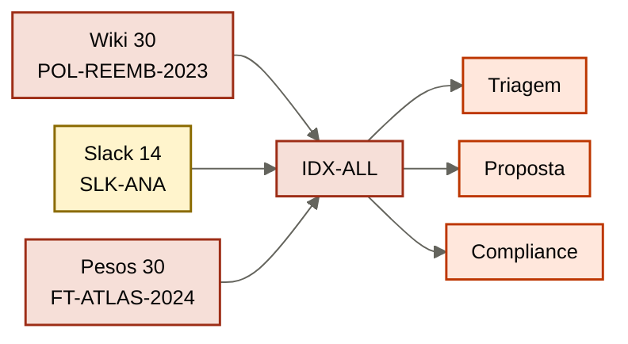

# Caso de ensino — Atlas Assist

Empresa B2B que vende automação de suporte. Três agents já rodam. Use este caso como **treino declarado** — não como se fosse a sua operação.

Três vozes, um store, três agents. O outcome pede política vigente, proposta sem dado indevido, exceção citável.

| Agent | Outcome | O que “sabe” hoje |
|-------|---------|-------------------|
| Triagem | classifica e responde ticket L1 | wiki + vector store de tudo |
| Proposta | rascunha proposta comercial | GPT interno fine-tunado em 2024 |
| Compliance | recusa ou aprova exceção de SLA | o que a líder jurídica (Ana) decide no Slack |

## Outcome observável

Ticket classificado com política **vigente**, proposta **sem dado que o autor não pode ver**, exceção de SLA **com fonte citável**.

## Inventário que as aulas usam

| ID | O que é | Habitat | Problema |
|----|---------|---------|----------|
| POL-REEMB-2023 | página do wiki, reembolso em 30 dias | documento sem dono | revogada em março, ainda vigente no retrieve |
| SLK-ANA-2026-03-12 | thread da Ana: reembolso em 14 dias | cabeça de gente | não é fonte; é resolução privada |
| FT-ATLAS-2024 | snapshot do GPT interno | pesos | deprecação em 90 dias; ainda diz 30 dias |
| IDX-ALL | vector store de wiki + Drive + Slack + tickets | store-oráculo | sem ACL, sem tipo, sem gate de escrita |
| T-8841 | transcript de ticket mal fechado, colado no IDX-ALL | episódio bruto | no dia seguinte a triagem trata como SOP |
| SOP-EXC-SLA | PDF na pasta da Ana, “como pedir exceção” | procedural informal | três versões; nenhuma aprovada |
| MARGEM-CLIENTE | planilha de margem no mesmo índice | dado restrito | estagiário da proposta vê no rascunho |

## Cinco falhas do mesmo dia (M0)

1. Triagem cita POL-REEMB-2023. Jurídico já opera 14 dias (SLK-ANA-2026-03-12). FT-ATLAS-2024 ainda diz 30.
2. Provider anuncia deprecação de FT-ATLAS-2024 em 90 dias.
3. Triagem manda ~40 mil chunks de IDX-ALL em todo ticket.
4. Estagiário vê MARGEM-CLIENTE no rascunho da proposta.
5. T-8841 entra no índice. No dia seguinte vira “política”.

## Pessoas e papéis (M2)

| Ator | Pode ler política pública | Pode ler margem | Pode escrever claim | Pode revogar |
|------|---------------------------|-----------------|---------------------|--------------|
| Agent de triagem | sim | não | não | não |
| Agent de proposta | sim | não (estagiário tampouco) | não | não |
| Agent de compliance | sim | não | candidato, não fato | não |
| Ana (jurídico) | sim | não | sim, com aprovação | sim |
| Estagiário comercial | sim | não | não | não |

Este caso é didático. Nas práticas, substitua Atlas pelo seu case real. Não invente IDs novos sem declarar.
