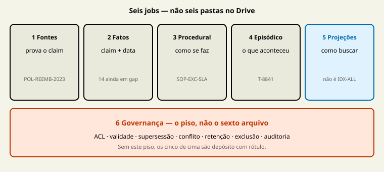

# M1 — Anatomia: os seis módulos

## Resultado

Mapa de módulos do case: fontes, claims, procedural, episódico e projeções — cada um com job, o que não é, e ritmo de atualização. Governança (o sexto) abre no M2.

## Aulas

- [Fontes canônicas](../aulas/04-fontes-canonicas.md)
- [Fatos e sínteses com proveniência](../aulas/05-fatos-e-sinteses.md)
- [Memória procedural](../aulas/06-memoria-procedural.md)
- [Memória episódica](../aulas/07-memoria-episodica.md)
- [Projeções recuperáveis](../aulas/08-projecoes-recuperaveis.md)

## Checkpoint

Inventário + ledger + catálogo procedural + ledger episódico + escolha de projeção. [Quiz M1](../avaliacoes/Quiz-M1.md).

## Evidência de conclusão

POL-REEMB-2023 (ou o equivalente do case) é fonte; IDX-ALL não é; T-8841 não é SOP; a projeção escolhida declara a mentira que compra.

[← M0](M0-fundacao-o-problema-e-a-tese.md) · [Curso](../README.md) · [Próximo →](M2-governanca-a-camada-de-confiabilidade.md)
